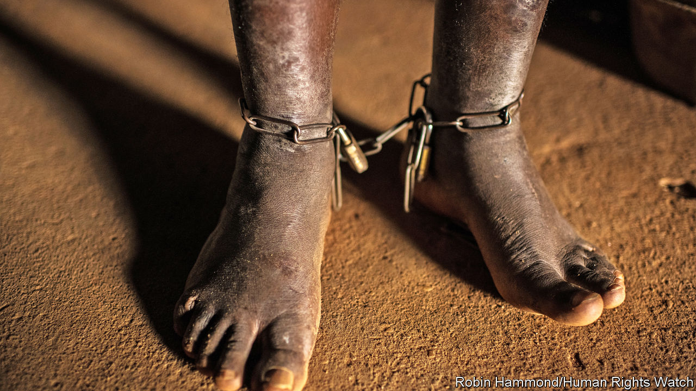

###### Shackling body and mind

# The torments of Kenya’s mentally ill 

##### Many are locked away, few receive proper care 

 

> Nov 19th 2020 

SUNDAY WORSHIPPERS at the Holy Ghost Coptic Church of Africa, where services often last for hours, are used to the racket coming from the pews at the back. But it is not the sound of bells ringing or ecstatic chanting. Rather, the clanking comes from chains that shackle Father John Pesa’s “patients”. In Kisumu, Kenya’s third-biggest city, Father Pesa has built a reputation for “spiritually healing” the mentally ill.

Others have called it “psychological torture”. Rose Ojwang’s husband sent her 17-year-old son to Father Pesa after the boy began hallucinating and behaving strangely. Like other patients, he was shackled. He grew thin, says Rose, because the church does not feel obliged to feed its wards unless paid to do so. For two years the boy went without proper medical treatment.


Rose’s grim story echoes the reporting of Human Rights Watch (HRW), an international watchdog, which found that the church had kept no fewer than 60 people in chains. Kenyan doctors say the practice is common. Their country is not alone. HRW’s report, published in October, found evidence of shackling in 60 countries, from Brazil to Indonesia. It reckoned that hundreds of thousands of people who suffer from mental illness have at some point been chained or locked up. In countries where such illnesses are poorly understood, many sufferers never see doctors.

Kenya is anyway short of psychiatrists. In Africa, on average, there is less than one mental-health worker per 100,000 people, compared with 50 in Europe. Kenya has 0.19 psychiatrists per 100,000 people and one psychiatric hospital. At the local level, “mental health is a mess and mostly forgotten,” says Iregi Mwenja of the Psychiatric Disability Organisation, a Kenyan NGO.

“No family wants to shackle their child,” says Kriti Sharma of HRW. But good care is expensive and patients are expected to recover in their community. Often people are ignorant of mental health issues, or fearful that the afflicted person may harm others.

But people seek out the services of Father Pesa for other reasons, too. Mental illness in Kenya, as in many parts of Africa, is often thought to be caused by evil spirits. Traditional healers are called in before health professionals. Father Pesa’s church purports to flush out demons. It cites a miracle in the New Testament when Jesus drove demons out of a madman (who was shackled) and sent them into pigs. In Kenya’s Somali region, which is mostly Muslim, many believe the mentally ill are possessed by jinns (supernatural creatures).

It is hard to shake off such deep-rooted beliefs. A health official who worked in Mathari Hospital, the country’s sole psychiatric one, tells the story of her mentally ill brother. The last time he had a psychotic episode he chopped off three of his wife’s fingers with a machete. Yet the doctor and her sister could not convince their mother that he needed medical care. “Even as a mental-health specialist, I still don’t have any influence,” she laments.

There is some cause for hope. Kenya has signed up to a World Health Organisation initiative that promotes better care for the mentally ill. Politicians are striving to amend outdated laws, and the health ministry is wrangling for more power to monitor facilities where patients are shackled. A recent High Court ruling found that Rose’s son had been tortured and ordered the church to pay him 500,000 Kenyan shillings ($4,590) in damages. But Father Pesa continues to host patients. ■

