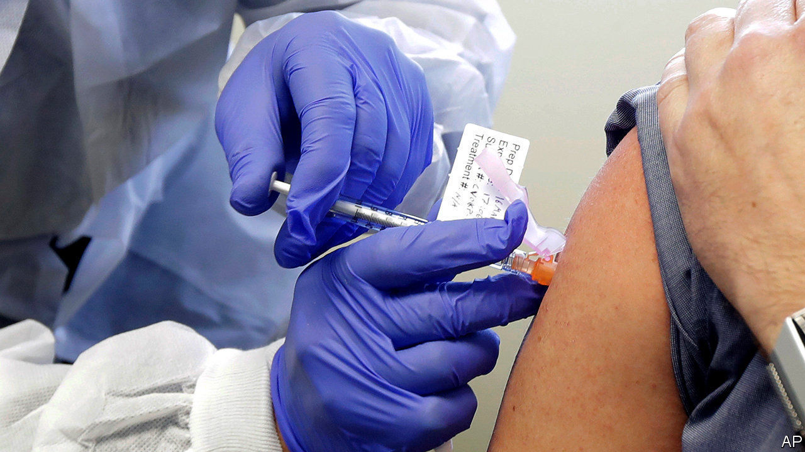

###### Getting better all the time

# A second vaccine against covid-19 arrives 

##### And there are surely more to come 

 

> Nov 19th 2020 

WAITING FOR a breakthrough in the fight against covid-19 has been a bit like waiting for a bus to arrive. After almost a year of watch-checking and neck-craning, two come along at once. First, on November 9th, Pfizer, an American pharma giant and BioNTech, a German minnow, announced that they had jointly developed an effective vaccine for the illness. They were followed, on November 16th, by Moderna, an American biotech firm.

Moderna says its offering is 94.5% effective. Pfizer says the efficacy of its is 95%. Moderna’s figure is an estimate based on a peek at data being gathered in a continuing trial involving 30,000 volunteers. Pfizer’s comes from the final analysis of a trial involving 43,000 people, in which 170 cases of covid-19 were seen. Of these, 162 were in the placebo arm (ie, those involved had received dummy injections).


The news bodes well for a third candidate, from AstraZeneca and Oxford University. This pair have, rather notably, not released any interim data from their trials so far. They have also been vaguer about when their vaccine might be available, saying only, “the end of the year”. But it is thought their trials are only weeks away from having a full set of data. Mene Pangalos, AstraZeneca’s head of R&amp;D, told the Greenwich Economic Forum, a conference held last week, that the firm might apply for full approval—rather than the emergency authorisation sought by the other two projects—in America, and perhaps in Britain and other parts of Europe as well.

More good news was to be found among the details of how, and for whom, these vaccines work. All the severe cases of covid were seen in unvaccinated volunteers. It is also now clear that the vaccines worked in participants of a range of ages, including those over 65, and from a variety of ethnic backgrounds. This means both vaccines will save lives in groups of people who have been hit disproportionately hard by covid-19. Data published this week in the Lancet suggest that the elderly respond well to the AstraZeneca vaccine, too. Continuing reviews of the safety of these vaccines suggest they are well tolerated, although a minority do get a day of flu-like symptoms, such as fatigue, muscle and joint pain.


The first two vaccines both look like worthy weapons in the fight against covid-19. There is, though, one thing about the Moderna vaccine that sets it apart. It can be kept in a regular fridge at between 2°C and 8°C for 30 days. The Pfizer vaccine, by contrast, needs to be kept ultracold, at -70°C or below, most of the time. That will make the Moderna vaccine far easier and cheaper to distribute (although the cost of the Moderna vaccine itself is higher). If the AstraZeneca vaccine proves successful, it, too, is thought likely to need only a standard refrigerator to preserve it. And because this vaccine is also a fraction of the price of the others, it might still end up being the most popular choice.

All three vaccines use the same strategy: to introduce into the human body RNA (a molecule similar to DNA) that carries the recipe for “spike”, a protein abundant on the outsides of particles of SARS-CoV-2, the virus that causes covid-19. The body then uses this recipe to manufacture spike, and the immune system, recognising the protein as alien, mounts a response to it. Thus stimulated, the immune system can react rapidly if it subsequently encounters the spike proteins of actual viruses.

The vaccines from Pfizer and Moderna introduce the RNA directly, as molecules known as messenger RNA (mRNA) held inside small, fatty particles called liposomes. AstraZeneca’s offering instead incorporates the RNA into the genetic material of a harmless cold virus. The mRNA approach is regarded as particularly interesting, because this is the first successful example of what researchers hope will be a new class of drugs that work by feeding cells instructions to make therapeutic proteins in situ.

Message received

Learning how to introduce mRNA into the body without it either being destroyed or stimulating an unhelpful immune response has been challenging. These two new vaccines are the first evidence of the technology’s potential. Moderna is pursuing mRNA as the basis for other vaccines, against such pathogens as cytomegalovirus, influenza, paediatric-respiratory-syncytial virus and Zika. BioNTech, meanwhile, is exploring the use of mRNA to stimulate the immune system to fight cancer. Its pipeline includes treatments for malignant melanoma and for prostate, head-and-neck and breast cancers.

As for covid-19, the success of these rapidly created mRNA vaccines bodes well for dealing with any future mutations of SARS-CoV-2. As the pandemic continues to spread, and such mutations accrue, it is possible that the excellent responses these vaccines now provoke could wane. That, though, should not be a problem. Just as natural selection can tinker with the virus’s genetic code, so too can scientists tinker with the code in the vaccines. And, once they have proved themselves, those vaccines could be adjusted every year, as happens already with influenza vaccines. The tools the world needs to emerge from the covid-19 pandemic are starting to arrive. That they are all arriving at the same time is an unlooked-for blessing.■

Editor’s note: Some of our covid-19 coverage is free for readers of The Economist Today, our daily . For more stories and our pandemic tracker, see our 

