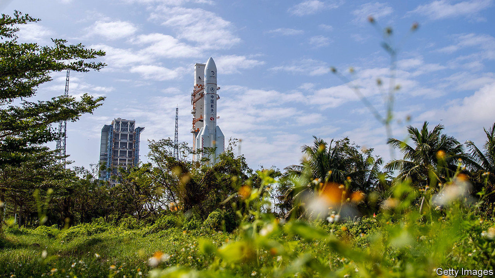

###### Mandate of heaven

# China plans to bring back the first Moon rocks for 40 years 

##### If it succeeds, they will arrive in December 

 

> Nov 21st 2020 

IN JANUARY 2019, when a Chinese spacecraft called Chang’e 4 visited the Moon, the mission broke new ground, figuratively speaking, by landing on the far side of that orb, which is perpetually invisible from Earth and thus also out of direct radio contact. This meant communications had to be relayed by a satellite which had been cunningly located for the purpose at a place where the interaction of the gravitational fields of Earth and Moon meant it could orbit a point in empty space.

China’s next lunar mission, by contrast, will break ground literally. Chang’e 5, scheduled for launch around November 24th, is intended to drill two metres down into the Moon’s surface, retrieve about 2kg of rock, and then return this to Earth. If successful, it will be the first lunar sample-return mission since 1976, when a Soviet probe called Luna 24 sent back a mere 170g of the stuff. And it will be another step forward in China’s space programme.


The Chang’e missions, named after a Chinese Moon goddess, have had their ups and downs. Chang’e 5 was originally scheduled for blast off in 2017, but the failure in July of that year of an otherwise-unrelated project that was, like Chang’e 5, using a Long March 5 as its launch vehicle, caused a delay. (Chang’e 4 used a different sort of launcher, a Long March 3B.) The “go” does, however, now seem to have been given. State media reported on November 17th that the rocket with Chang’e 5 on board has been moved to its launch pad at Wenchang space centre, on Hainan island.

Assuming the launch goes to plan, success will then depend on a complex ballet involving the craft’s four components. These are a service module, a return-to-Earth module, a lunar lander and an ascender—a configuration originally used by America’s Apollo project. Once the mission is in lunar orbit, the lander and the ascender will separate from the orbiting mother ship of service and return modules as a single unit and go down to the surface. The landing site is in the northern part of a vast expanse of basalt called Oceanus Procellarum, a previously unvisited area. Researchers hope rocks collected here will confirm that volcanic activity on the Moon continued until far more recently than the 3.5bn years ago that is the estimate derived from studies of currently available samples.

Once the new material has been gathered, which will take several days, the ascender will lift off, dock with the mother ship and transfer its haul to the return module. The service module will then carry the return module back to Earth, releasing it just before arrival to make a landing at a recovery site in Inner Mongolia, also used for China’s crewed missions, in December.

Digging into the lunar surface may, however, pose problems. InSight, an American rover now on the surface of Mars, has struggled to operate a drill nicknamed “the mole” that is designed to reach three metres below ground level. According to NASA, America’s space agency, this is because the mole has encountered clumpier regolith than its designers were expecting, causing it to bounce rather than burrow.

If Chang’e 5 does manage to overcome such hazards and return samples to Earth, China has said little so far about which foreign countries, if any, will be granted access to them. But America is likely to be last in the queue. For the past couple of decades American governments of all stripes have been reluctant to co-operate with China in space-related matters, largely because of fears about giving away secrets useful for designing ballistic missiles. In space, as in so much else, the two powers are not-so-friendly rivals. China’s stated goal is to establish a crewed base near the Moon’s south pole, where water is available in the form of ice perpetually shielded from sunlight by crater walls. America has similar plans. Watch, as it were, this space.■

