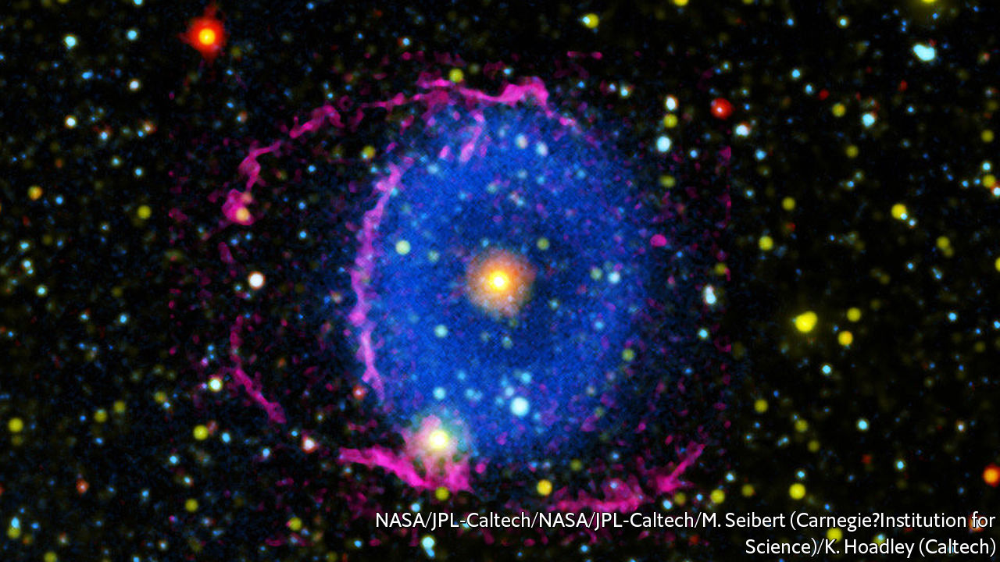

###### Astronomy

# Colliding stars 

##### A cosmic cataclysm pictured 

 

> Nov 21st 2020 

THIS PICTURE shows the 5,000-year-old aftermath of a merger between two stars—though the light that created it took a further 6,000 years to reach Earth’s neighbourhood. It was published in this week’s Nature by Keri Hoadley of the California Institute of Technology and her colleagues. It is a composite of three images taken at different frequencies, two by the Galaxy Evolution Explorer, a space telescope which operated from 2003 to 2012, and one from the ground. The blue area represents gas ejected during the merger. The faint red rings are the visible traces of shock waves from the resulting explosion. Such collisions are reasonably common in binary star systems. But this image is reckoned one of the clearest so far of the consequences.■

