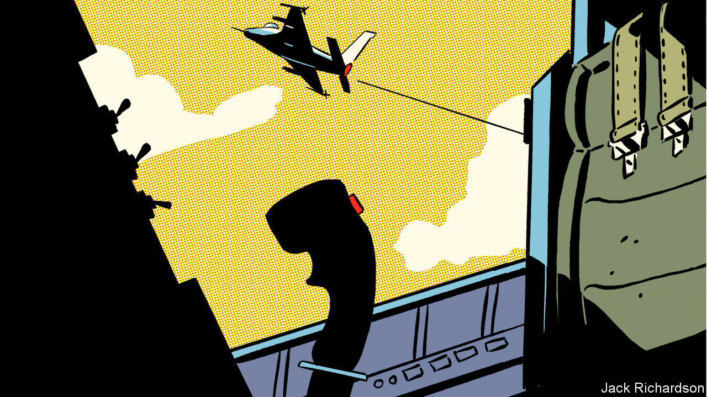

###### Air combat

# Fighter aircraft will soon get AI pilots 

##### But they will be wingmen, not captains 

 

> Nov 19th 2020 

CLASSIC DOGFIGHTS, in which two pilots match wits and machines to shoot down their opponent with well-aimed gunfire, are a thing of the past. Guided missiles have seen to that, and the last recorded instance of such duelling was 32 years ago, near the end of the Iran-Iraq war, when an Iranian F-4 Phantom took out an Iraqi Su-22 with its 20mm cannon.

But memory lingers, and dogfighting, even of the simulated sort in which the laws of physics are substituted by equations running inside a computer, is reckoned a good test of the aptitude of a pilot in training. And that is also true when the pilot in question is, itself, a computer program. So, when America’s Defence Advanced Research Projects Agency (DARPA), an adventurous arm of the Pentagon, considered the future of air-to-air combat and the role of artificial intelligence (AI) within that future, it began with basics that Manfred von Richthofen himself might have approved of.


In August eight teams, representing firms ranging from large defence contractors to tiny startups, gathered virtually under the auspices of the Johns Hopkins Applied Physics Laboratory (APL) in Laurel, Maryland, for the three-day final of DARPA’s AlphaDogfight trials. Each had developed algorithms to control a virtual F-16 in simulated dogfights. First, these were to be pitted against each other. Then the winner took on a human being.

Dropping the pilot?

“When I got started”, says Colonel Dan Javorsek, who leads DARPA’s work in this area, “there was quite a bit of scepticism of whether the AI algorithms would be up to the task.” In fact, they were. The winner, created by Heron Systems, a small firm in the confusingly named town of California, Maryland, first swept aside its seven digital rivals and then scored a thumping victory against the human, a pilot from America’s air force, in five games out of five.

Though dogfighting practice, like parade-ground drill and military bands, is a leftover from an earlier form of warfare that still serves a residual purpose, the next phase of DARPA’s ACE (air combat evolution) project belongs firmly in the future, for it will require the piloting programs to control two planes simultaneously. Also, these virtual aircraft will be armed with short-range missiles rather than guns. That increases the risk of accidental fratricide, for a missile dispatched towards the wrong target will pursue it relentlessly. Tests after that will get more realistic still, with longer-range missiles, the use of chaff and flares, and a requirement to deal with corrupt data and time lags of a sort typical of real radar information.

The point of all this, putative Top Guns should be reassured, is not so much to dispense with pilots as to help them by “a redistribution of cognitive workload within the cockpit”, as Colonel Javorsek puts it. In theory, taking the pilot out of the plane lets it manoeuvre without regard for the impact of high g-forces on squishy humans. An uncrewed plane is also easier to treat as cannon-fodder. Still, most designs for new fighter jets have not done away with cockpits. For example, both of the rival European programmes—the British-led Tempest and the Franco-German-Spanish Future Combat Air System (FCAS)—are currently “optionally manned”. There are several reasons for this, explains Nick Colosimo, a lead engineer at BAE Systems, Tempest’s chief contractor.

One is that eliminating the pilot does not provide much of a saving. The cockpit plus the assorted systems needed to keep a human being alive and happy at high altitude—cabin pressure, for example—contribute only 1-2% of a plane’s weight. A second is that even AI systems of great virtuosity have shortcomings. They tend not to be able to convey how they came to a decision, which makes it harder to understand why they made a mistake. They are also narrowly trained for specific applications and thus fail badly when outside the limits of that training or in response to “spoofing” by adversaries.

An example of this inflexibility is that, at one point in the AlphaDogfight trials, the organisers threw in a cruise missile to see what would happen. Cruise missiles follow preordained flight paths, so behave more simply than piloted jets. The AI pilots struggled with this because, paradoxically, they had beaten the missile in an earlier round and were now trained for more demanding threats. “A human pilot would have had no problem,” observes Chris DeMay, who runs the APL’s part of ACE. “AI is only as smart as the training you give it.”

This matters not only in the context of immediate military success. Many people worry about handing too much autonomy to weapons of war—particularly when civilian casualties are possible. International humanitarian law requires that any civilian harm caused by an attack be no more than proportionate to the military advantage hoped for. An AI, which would be hard to imbue with relevant strategic and political knowledge, might not be able to judge for itself whether an attack was permitted.

Of course, a human being could pilot an uncrewed plane remotely, says Mr Colosimo. But he doubts that communications links will ever be sufficiently dependable, given the “contested and congested electromagnetic environment”. In some cases, losing communications is no big deal; a plane can fly home. In others, it is an unacceptable risk. For instance, FCAS aircraft intended for France’s air force will carry that country’s air-to-surface nuclear missiles.

The priority for now, therefore, is what armed forces call “manned-unmanned teaming”. In this, a pilot hands off some tasks to a computer while managing others. Today’s pilots no longer need to point their radars in the right direction manually, for instance. But they are still forced to accelerate or turn to alter the chances of the success of a shot, says Colonel Javorsek. Those, he says, “are tasks that are very well suited to hand over”.

One example of such a handover comes from Lockheed Martin, an American aerospace giant. It is developing a missile-avoidance system that can tell which aircraft in a formation of several planes is the target of a particular missile attack, and what evasive actions are needed. This is something that currently requires the interpretation by a human being of several different displays of data.

Another example is ground-collision avoidance. In 2018 a team led by the American air force, and including Lockheed Martin, won the Collier Trophy, an award for the greatest achievement in aeronautics in America, for its Automatic Ground Collision Avoidance System, which takes control of a plane if it is about to plough into the terrain. Such accidents, which can happen if a pilot experiencing severe g-forces passes out, account for three-quarters of the deaths of F-16 pilots. So far, the system has saved the lives of ten such pilots.

A dog in the fight?

Eventually, DARPA plans to pit teams of two planes against each other, each team being controlled jointly by a human and an AI. Many air forces hope that, one day, a single human pilot might even orchestrate, though not micromanage, a whole fleet of accompanying unmanned planes.

For this to work, the interaction between human and machine will need to be seamless. Here, as Suzy Broadbent, a human-factors psychologist at BAE, observes, the video-game and digital-health industries both have contributions to make. Under her direction, Tempest’s engineers are working on “adaptive autonomy”, in which sensors measure a pilot’s sweat, heart-rate, brain activity and eye movement in order to judge whether he or she is getting overwhelmed and needs help. This approach has been tested in light aircraft, and further tests will be conducted next year in Typhoons, fighter jets made by a European consortium that includes BAE.

Ms Broadbent’s team is also experimenting with novel ways to deliver information to a pilot, from a Twitter-like feed to an anthropomorphic avatar. “People think the avatar option might be a bit ridiculous,” says Ms Broadbent, who raises the spectre of Clippy, a famously irritating talking paper clip that harangued users of Microsoft Office in the 1990s and 2000s. “Actually, think about the information we get from each other’s faces. Could a calming voice or smiling face help?”

 


Getting humans to trust machines is not a formality. Mr Colosimo points to the example of an automated weather-information service introduced on aircraft 25 years ago. “There was some resistance from the test pilots in terms of whether they could actually trust that information, as opposed to radioing through to air traffic control and speaking to a human.” Surrendering greater control requires breaking down such psychological barriers.

One of the aims of AlphaDogfight, says Mr DeMay, was to do just that by bringing pilots together with AI researchers, and letting them interact. Unsurprisingly, more grizzled stick-jockeys tend to be set in their ways. “The older pilots who grew up controlling the radar angle…see this sort of technology as a threat,” says Colonel Javorsek. “The younger generation, the digital natives that are coming up through the pipeline…trust these autonomous systems.” That is good news for DARPA; perhaps less so for Colonel Javorsek. “These things that I’m doing can be rather hazardous to one’s personal career”, the 43-year-old officer observes, “given that the people who make decisions on what happens to me are not the 25-year-old ones. They tend to be the 50-year-old ones.”■

