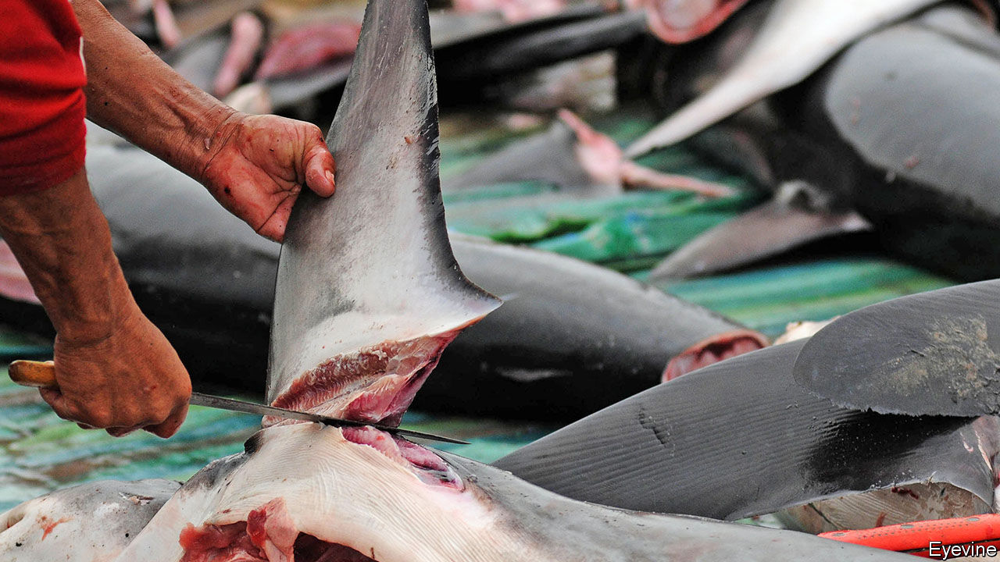

###### Piscine plunder

# Ecuador, a victim of illegal fishing, is also a culprit 

##### Endangered species of shark are caught in Ecuadorean nets 

 

> Nov 21st 2020 

ON MAY 4TH customs officials in Hong Kong impounded the largest illegal haul of shark fins in the territory’s history. The documents declared the cargo to be dried fish, but they were in Spanish, not English, which aroused suspicions. Officials found 24 tonnes of fins, most from endangered species such as thresher sharks, with a retail value of $1.1m. They came from Ecuador.

Ecuador portrays itself as a victim of illegal, unregulated and unreported (IUU) fishing by Chinese trawlers near the Galapagos islands. In fact, its fishing industry is just as bad, says Max Bello of Mission Blue, an NGO based in California. Ecuadorean vessels fish illegally in protected areas such as Colombia’s Malpelo sanctuary and Costa Rica’s Cocos island. Since 2018 at least 136 large Ecuadorean fishing vessels have entered the Galapagos islands’ reserve, which covers 133,000 square km (51,000 square miles), says the director of the archipelago’s national park.


Consumers in Quito and other inland cities buy shark meat thinking it is sea bass. Many boats illegally transfer their catch on the high seas to larger vessels, which carry them to other markets. Under Ecuadorean law fishermen can sell endangered species like sharks or turtles if they catch them unintentionally. Some boats report half their catch as by-catch.

The world is taking notice. Last year the National Oceanic and Atmospheric Administration, an American government agency, accused Ecuadorean fishing companies of violating international conservation agreements. The European Union, the biggest buyer of Ecuadorean tuna, has told the country to step up action against IUU or risk losing access to its market. In 2018 a committee within CITES, an international convention on trading in endangered species, recommended that its 183 members suspend trade in fish with Ecuador.

Its government is incapable of reining in a powerful industry. Fishing companies employ 100,000 people, and contribute $1.6bn a year, 1.5% of GDP, to the economy. Ecuador’s tuna fleet, the largest in the eastern Pacific, has around 115 large mechanised ships. The rest of the fishing industry consists of more than 400 semi-industrial vessels and nodrizas, small boats with no machinery that catch a greater variety of fish. Fishing gets special treatment from the government. It often issues permits for export of shark fins to Peru that do not comply with CITES standards, says Oceana Peru, an NGO. Allies of the industry hold important posts at the vice-ministry of aquaculture and fishing. Some have seats in the legislature.

Operators of Ecuadorean-flagged tuna boats say it is fleets from other countries that are responsible for IUU fishing in or near Ecuadorean waters. They say their by-catch is just 2%. Observers, on board under rules issued by the Inter-American Tropical Tuna Commission (IATTC), a regional organisation, vouch for that claim. Conservationists do not believe them. Purse seining and longlining, the fleet’s main ways of fishing, often result in high levels of by-catch. The IATTC is a weak organisation, aligned with fishing companies, conservationists say. “It’s like trusting a wolf to be honest about how many sheep it ate,” says an adviser to legislators who want to tighten regulation. Even if by-catch is as low as the industry claims, it is enough to massacre some species.

Still more controversial than purse seining and longlining is the use of fish aggregating devices (FADs). Industrial ships release these into the current that passes through the Galapagos islands’ protected area to attract prey, say green groups. Sometimes they fix goats’ heads on the devices to lure sharks, say Galapagans. Crews track them with GPS and surround them with nets when they leave the protected zones, entrapping turtles, sea lions, manta rays and sharks. Ecuadorean ships deploy more FADs than those of any other country, according to a study in 2015 by the Pew Charitable Trusts.

Nodriza boats are even harder to regulate. They are not required to sail with observers. They smuggle not only shark fins, but also cocaine. Last year Sea Shepherd, a vigilante conservation group, filmed fishermen aboard a nodriza beheading a shark, a practice that is illegal in Ecuador. The fishermen then played with the head for Sea Shepherd’s cameras.

Ecuador’s government tried to crack down, especially after the EU’s “yellow-card” warning. In April the legislature passed a law that increases fines for illegal fishers. Vessels are now prohibited from selling three endangered species of shark, even if they are by-catch, says Jeff LeBlanc, a government adviser. The government has started an advertising campaign to discourage Ecuadoreans from eating shark.

Conservationists say these measures will not work. Ecuador’s coast guard and navy do not have enough money to patrol its seas effectively. Ecuador must improve its rules and enforcement before the EU lifts its yellow card, says an EU official.

Conservationists are urging the government to double the size of the Galapagos reserve. That would cripple Ecuador’s fishing industry, which competes with China’s modern, government-subsidised fleet, says Bruno Leone, president of the National Chamber of Fisheries, a pressure group.

The pain would be temporary, respond advocates of the expansion. Eventually it would lead to an increase in fish stocks and thus to bigger catches. The Galapagos reserve, even though it is poorly policed, has rescued species threatened by overfishing. A bigger one would help the threatened yellowfin tuna population. The critically endangered scalloped hammerhead shark, which mates in the Galapagos reserve, might survive. If Ecuador wants to continue profiting from its marine riches, it will have to protect them. ■

: An earlier version of this story said that scalloped hammerhead sharks lay eggs. In fact, they bear live young. 

