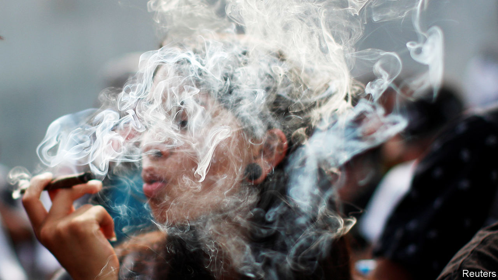

###### Smoke and legislators

# Mexico may become the third country to legalise cannabis 

##### It would be the first with such a strong underworld to take that step 

 

> Nov 21st 2020 

IN THE PUBLIC park outside Mexico’s Senate is a small forest of cannabis. Volunteers are staging a plantón (a punning way to say “sit-in”) to spur lawmakers to legalise weed. They tend to the 1,000 or so plants on Tuesdays and Thursdays, spraying organic insect repellent and picking up leaves. One volunteer, Leopoldo Rivera, calls it “the first non-clandestine plantation” of marijuana in Mexico since the government banned it a century ago. The police did not uproot the seedlings in February, when the plantón began. Some plants are now three metres (ten feet) tall.

On November 19th the Senate began debating a bill that would make Mexico the third country in the world, after Uruguay and Canada, to legalise cannabis for recreational use nationwide. For Mexico, the change seems riskier. It was once the world’s largest producer of cannabis. Campaigners for legalisation are watching how it will go in a country where organised crime is strong, the rule of law is weak and much of the economy is undocumented.


Mexico’s route to legalisation has been unusual, and its arrival may yet be delayed. The president, Andrés Manuel López Obrador, has so far been a bystander. In contrast to the United States, where voters have endorsed reform in state referendums, legalisation has little popular support in Mexico. Surveys suggest that just over a third of voters favour it.

Campaigners have used the courts rather than popular pressure to advance their cause. Anti-discrimination advocates created an opening in 2001 by arguing successfully for adding to the constitution a right to “human dignity”. The Supreme Court cited it in 2008 when it ruled that all Mexicans have a “right to the free development of personality”. The principle has been used to protect unfaithful spouses and posh schoolboys who refuse to cut their hair. Now dope-smokers may benefit.

In Mexico it takes five separate rulings by the Supreme Court to establish a precedent that citizens can invoke to disregard unconstitutional laws. Since 2011 the court has been able to invoke its fifth ruling to instruct Congress to rewrite laws by a certain date. In 2019 it used that power for the second time, directing Congress to revoke laws banning cannabis. The deadline has been extended twice, first because lawmakers could not agree, then because of covid-19. The new one is December 15th.

The jolt of legalisation could provoke gangs to behave even more violently than now. Mexico’s murder rate, among the world’s highest, reached a record last year. Gangs could diversify faster into such activities as kidnapping and cooking fentanyl. But the shock will be smaller than it would have been four decades ago, when cannabis exports were their core business. Americans in 11 states buy cannabis legally for recreational use and will soon be able to do so in four more. They have less need to import illegal Mexican weed. Mexico’s domestic market is relatively small. In 2016 just 2% of Mexicans surveyed admitted to smoking marijuana in the previous year.

The United States’ hard line on narcotics prevented previous attempts by Mexico to liberalise. When, in an early experiment with harm reduction, President Lázaro Cárdenas legalised heroin and opened injecting rooms in 1940, the United States cut off supplies of morphine, a heroin substitute. Cárdenas retreated. In the 1970s the United States began training Mexican pilots to drop Paraquat, a herbicide, on farms growing cannabis. Now, if Mexico legalises, the United States is likely to shrug. President-elect Joe Biden supports decriminalisation (though not legalisation).

The task of complying with the court’s order is being led by Mr López Obrador’s Morena party, an assortment of leftists, liberals and evangelicals that controls Congress. Rather than simply removing the cannabis ban, it has opted to establish a framework to regulate its cultivation and sale. Its details are almost as controversial as the principle of legalisation itself. The bill, which might still be amended, would liberalise cautiously. It would ban advertising and smoking in public. Tokers could possess no more than 28 grams (one ounce), as in California. They would be able to grow up to six plants at home with a permit from a new Cannabis Institute.

The draft law creates a framework for exporting the stuff: as a producer of cheap ganja, Mexico could eventually become a big legal supplier to the United States and Canada. Legal weed would provide the Mexican government with tax revenue. But tax and regulation cannot be too burdensome, lest they drive consumers back to the illegal market.

Regulations, such as requiring sellers to be able to trace the product’s origin, will confine the market to enterprises with the money and expertise to obey them. That will give an edge to big Canadian firms, and keep out informal sellers, who make up the bulk of commerce in Mexico. The proposed reform is “totally neoliberal”, says Tania Ramírez, who helped shape the lawsuits that paved the way for legalisation.

Proponents point to social-justice measures in the bill. For five years two-fifths of cultivation licences will be reserved for farmers in municipalities that were subject to weed-eradication schemes. But to get those licences growers may have to install security cameras, barbed wire and the like. That would keep out poor farmers, says Catalina Pérez Correa of CIDE, a think-tank.

Morena’s leaders expect the bill to pass quickly through the Senate, and then the lower house. A possible obstacle is Mr López Obrador, who opposes legalisation for recreational use. Although he has said he will let the legislature decide, he could end Mexico’s marijuana dream, for a while, with a disapproving glance. The obligation to legalise would remain, but the deadline might be pushed into next year. Until Congress acts, cannabis will sprout outside its upper chamber, and outside the law.■

