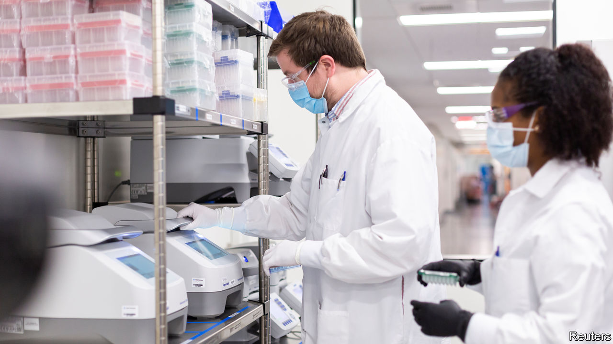
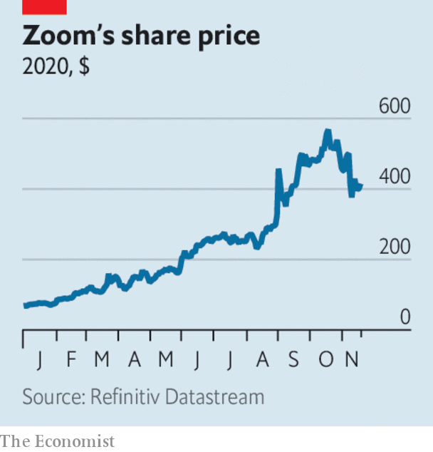

###### 

# Business this week 

#####  

 

> Nov 21st 2020 

Pfizer and BioNTech said further data showed that their vaccine for covid-19 was 95% effective, and similarly efficacious in people over 65. They will soon ask regulators in America and Europe for emergency approval of the treatment. That came after Moderna reported that its vaccine was 94.5% effective in an interim analysis, the second breakthrough in potentially preventing the disease in just over a week. Moderna’s advantage is that its vaccine can be stored at refrigerated temperatures of between 2C and 8C for 30 days. The shots being developed by Pfizer and BioNTech need to be transported at -70C and last less than a week in refrigerated conditions. See .

 


The good news on vaccines is bad news for the share price of Zoom, one of the star performers in tech stocks boosted by remote working. It is not just office staff who are stuck indoors. Zoom is making its video-chat service entirely free on Thanksgiving Day so that families can catch up for longer; free meetings are usually limited to 40 minutes.

Amazon launched an online pharmacy in America that offers discounts of up to 80% to subscribers to its Prime programme, assuring customers that their health data would be kept confidential and separate from other information. The share prices of big pharmacy companies, such as Rite Aid and CVS Health, swooned in response.

Australia, New Zealand and 13 Asian countries, including China, signed the Regional Comprehensive Economic Partnership. The trade deal is limited in scope, joining together a patchwork of existing free-trade agreements, and does not include India, which withdrew for fear of being overwhelmed by Chinese imports. But it will produce benefits, raising global GDP in 2030 by an annual $186bn according to one estimate. See .


Jay Clayton decided to step down as chairman of America’s Securities and Exchange Commission by the end of the year. Joe Biden is expected to appoint someone to the job who will be tough on banks.

 PNC, a bank operating primarily in America’s east and south, agreed to buy the American operations of BBVA, a Spanish bank, for $11.6bn. The deal will make PNC the country’s fifth-largest commercial bank by assets (though still some way behind the big four). Meanwhile, more consolidation in Spain’s banking industry beckoned when BBVA said it was in talks to merge with Sabadell, a rival. See .

Airbnb filed the prospectus for its long-awaited IPO, which is expected in December. DoorDash, a food-delivery service, also published a prospectus for its stockmarket flotation, also expected next month. See articles on  and .

Cleared for take-off

The Federal Aviation Administration gave its approval for Boeing’s 737  max aircraft to fly again in America, 20 months after the fleet was grounded following two crashes. The 737 MAX won’t take to the skies immediately. Among other things, airlines based in America must still get the FAA’s all- clear for revised pilot-training procedures for the plane.

With flying curtailed during the pandemic, easyJet reported a £1.3bn ($1.7bn) annual loss, the first in its 25-year history.

The British government brought forward to 2030 the date by which the sale of new petrol and diesel cars will be banned. It forms part of a new “green industrial revolution” strategy, which includes energy-efficiency measures and a huge boost to offshore-wind power. Critics said the plan would need more money, not least for charging points for the millions of electric cars that drivers are supposed to buy. See .

Japan’s economy grew by 5% in the third quarter over the second, though year on year it was 5.8% smaller. Consumption bounced back, but business investment fell again.

Four astronauts were transported to the International Space Station aboard the Crew Dragon spacecraft built and operated by SpaceX. NASA described it as the first operational flight of the spacecraft. Two astronauts who took the trip in May, the first to be launched from American soil since 2011 and the first from any country to reach orbit in a vessel designed and operated by a private company, were conducting tests.

Swire Pacific was dropped from Hong Kong’s Hang Seng stockmarket index. Founded in 1816, the conglomerate used to be synonymous with business in the territory and is still the largest shareholder in Cathay Pacific. Its replacement in the index is a food-delivery app.

Respectability at last

Having previously been spurned by the S&amp;P 500, Tesla is to be included in the indeX from December 21st. Fund managers that track the S&amp;P will now have to buy the electric-car maker’s stock for their portfolios. The share price has soared this year, and surged again on the news. Tesla will be one of the biggest companies by market value in the S&amp;P 500 when it joins.

