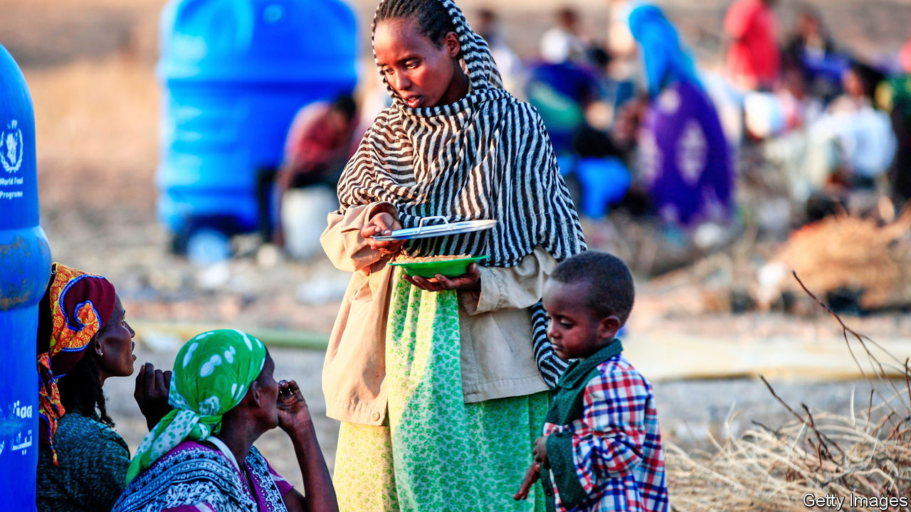
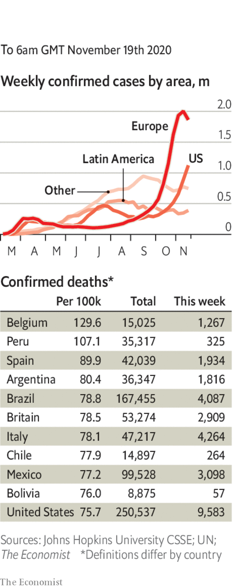

###### 

# Politics this week 

#####  

 

> Nov 21st 2020 

Government forces in Ethiopia said they had captured key towns on the road towards Mekelle, the capital of the rebellious province of Tigray. The civil war has spilled across the border into Eritrea and led to an ethnic massacre. The government has resisted calls for talks or mediation. Tens of thousands of refugees have fled into Sudan. See .

Russia said it would build a naval base in Sudan, adding to a “great power” rivalry that has already seen the establishment of American and Chinese naval and air bases on the Red Sea.


Shooting broke out between Morocco and the Polisario Front, which is fighting for the independence of Western Sahara, after rebel forces blocked a key highway. The UN, which monitors a ceasefire, called for restraint.

Egypt unearthed more than 100 intact sarcophagi and other artefacts dating as far back as 2,500 years from the necropolis of Saqqara, near Cairo. In October the authorities revealed dozens of other sealed sarcophagi, most with mummies inside, in the same area.

The UN’s atomic watchdog reported that Iran had restarted advanced centrifuges installed underground at Natanz, a nuclear site. It also said that Iran had more than 2,440kg of low-enriched uranium, well beyond the limit set by the nuclear deal it signed with world powers in 2015. Both developments move Iran closer to producing a bomb, an ambition it denies. Donald Trump reportedly asked his advisers for options on attacking Natanz.

America announced that it would reduce its forces in Afghanistan from 4,500 troops to 2,500 by mid-January. That will allow Mr Trump to say he has ended America’s longest war, but could have dire consequences for Afghanistan’s stability. Troop numbers in Iraq are also to be cut. See .

A report by the inspector-general of Australia’s armed forces found that at least 39 people in Afghanistan had been unlawfully killed by elite troops in a culture of “blooding” that treated killings as a rite of passage. In some cases weapons had been planted on the bodies of the victims to justify shootings. The report recommended that police investigate 19 former or current soldiers.

Thailand’s parliament, one chamber of which was appointed by the leaders of a military coup in 2014, rejected the idea of curbing the powers of the monarchy. At the same time, the authorities used greater force to disperse protests in Bangkok against the military-led government and the monarchy.

Manuel Merino resigned as Peru’s president after five days in the job. He took office when Congress removed President Martín Vizcarra. Mr Vizcarra’s departure sparked protests and a police crackdown in which at least two people were killed, prompting Mr Merino’s resignation. He has now been replaced by Francisco Sagasti, who is expected to serve until after an election next April. See .

America’s Justice Department dropped charges of drug-trafficking and money-laundering against Salvador Cienfuegos, a former Mexican defence minister, so that Mexico can investigate him.

Hurricane Iota, the strongest storm ever to strike Nicaragua, made landfall close to where Hurricane Eta hit the country this month. Iota is the 30th named storm of the Atlantic season. It is the first to strike Colombia at category-five force and has also hit Honduras and El Salvador.

Most candidates supported by Brazil’s far-right president, Jair Bolsonaro, failed to win office in the country’s local elections. Established politicians from the centrão, a bloc of centre-right parties, did well, in contrast with their performance in national elections in 2018. The president himself remains popular thanks to big spending on poor people.

Dominic Cummings, the chief adviser to Boris Johnson, Britain’s prime minister, left his job amid a power struggle at Downing Street. Speculation swirled that Mr Cummings leaked lockdown proposals and briefed against his boss. A master in the art of outmanoeuvring the executive (Mr Cummings was the strategist behind the Brexit vote), his uncompromising style finally forced his exit. Separately, Mr Johnson announced the biggest boost to British defence spending in 30 years. See .

An agreement on a €1.8trn ($2.1trn) budget for the EU, including a special covid-19 recovery fund worth €750bn, hit a new snag as Poland joined Hungary in threatening a veto because the package contains provisions that require recipients to abide by EU standards on the rule of law. But there is still optimism that the deal will be agreed to by the end of the year, when the existing seven-year budget expires.

In America’s election Joe Biden was deemed the winner in Arizona and Georgia, bringing the final tally in his electoral-college votes to 306 to Donald Trump’s 232. In Georgia, one county found 2,600 ballots it had overlooked.

Still not conceding the race, which hinders the smooth transfer of power to Mr Biden, Mr Trump sacked the official overseeing cyber-security at the election, who had contradicted the president’s claim that the vote was fraudulent. See .

Coronavirus briefs

 


The number of deaths in America passed 250,000 and the tally of cases hit 11m. New York City closed its schools again. California’s governor said he was “pulling the emergency brake” on reopening.

South Korea, which has been widely praised for bringing the disease under control, tightened social-distancing measures after reporting 200 fresh cases for four straight days.

With growing pressure on intensive care, Sweden lowered the number of people who can gather together to eight. In Denmark the agriculture minister resigned over the recent order to cull 17m mink, which had no legal basis.

The quarantine rules for foreign poultry workers were relaxed in England to ensure there is enough turkey on the table at Christmas. Stuffed in their accommodation, they can mix only with fellow workers.

