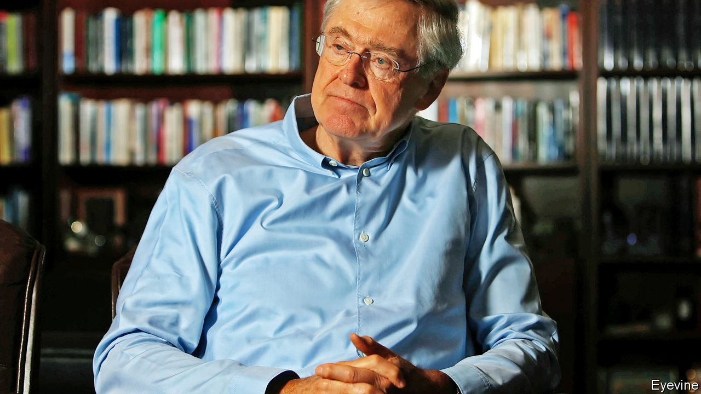

###### My Kochtopus teacher

# Charles Koch offers partial regrets for his partisan ways 

##### One of the biggest political donors on the right issues a sort of mea culpa 

 

> Nov 19th 2020 

“BOY DID we screw up. What a mess!” Towards the end of his new book, Charles Koch, the billionaire owner of Koch Industries, the second-largest private firm in America, offers this surprising mea culpa. For years he gave extraordinary sums to Republican campaigns, encouraging partisan confrontation. (He and associates probably guided over $1bn in political spending in the past decade). Today he would like readers to know that he boobed. He says he picked the “wrong road”.

The wizard from Wichita is too coy to set out in detail what he, his late brother David, and their political action committee, Americans For Prosperity (AFP), were up to. Soon after the election of Barack Obama, he writes, “we started engaging directly in major party electoral politics”. They mostly funded enthusiasts for the Tea Party movement. This fostered tribalism and weakened moderate Republicans. Mr Koch now regrets that this meant most efforts at bipartisan co-operation amount to “a sick joke”. He worries, too, that such dysfunction is pushing youngsters to favour socialism.


What is behind his admission? In “Believe in People”, he claims his goal was “not to toot my own horn”. Yet he must have noted the widespread, unflattering, coverage after his brother David died last year. The 85-year-old knows his own reputation is toxic on the left, for his hostility to Obamacare and ongoing denial of climate science. He has also lost standing on the right, where politicians mostly prefer the big-spending populism of Donald Trump. The author—who does not mention the president—is dismayed by most of his policies: the increases in tariffs, the tendency to pick corporate favourites, the curtailment of legal immigration.

His writing is a mix of family memoir, stories of corporate good deeds and calls for government to shrink so the needy can better tug at their bootstraps. The author seems to argue that philanthropists and well-meaning activists will do most to tackle inequality, deaths from despair, falling life expectancy, racism and other social ills. That won’t change sceptics’ minds about him, but it is rare to hear a prominent figure express such blunt regrets for past actions. He now argues that partnership—such as the First Step bipartisan efforts he backed in 2018 to reform the criminal justice system—achieves more than party confrontation. He has also started sending smaller sums to Democratic candidates.

Mr Koch has not changed his spots entirely, though. AFP poured millions into this year’s elections. These include help given recently to David Perdue, a Republican senatorial candidate in a run-off in Georgia. Meanwhile the AFP’s website brags of how it lobbied to get Amy Coney Barrett installed quickly on the Supreme Court last month (to Democratic fury), just as it pushed for Brett Kavanaugh two years ago. A road once taken can be hard to leave again.

