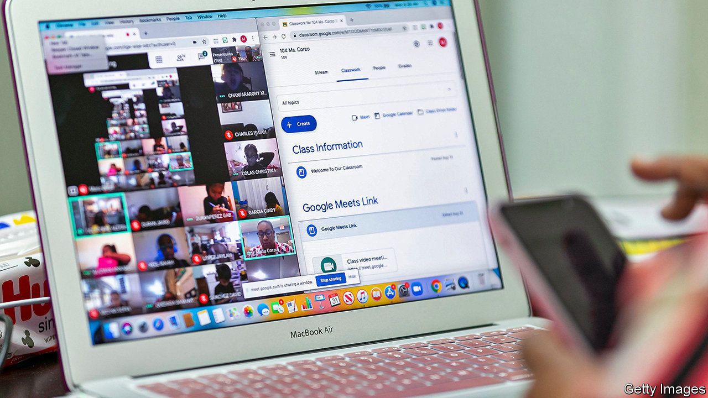

###### Crash courses

# Charter-school networks are outperforming traditional public schools 

##### Their edge in America now extends to online schooling, too 

 

> Nov 19th 2020 

NEW YORK CITY’S schools may be closing, but the pupils at Success Academies, a network of charter schools which has placed all of its 20,000 pupils in remote learning, will still be wearing their uniform (vivid, pumpkin-orange shirts with navy trousers) every day of the week. Unlike traditional public schools in the city, which reopened eight weeks ago but are now closing as covid-19 cases spike, Success has remained all-virtual. Just as with their in-person offerings, high-performing charter networks have managed to create an exemplary virtual programme that other schools are starting to learn from.

Eva Moskowitz, the founder of Success, compares the logistics of arranging high-quality remote learning to the D-Day operation. Children needed laptops, science kits, and noise-cancelling headphones. The 7% of her pupils who live in homeless shelters needed internet hotspots. “Remote 2.0’s” curriculum is continuously refined. Ms Moskowitz tweaked the school schedule, usually sacrosanct, to make more time for small-group learning. Unlike many schools, Success did not abandon learning standards or live teaching after closures started in the spring. It required pupils to snappily start school on time and in uniform. If a child is not at her screen by 9am, parents are called.


This approach has achieved “striking success in the face of the viral challenge,” notes a report from the Thomas B. Fordham Institute, an education think-tank. Like Success, Uncommon Schools, another high-performing network with 21,000 pupils, has now made much of its virtual curriculum available free online. At least 227,000 people from every state in America and 92 countries have used the materials. Anyone can log in to download lessons given by its best teachers. One family in Washington, DC, even sought to enroll their child virtually, despite being hundreds of miles from the nearest Uncommon school.

As much as Success, which also shares virtual lesson plans and webinars, and Uncommon are engineering a new model for remote learning, virtual learning is still a pale imitation of in-person instruction. “I want to get back on campus so badly, says Ms Moskowitz. “It’s just not the same on Zoom.” With covid-19 infections accelerating, though, that might not happen for a while.

