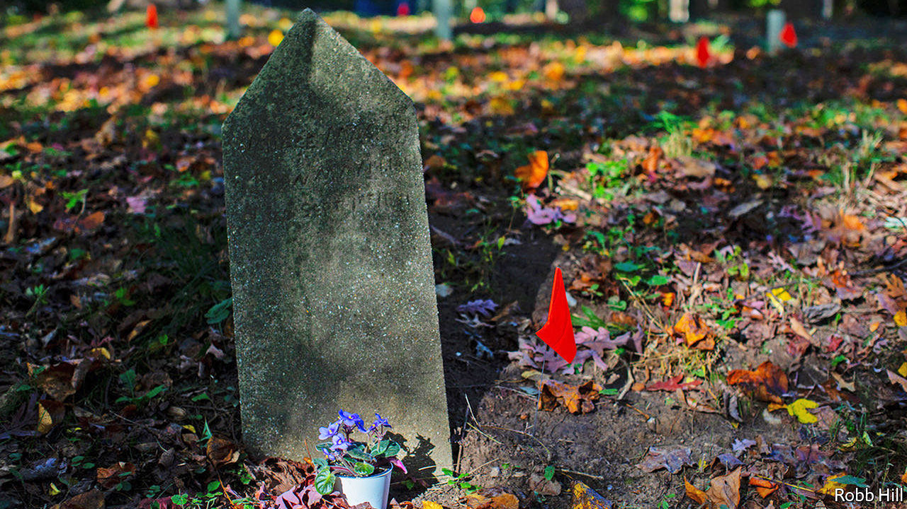

###### Black tombs scatter

# Should development be stopped to preserve African-American cemeteries? 

##### Washington, DC, like other southern cities, is confronting the question more often 

 

> Nov 19th 2020 

WHEN CHARLOTTE TROUP LEIGHTON first looked around her house, in the Maryland suburbs of Washington, DC, she was drawn to the small wooded meadow that lay behind it. Brambly and overgrown, it formed a picturesque buffer between the house and the thundering multi-lane Capital Beltway beyond. Looking closer, she saw it was dotted with small stones, some engraved by hand, and periwinkle, which is often planted as a ground cover in cemeteries. Though it was not listed, it was an African-American cemetery, established by former slaves in the 1890s.

America has innumerable old African-American burial grounds that have been largely forgotten. The one at the back of Ms Troup Leighton’s garden, which she is now trying to protect from a plan to widen the highway, was established by Morningstar Tabernacle No. 88, the local chapter of a benevolent society set up by former slaves after the civil war. During segregation, it used members’ fees to provide services, from care of the ill and destitute to education and burial. Along with a meeting hall, the foundations of which are still visible, and a church, it formed the heart of a tight-knit black neighbourhood known as Gibson Grove, named after Sarah Gibson, who was enslaved in Virginia before buying land that she donated to the community. She is one of at least 80 people thought to be buried in the cemetery.


By the middle of the 20th century, as the suburbanisation of a once-rural area pushed up property taxes, many had left; today the area is almost entirely white. The community was dealt a decisive blow in the early 1960s when the highway, built to link the capital’s fast-growing suburbs, separated the cemetery and hall from the church. Alexandra Jones, an archeologist who has studied the remnants of the Gibson Grove community, says this pattern, in which highways were driven through the middle of black neighbourhoods, was repeated in many places during the building boom of the 1950s and 1960s.

Today, developers are required to assess whether they are building on graves or historic sites. Yet often they do not. In 2018 the Maryland State Highway Administration published a plan to widen the beltway, potentially disturbing a slice of cemetery land, including parts of the hall’s foundations. Its map did not list the cemetery as a burial or historic site, prompting Ms Troup Leighton and Ms Jones to form a group to protect it. The state is now planning to undertake a survey to establish whether the expansion would destroy any graves.

Across America, the fate of African-American burial sites depends upon the efforts of local campaigns such as this. That may change if Congress passes the African-American Burial Grounds Network Act, which would create a database of historic black burial sites, managed by the National Park Service, and provide funding to research and protect them. It was introduced last year by A. Donald McEachin, a congressman from Virginia, who discovered that his great-grandfather was buried in an African-American graveyard in Richmond which, until a few years ago, was overgrown and strewn with rubbish. The act may become law in 2021.

For an unknown number of burial grounds, the law will have come too late. Earlier this year Richard Stuart, a state senator in Virginia, spotted a headstone in the river that runs alongside the farm he had just bought. He discovered that a two-mile stretch of a barrier, constructed in the 1960s by a previous owner, contained innumerable others. They came from Columbian Harmony, once one of the biggest African-American cemeteries in Washington, DC. It was dug up in the 1960s to make way for development. Many of the graves were moved to a new burial ground in Maryland. But the headstones were sold as scrap.■

