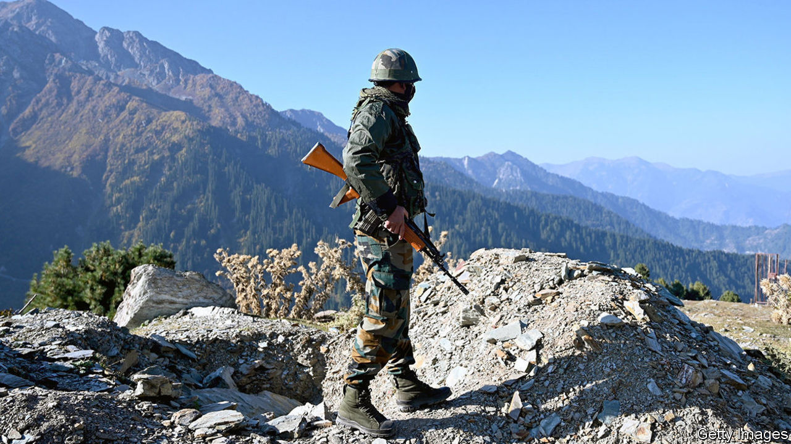
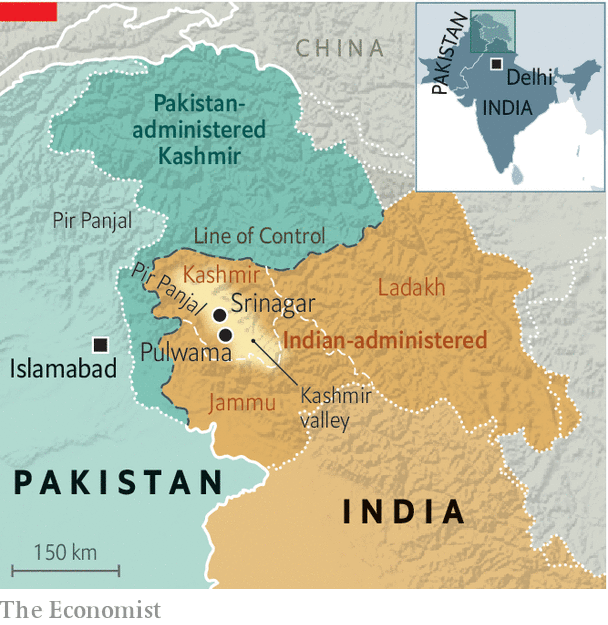

###### Shell game

# Flare-ups between India and Pakistan in Kashmir are getting fiercer 

##### Artillery is often thundering along the “line of control” 

 

> Nov 24th 2020 

THE “LINE OF CONTROL” (LoC) that wends across the rugged valleys of the former princely state of Jammu &amp; Kashmir is something of a bellwether. It marks the spot Indian and Pakistani forces had reached when they agreed on a ceasefire in their war over Kashmir in 1948. If the two countries are getting on relatively well, the mountains are quiet. Soldiers have even been known to meet on the line to exchange sweets and pleasantries on holidays such as Diwali or Eid. When the two countries met on the cricket field, Ajai Shukla, a retired Indian colonel, reminisced in 2013, “each wicket taken or boundary hit would see intense celebratory gunfire—directed at a nearby, or especially vulnerable, enemy post”. But these days the sweets have gone and the shells are flying in anger.

On November 13th India said that four civilians and five members of the security forces had been killed, and 19 injured, in “unprovoked” Pakistani firing across several parts of the LoC. Pakistan in turn said that five of its civilians and one soldier were killed in an “unprovoked and indiscriminate” Indian attack. Both sides said they had given the other a “befitting reply”. It followed an earlier flare-up in April, when drone footage released by India’s army showed alleged Pakistani ammunition dumps and artillery positions erupting like volcanoes, throwing flaming debris into the cool Himalayan sky.


Though India and Pakistan agreed on an informal ceasefire in 2003, it fell apart a decade later. Since 2018 the number of ceasefire violations recorded by the Indian Army has almost doubled, while Pakistan has documented a 10% jump (the figures differ because violations are defined loosely, including everything from a stray bullet to an artillery barrage). Things have been getting steadily worse: in 2019 the Indian army recorded 3,479 violations; the figure for this year so far is over 3,800.

 


In many respects, the shelling follows a familiar pattern. Former Indian and Pakistani officials acknowledge privately that both sides deliberately target not only army posts, but also villages. That grim contest puts Pakistan at a disadvantage: it has more villages and farmland close to the LoC, and its soldiers are averse to pummelling their co-religionists in the Kashmir valley (they have less compunction about Hindu areas to the south). Pakistan says that 170 civilians have been “martyred” and 918 injured since 2017. But the ritual of strike and counterstrike is also evolving. Last year India began pounding targets north of the Pir Panjal mountain range, where villages are closer together and denser, for the first time in years. It also deployed guided missiles, which can destroy bunkers.

“There is no trigger here,” says Moeed Yusuf, an adviser to Imran Khan, Pakistan’s prime minister. “I can’t see any other reason for this but what is happening internally within India.” Last year India revoked Kashmir’s special status, detained local leaders and restricted phone and internet access. Panchayat (village council) elections are planned on November 28th, with tight limits on campaigning.

But General H.S. Panag, who led India’s Northern Command in 2006-08, says that artillery flurries—“Diwali fireworks”, as he calls them—break out for a jumble of reasons. Indian officials often accuse Pakistan of trying to distract Indian soldiers and thus enable militants to infiltrate. Several alleged infiltrators have been killed in gunfights this month, and on November 23rd India said it had discovered a freshly-dug 150-metre underground tunnel. But Happymon Jacob, author of “Line on Fire”, a book on the LoC, points out that the statistical relationship between infiltration and skirmishing is weak. Shells are as likely to alert troops as distract them, after all.

Another explanation is that cross-border fire is a form of punishment. General D.S. Hooda, another former head of Northern Command, says that the LoC deteriorated in 2013 after Indian troops faced a wave of improvised bombs, sniper attacks and even beheadings. “This led to an immediate spike in cross-border firing,” he says. After a big terrorist attack at Pulwama in the Indian part of Kashmir in 2019, for which a group based in Pakistan claimed responsibility, India grew bolder. “After Pulwama, the general policy was to pound them everywhere,” says General Panag. ■

