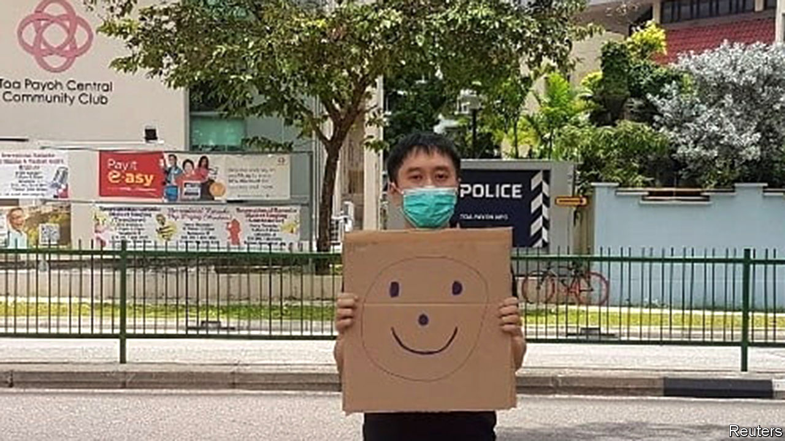

###### A city reels

# Public order in Singapore has been shaken by a hand-drawn smiley face 

##### An activist who stood in a public place with the offending image has been charged with illegal assembly 

 

> Nov 28th 2020 

IN MARCH AN activist named Jolovan Wham stood outside a police station, held up a piece of cardboard with a smiley face drawn on it and got somebody to take a picture. Passers-by, if they noticed at all, might have wondered what he was doing. None reported Mr Wham and his badly drawn emoji to the police—although in retrospect they should have. Indeed, the police themselves remained in the station, apparently oblivious to the dangerous events unfolding outside. But this week the authorities corrected their oversight, charging Mr Wham with holding an illegal public protest. 

In Singapore, smiley faces are not as innocent as they seem—at least not in the hands of a hardened criminal like Mr Wham, who has frequently violated the city-state’s laws. Take freedom of assembly. Would-be protesters, even if they number no more than one, must first secure permission from the police. Mr Wham did not. (The one spot where it is possible to gather without approval from the authorities, Speakers’ Corner, has been closed since March, when many public places were shuttered owing to covid-19.) 


Mr Wham says the smiley-face stunt was in support of two young activists who were questioned by police in March for posting online a picture even more subversive than Mr Wham’s. They were depicted holding placards which urged the city-state to do more to combat climate change. Mr Wham stands accused of breaching the Public Order Act for the smiley-face incident and another in 2018 in which he held up a sheet of paper calling for defamation charges to be dropped against two journalists who accused government officials of corruption. Mr Wham says he will not plead guilty. If convicted, he may be fined up to S$5,000 ($3,725) for each offence. 

Mr Wham has frequently fallen foul of Singapore’s laws in his effort to highlight how “ridiculous and overbearing” they are, as he told the New York Times. He has spent two short stints in jail this year, for “scandalising” the judiciary by alleging that Malaysia’s courts are more independent than Singapore’s, and for hosting an online event which the authorities deemed a public assembly. The webinar featured Joshua Wong, a democracy activist who is in legal trouble in Hong Kong.

Last year police in Kazakhstan arrested a protester for the equally alarming act of holding up a blank piece of paper. But the Kazakh authorities do not have the backbone of their Singaporean counterparts: they soon released the man in question without charge. Eugene Tan, a law professor at Singapore Management University, thinks local prosecutors will have an easy time of it. Mr Wham’s photos were shot in public places and were intended “to draw attention to a particular cause”, he notes. “Those actions get caught under the public-order law.” Alas, the authorities are clearly not cracking down hard enough. Hundreds of Mr Wham’s supporters have posted selfies with smiley faces on social media. Call it a crime wave. ■

