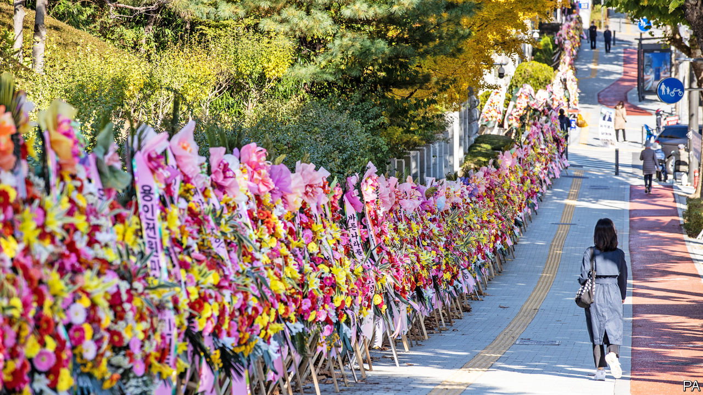

###### Prosecution complex

# South Korea’s president wants to take politics out of prosecutions 

##### But his reforms seem to be having the opposite effect 

 

> Nov 28th 2020 

THE IMAGERY is funereal. The slogans attached to the sides of the vans outside the Ministry of Justice are framed in black, like pictures of someone recently deceased. They read, “Democracy is dead” and “The Ministry of Justice is dead.” The dozens of funeral wreaths made of white and yellow plastic flowers that have been laid against the building’s fence also carry messages. One addresses the president: “Moon Jae-in, you’re going to die.” The majority express wrath for the justice minister: “Choo Mi-ae, you bitch.” Funeral music wails from speakers mounted on the vans.

The protest, organised by a right-wing group which insists that the wreaths’ message is strictly metaphorical, and an earlier phalanx of flowers left at the prosecution service (pictured above) are rather extreme expressions of support for Yoon Seok-youl, the chief prosecutor, whom Ms Choo suspended on November 24th—the first time a justice minister has taken such a step. Among other things, she accuses Mr Yoon of spying on judges hearing cases against her predecessor and of lacking political impartiality. Mr Yoon denies wrongdoing and says he will challenge the “unjust” demotion in court. He says the prosecution service is being unfairly targeted by the justice minister. That implies criticism of Mr Moon, who has made reforming it one of his political priorities.


The life-and-death rhetoric employed by both sides may be overblown, but Mr Moon is locked in a ferocious dispute with prosecutors. He says he wants to stop both the frequent manipulation of prosecutions by the executive and the pursuit of vendettas against government officials by the prosecutors. But rather than ending the tug-of-war, Mr Moon’s approach risks intensifying it, with potentially grave consequences for him and his government.

South Korea’s prosecutors have the power not just to indict suspects but also to launch investigations, a task more commonly performed by the police in other countries. Under the administrations of Lee Myung-bak and Park Geun-hye, Mr Moon’s predecessors, they were accused of using their authority to increase their own standing as well as to align themselves with the political aims of the government when it suited them. They were seen as too soft on powerful politicians and businesspeople, and too hard on those whom they or the president of the day regarded as pesky opponents. Both Mr Lee and Ms Park are now serving long prison sentences for corruption which critics say prosecutors did not scrutinise sufficiently during their time in office.

A central aim of Mr Moon’s reform of the prosecution service, parts of which passed the National Assembly earlier this year, was to put an end to such abuses by limiting prosecutors’ investigative powers. Under the new laws, which took effect in the summer, they are supposed to yield some authority to the police and some to a new agency to investigate government officials and business bigwigs.

Some see an element of hypocrisy in this. Early in his term Mr Moon was focused on breaking the power of big business and remedying the corrupt habits of his predecessor, and made it clear that prosecutors had his support in using their sweeping powers in this effort. “That has made it harder to implement prosecution reform, which involves taking away some of these powers,” says Park Myung-lim of Yonsei University.

Mr Moon appointed Mr Yoon to his post because of his reputation as a hard-nosed, independent prosecutor who did not shy away from cases that the government would rather leave untouched: for instance, investigating the national intelligence service while Ms Park was still in office. Mr Yoon says that the president encouraged him to apply the same scrutiny to Mr Moon’s own associates. He has done so with gusto, particularly when it comes to the officials working to curb the power of his own agency. Cho Kuk, Ms Choo’s predecessor as minister of justice, was forced to resign last year after prosecutors began investigating his family for nepotism and alleged financial irregularities. Ms Choo herself has come under scrutiny for allegedly seeking favourable treatment for her son during his military service.

None of these investigations has resulted in any convictions, prompting accusations from Mr Moon’s supporters that, rather than being scrupulously independent, Mr Yoon is using his powers to undermine the president’s reforms, perhaps to further his political career or to deflect scrutiny from his own associates. (Mr Yoon’s mother-in-law was indicted on charges of fraud on November 24th, following an investigation from which he had to recuse himself.) The government’s critics, however, point to Ms Choo’s repeated interventions in investigations that could become awkward for the government. They charge that the government is reverting to the tactics of its predecessors, using prosecution reform as a pretext to protect the president’s allies. The reform has become “a shield to cover up whatever misdemeanours Moon’s colleagues commit”, asserts Jun Sung-in of Hongik University.

Despite such claims, most South Koreans seem to support the reforms. But the power struggle between Mr Yoon and Ms Choo has done little to turn the prosecution service into a duller, more workaday agency. Mr Park of Yonsei University thinks that Mr Yoon’s suspension may convince the entire prosecution service to take their boss’s side, which would not only defeat the intention of the reforms, but also potentially paralyse Mr Moon’s administration through endless prosecutions. If Ms Choo manages to assert herself, in contrast, the service may revert to doing the government’s bidding, says Park Kyung-sin of Korea University Law School.

For Mr Moon himself, the most important question may be whether the situation increases the danger that he will share the fate of his jailed predecessors. So far, not even his fiercest critics have accused the president of crimes that could match theirs. As his term draws to a close, he may nevertheless find himself under growing scrutiny by prosecutors who are miffed at his efforts to curb their power, yet retain enough of it to cause him misery. ■

