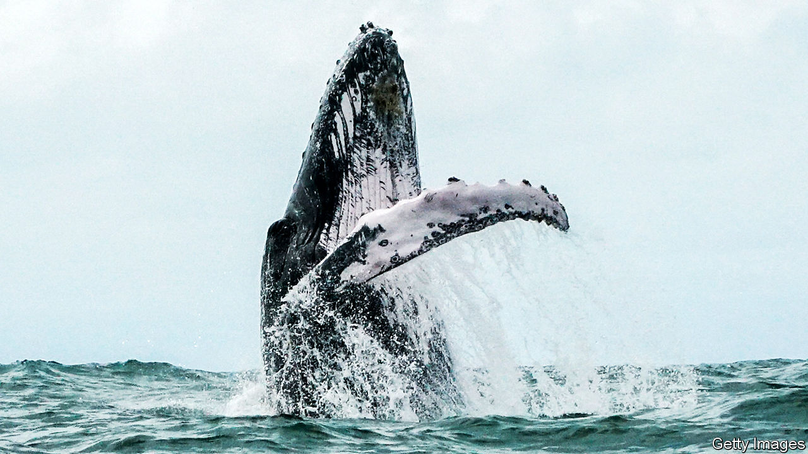

###### Thar she blew

# An elegy for the world’s biggest creatures 

##### An encounter with a dying whale on a beach in Perth set off Rebecca Giggs’s inquiry 

 

> Nov 28th 2020 

Fathoms. By Rebecca Giggs.Simon &amp; Schuster; 352 pages; $27. Scribe; £20.

TWO YEARS ago your reviewer stood in an office overlooking the Pacific Ocean at the Monterey Bay Aquarium Research Institute in Moss Landing, California. Outside, giant pelicans sliced through the sea air. Inside, the walls and windows were shaken by a below-bass note that boomed out of huge speakers. This, said John Ryan, an oceanographer, was the moan of a humpback whale, the darling of whale-watchers, known for its impressive fin- and tail-slapping displays and haunting “song”. Most recordings of humpbacks seem almost violin-like, but this was much, much deeper—barely a sound, more a vibration that was felt rather than heard.


In the opening scene of “Fathoms”, Rebecca Giggs describes a very different kind of encounter with a humpback: on a beach in Perth, Australia, where a young giant had found itself stranded. For three days, she witnessed its enormous mass crushing its vital organs; the blubber that evolved over millions of years to keep the species alive in the frigid abyss now had the opposite effect. The humpback, she says, “was boiling alive in the kettle of itself”.

Stirred by this encounter, Ms Giggs embarks on a poetic exploration of the largest creatures alive today. “Fathoms” is a series of essays that span aeons and vast amounts of space, from the bottom of the ocean to the far reaches of the solar system. The Voyager probe carries a recording of humpback song; ionic bursts at the surface of the Sun ricochet through space, provoke the shimmery displays of the Northern Lights and eventually disrupt the geomagnetic-field maps that whales use to orient themselves. Throughout, Ms Giggs weaves the human and whale stories around a central question: did the conservationists of the late 20th century save the whales from extinction-by-slaughter, only to deliver them to a more insidious demise? From plastics to toxins, warming oceans, melting sea ice, acidifying waters and modified soundscapes, humanity is warping everything that whales need to live and thrive.

Many of these changes are reflected in the whales themselves. Their flesh, guts, blood and even their song are all, in this telling, a record of human activity. One whale is found to have ingested an entire greenhouse. Postmortems performed on others reveal gas-bubble lesions, ruptured ear canals and abnormal nitrogen levels, all of which are eventually linked to anti-submarine warfare training. And after the 9/11 terrorist attacks, researchers who were monitoring stress hormones in North Atlantic right whales (by analysing their faeces) noticed that their subjects had relaxed, presumably because most ships temporarily returned to port and, for that time, the oceans were quiet.

Death runs through the pages. Today it would be impossible to write a book about whales that did not combine a sense of awe with inevitable tragedy. But “Fathoms” is brilliantly full of wonder. A passage lingers on whale lice, describing how, even now, their genes hold traces of an epic migration made by at least one right whale in the past 1m-2m years. Another marvels at how the decimation of whales in the oceans has transformed ecologies on land: the past movements of whaling communities can be traced in aerial surveys of Arctic vegetation, in places made richer and greener by buried giants. A third section asks whether conserving whale populations might help stabilise the climate. Whales draw carbon dioxide out of the atmosphere and down into the abyss, by fertilising tiny plankton with their faeces, as well as when they die and sink to the sea floor.

The tragedy is detached rather than gory. In places it is beautiful. The afterlife of a whale is tracked from the surface, where its floating carcass is pecked, chewed and debrided by scavengers, down through the water column, past fish that resemble “bottled fireworks”, to its resting place on the seabed. There, “the ballooning mass scatters skin and sodden flesh…upon which grows a carpet of white worms.” One “whale fall” feeds entire ecosystems. It jiggles with life—crabs, fish, worms, bacteria. “A whale body is, to this glitter splash of biology, a godsend,” writes Ms Giggs in one of her finest turns of phrase.

When she encounters a live whale, she feels herself shrink to the size of a pinhead yet retains the detachment that she applies, elsewhere, to her observation of dead ones. She does not sense the affinity that others aver. “Only the most witless individual would believe in a benevolent connection with real whales,” she insists. In the presence of leviathan, “the adrenalin in me was the kick of imminent danger.” ■

For more coverage of climate change, register for The Climate Issue, our fortnightly , or visit our 

