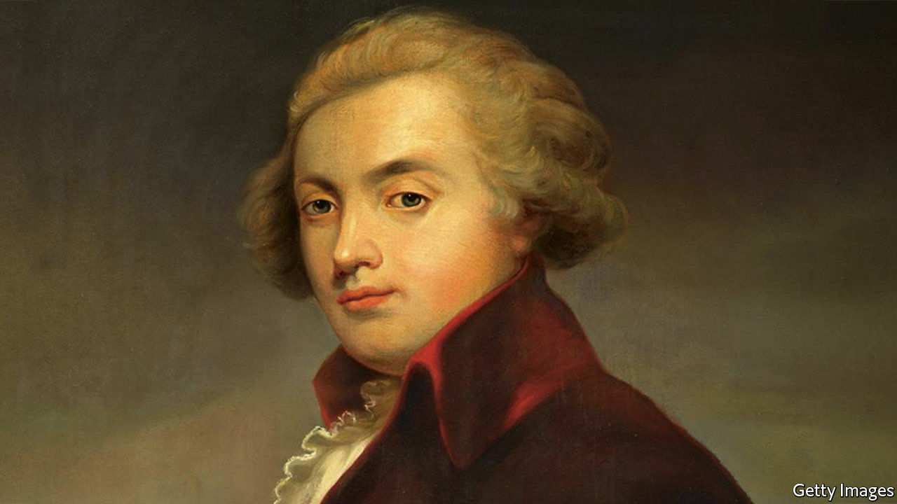

###### Too beautiful

# An exhilarating life of Mozart 

##### Jan Swafford peppers his biography of a genius with astute critical judgments 

 

> Nov 28th 2020 

Mozart: The Reign of Love. By Jan Swafford.Harper; 832 pages; $45. Faber &amp; Faber; £30.

THE MOMENT he saw an organ, Wolfgang Amadeus Mozart knew what to do with it. Aged six, already a prodigy on the clavier, he encountered pedals and stops for the first time in an Austrian church. Within moments he was accompanying mass and improvising freely. In the following year, 1763, an official in Heidelberg was so astonished by his organ-playing that he had a plate engraved for his church to mark the boy’s visit. Mozart composed his first symphony at eight. His father wrote that “every day God performs fresh miracles through this child.”


Youthful promise often wanes. With Mozart the reverse was true: his precocity only hinted at the wonders to come. Through him classical music may have found its most ideal expression. As Jan Swafford writes in his outstanding biography, Mozart’s compositions displayed “a kind of effortless perfection so easily worn that they seem almost to have written themselves”. He drafted quickly, often without needing to revise. He “could dispense delight by the yard”. A man of his time rather than a reactionary like Bach or a revolutionary like Beethoven, Mozart was equally at home composing for the concert salon or the opera stage.

Mr Swafford eschews myths about tortured genius. Mozart, he insists, “was fundamentally a happy man”. Despite his natural gifts, he worked relentlessly to master his art. He enjoyed a contented and loving marriage, and deftly parried his scheming father, who clung to his coat-tails while resenting his success. As he made his life’s journey from Salzburg to Vienna he remained childlike and obscene, fixated on bottoms. Mr Swafford describes “an inexplicable force of nature who could rise from a luminous improvisation at the clavier for a round of meowing like a cat and leaping over the furniture”.

He is the subject of many biographies, but the leading one, by Hermann Abert, is 100 years old and 1,600 pages long. Mr Swafford, himself a composer and a programme-writer for the Boston Symphony Orchestra, offers an updated, accessible and authoritative life, beautifully written and full of astute critical judgments and incisive notes on the works. The overture to “The Marriage of Figaro” is all “quicksilver brightness” and “indefatigable energy”; the Piano Trio in B-flat Major has “only a touch of galant preciousness”. “Eine kleine Nachtmusik” is “crystalline perfection”.

Mozart’s way with melody and keen view of human nature—his letters reveal an almost Dickensian ability to paint character—combined to elevate opera from light fare to a serious medium, the author contends. “His wit, his often-mordant scrutiny of people and their foibles, his fascination with the frenzies of love and lovemaking—all this made him the consummate composer” of the form, Mr Swafford reckons. As his characters scrambled around the stage, lost in the human comedy, Mozart gave them divine arias.

He was admired but not adored in his time. Most of his music adhered to conventional structures yet went over the heads of the average listener. Legend has it that his most important patron, Emperor Joseph II, reacted to one performance with backhanded criticism: “Too beautiful for our ears, my dear Mozart, and monstrous many notes!” Mozart, irrepressible and ever cheeky, supposedly replied: “Exactly as many as necessary, Your Majesty!” ■

