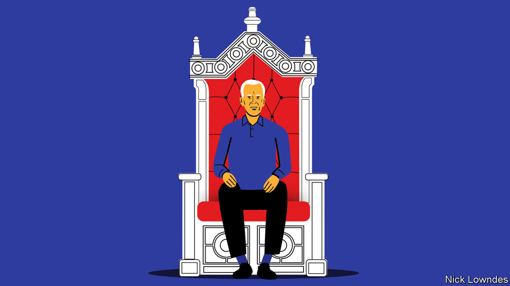

###### Johnson

# The president-elect lacks a silver tongue. That may be an asset 

##### Joe Biden’s prosaic style is a contrast to 12 years of extraordinary rhetoric 

 

> Nov 28th 2020 

DURING THE Obama years, the Onion, a satirical online newspaper, carried a series of articles about a man it referred to as “Diamond Joe” and “The President of Vice”. It featured headlines like “Shirtless Biden Washes Trans Am in White House Driveway” and “Biden Huddling With Closest Advisers on Whether to Spend 200 Bucks on Scorpions Tickets”.

The real Joe Biden, then vice-president, was a teetotaling and avuncular elder statesman, not a hair-metal-loving party animal. But the caricature of him as a regular guy drew on an element of truth. The now-president-elect, the son of a second-hand-car salesman, will be the first president since Ronald Reagan to lack an Ivy League degree, having finished near the bottom of his class at both the University of Delaware and Syracuse University’s law school.


And this is reflected in his use of language. In his speech, he is such an everyman as to defy parody. “Saturday Night Live”, which has featured impersonators for every president since Chevy Chase’s Gerald Ford, has yet to settle on a memorable Joe Biden. Forced to name Bidenisms, you might single out “malarkey”, his favoured disparagement for humbug, or “Here’s the deal”, to signal that he’s about to cut the malarkey. His favourite vocative is the folksy “Folks...”. In his first debate with Donald Trump, perhaps the most arresting thing he said was (to his constantly interrupting opponent) “Keep yappin’, man.”

He is, it is true, known for gaffes, though these are often overstated. Competing with Barack Obama for the Democratic nomination in 2007-08, Mr Biden praised his future boss as “the first mainstream African-American” to run for the presidency, “who is articulate and bright and clean”. (A gap before “who” made clear that he did not mean previous African-American candidates lacked cleanliness, just that they had been less “mainstream”.) While vice-president, he stood just a bit too close to a microphone as he said “This is a big fucking deal” into Mr Obama’s ear at the signing ceremony for their health-care reform. He once asked a wheelchair-bound state senator to stand and be recognised.

These bloopers give the impression of a mouth running faster than a brain. Mr Obama was famous for long, thoughtful pauses; not so Mr Biden. His campaign speeches, like his questions as a longtime Senate committee chairman, tended to ramble. He once mystifyingly called a young student who asked a tough question a “lying, dog-faced pony soldier”. Accused of corruption by a voter in Iowa, a bit of hotheaded “Diamond Joe” came out: he called the man a “damn liar” and challenged him to a press-up contest. And he mused that, were they in high school, he would “beat the hell” out of Mr Trump.

Instead, he beat him in politics, with words rather than fists. As things turned out, the contrasting styles of his predecessors may have made Mr Biden’s deeply prosaic register an asset after all.

Receiving his party’s nomination in 2008, Mr Obama said future generations might remember the occasion as “the moment when the rise of the oceans began to slow and our planet began to heal”. His high-flown rhetoric raised expectations to messianic levels. Dashed hopes led many voters to look for someone who sounded as little like a politician as possible. In 2016 that meant a political novice who eschewed focus-grouped formulations in favour of provocative, often vulgar tirades. Not only did voters not mind; Mr Trump’s outrageous style was hugely effective. His vernacular delivery implied that he was a real boss, not a backslapping hack, with unique skills to get things done. But in office his coarseness turned some voters off, even as it thrilled others.

All that makes this an ideal time for Average Joe, for whom being able to talk fluidly at all was a hard-won achievement. Mr Biden grew up with a severe stutter, which he overcame as a young man. In one of the most touching scenes of his campaign, he told a boy who stutters, “Don’t let it define you. You are smart as hell.” Mr Biden took the boy’s number and called him with some tips that had helped him; later the boy spoke to the Democratic National Convention.

Even careful presidents make gaffes under constant scrutiny. In office, Mr Biden will no doubt give comics plenty of material to sharpen their impersonations. But if he gets tongue-tied or says the wrong thing every now and then, well, so do most people. After 12 years of extraordinary political speech, Americans may be ready for a president who sounds like them.

