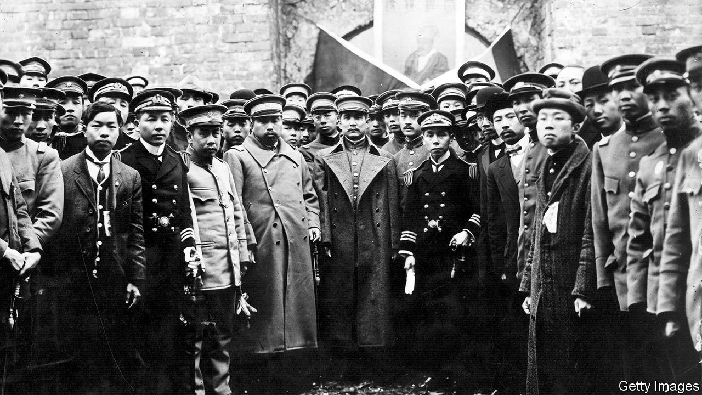

###### Brothers in arms

# When a fraternity of revolutionaries evolved across Asia 

##### A brilliant new history uncovers the underworld of empire 

 

> Nov 28th 2020 

Underground Asia. By Tim Harper.Allen Lane; 864 pages; £35. To be published in America by Harvard University Press in January; $39.95.

IN JUNE 1919 a petition circulated among delegates to the peace conference at Versailles. The “Demands of the Annamite People” claimed to speak for the inhabitants of the part of French Indochina that is today the heart of Vietnam. The petition, Tim Harper writes, was one of many “into which were decanted the hopes of entire peoples”. Its demands seemed moderate enough—things like freedom of the press, the right to education, abolition of government by decree—and it was received politely by Woodrow Wilson and even the president of the French republic.


But its tone, of presuming to speak directly to power, got under the skin of the French authorities, who had built an empire in Indochina on the back of forced labour, while plantations ran their own private prisons. As the document circulated among the diplomatic missions and, within two months, hit the streets of Hanoi, the security services knew that its author, Nguyen Ai Quoc—a pseudonym meaning “Nguyen the Patriot”—was in some way important. They were to maintain that conviction for more than three decades.

Briefly, Nguyen Ai Quoc would break cover, for instance to address political meetings in Paris, scruffily dressed. Yet the expanding secret-police files on him reflected official frustration. He lied about his age, his name, his origins and his profession. He changed his accent to suit. Time and again, Nguyen Ai Quoc slipped like quicksilver through the fingers of imperial powers. His shadow was found in libraries, cafés and boarding houses across France, in port cities such as Singapore and New York, and even in the London suburb of Ealing; one rumour had him as a pastry chef under the great Escoffier. His writings surfaced in illicit journals in China and Korea. But just when the Sûreté Générale picked up his scent again, he was gone.

Nguyen Ai Quoc is emblematic of a global underground of Asian nationalists and revolutionaries that is the subject of this superbly original book. In it, Mr Harper, a historian at the University of Cambridge, describes how in the first decades of the 20th century dreams took hold of a continent freed from imperial shackles—British shackles in India and South-East Asia, Dutch in the Dutch East Indies (modern-day Indonesia), French in Indochina and those of assorted European powers in China. These dreams were nurtured in the liminal cracks of empire: in steerage class along the new steamship routes connecting Asia with Europe and North America, in the doss houses of teeming port cities from Yokohama to Marseille, and among the modernist and radical circles in metropolitan centres such as London and Paris.

“Underground Asia” breaks new ground by showing how a collective consciousness emerged among revolutionaries on this shifting terrain. Some were well-heeled, sent to Europe with imperial blessing for a good education. Sumatran traditions encouraged young men like Tan Malaka to expose themselves to “the largeness of the world”; he went to the Netherlands. Others were more like Nguyen Ai Quoc, whose father, a local magistrate, was cashiered for drunken violence, whose sister hung out with pirates, and who worked his passage to Europe as an ordinary seaman. All nevertheless shared resources and knowledge, made alliances, or “were simply witness to each other, drawing strength from a sense of co-presence”. Activists from China, Japan and Vietnam struggled to understand each other’s speech. But through “brushtalk”—deploying the Chinese logograms common to all their writing systems—they laboriously exchanged ideas into the night.

Back home this wave of consciousness fostered experiments in mass education and political instruction, a new culture popularised by radical “mosquito journals”. It generated a powerful belief that—as Narendra Nath Bhattacharya, the Indian revolutionary better known as M.N. Roy, put it—Europe was not the world.

This was a fluid realm. Western ideas raced back to Asia, transmuting into action. Anarchism, “the quintessential ideology of exile”, shaded into the republicanism of Giuseppe Mazzini and Sinn Fein. At times, Islam claimed to transcend borders.

Back to the future

After Nicholas II of Russia abdicated in 1917, meanwhile, “the tempests of the world outside blew directly into the households of Surabaya and Semarang.” On seizing power, Vladimir Lenin had looked to Europe’s working classes to foster wider revolution. When that hope fizzled, the revolutionary potential of Asian peasantries—whom Lenin, like the colonialists, had hitherto deemed backward—was reassessed. Asian radicals were summoned to Moscow. Nguyen Ai Quoc, M.N. Roy and Tan Malaka were at the heart of what Mr Harper calls the greatest missionary effort in Asia since the Jesuits set out to convert China, India and Japan in the 16th century.

In Asia, and even in imperial homelands, action sometimes took violent form. Assassinations were attempted against the British viceroy of India and the governor-general of French Indochina. In early 1925 a young Chinese woman with the bob-cut of the “Modern Girl”, an attitude popularised in Shanghai and Tokyo before Paris or New York, walked into a welfare office in Kuala Lumpur and coolly tried to blow up two British functionaries.

Such violence aroused lurid fears of a “yellow peril”. In truth, strikes and boycotts targeting economies that required colonial subjects to be both producers and consumers had more effect. But by the late 1920s the authorities had the upper hand. Not least, borders were no longer porous, while the Sûreté and its counterparts had established IDs, fingerprinting and rigorous record-keeping. They recruited narks and watchmen from the same waterfronts and brothel areas inhabited by the revolutionaries. International co-operation was regularised when Interpol was founded in 1923.

Radicals caught in the colonial net were rounded up and sent to detention centres, such as at Port Blair in India’s Andaman Islands or, in the case of Indonesians, to Boven Digoel, upriver in malarial New Guinea. Mr Harper argues that these camps were a harbinger of the kind in which political undesirables would be held in Europe.

After the devastation suffered by even the victorious powers during the second world war, Asia’s revolutionaries saw fresh chances. Some seized the moment and rode to power. Today Nguyen Ai Quoc, he of countless aliases, has one of Asia’s most teeming metropolises named after him: Ho Chi Minh City. Tan Malaka, by contrast, was devoured by the revolution he helped spawn—killed by his own side in the fight against the Dutch and the British.

Yet the lives of both men are testament to an early premonition that, far from being a morass of backwardness requiring firm imperial tutelage, Asia lay, as Mr Harper writes, “at the forefront of human futures”. And so, though many of the revolutionaries he evokes are now forgotten—or, for some Asian nations, too inconvenient to remember—their underground stories still echo through time. ■

