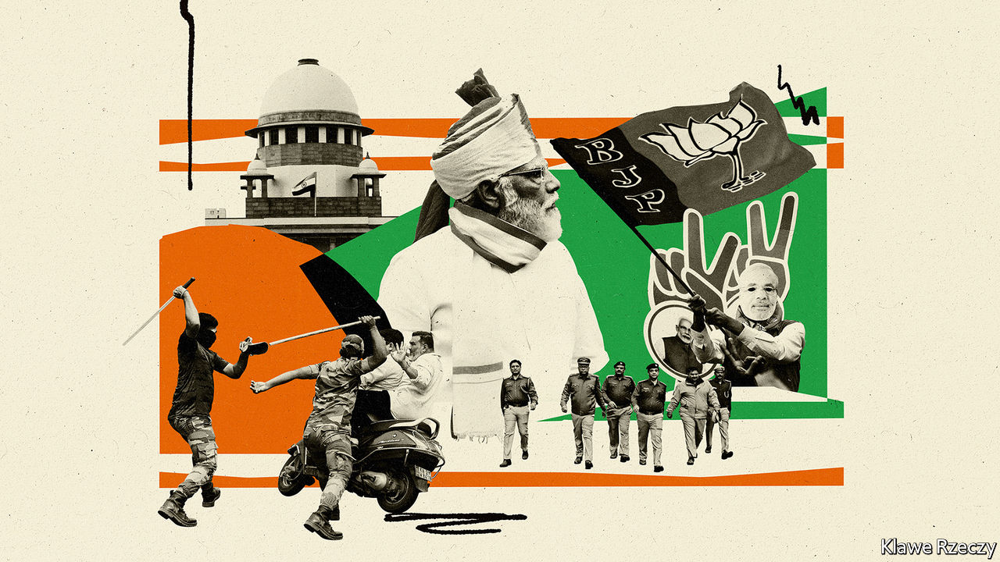
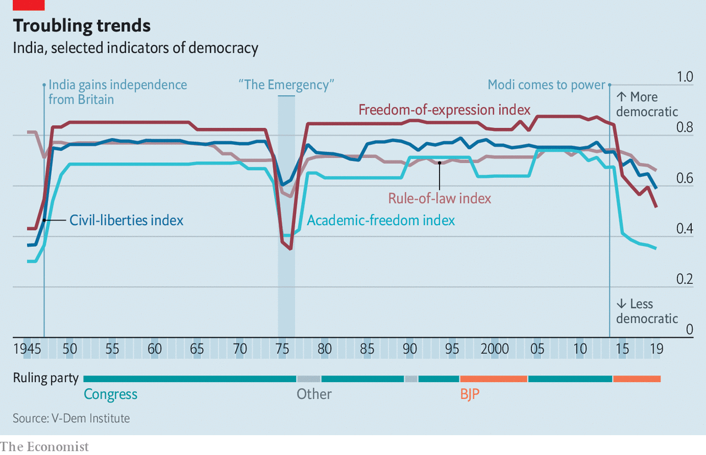
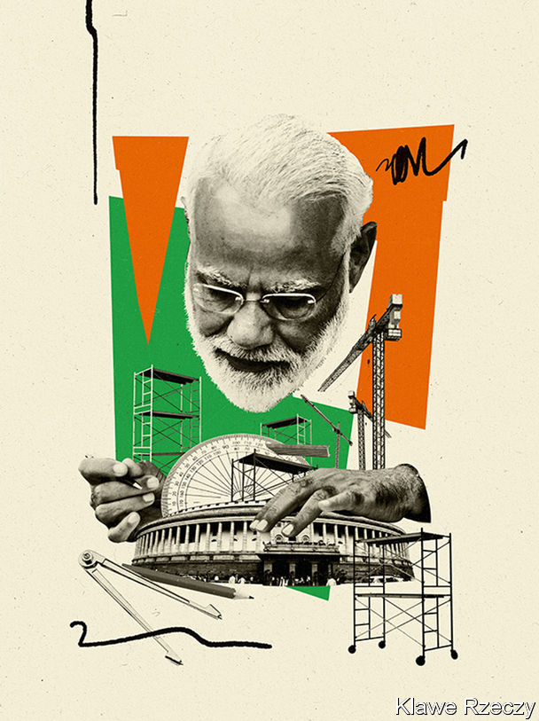
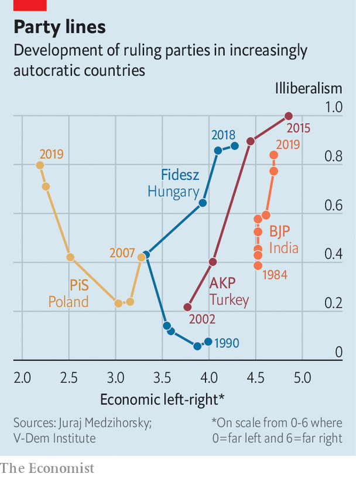

###### India’s diminishing democracy

# Narendra Modi threatens to turn India into a one-party state 

##### An increasingly dominant prime minister and the ongoing erosion of checks and balances 

 

> Nov 28th 2020 

IN EARLY NOVEMBER justices at India’s Supreme Court turned their attention to an urgent plea. Arnab Goswami, a prominent journalist, had been dragged from his home and hurled into jail. Government ministers decried the arrest as an assault on free speech, demanding that Mr Goswami be granted bail. The hearing was brief. “If we as a constitutional court do not lay down law and protect liberty, then who will?” proclaimed one judge. That evening Mr Goswami swept out of Mumbai’s Taloja prison into a rapturous crowd. “This is a victory for the people of India!” he crowed.

But was it? To much of India’s commentariat, Mr Goswami’s case represented not a test of freedom so much as a test of power. On its current trajectory, by all evidence (as the chart on the next page illustrates), the world’s largest democracy is headed to a future that is less, not more free.


Mr Goswami is a controversial figure. He has pioneered a style of attack journalism that makes his nightly television programme look like a show trial from China’s Cultural Revolution. Its victims are often critics of government policy. They are typically reduced to a corner box as Mr Goswami swells into a finger-jabbing prosecutor, denouncing them as “antinational” or, worse, an agent of Pakistan.

What landed Mr Goswami in jail was not something he said, though his tirades against the Mumbai police have indeed enraged the local government, which happens to be opposed to the prime minister, Narendra Modi, and his Bharatiya Janata Party (BJP). The journalist’s alleged crime involved a big unpaid debt to a decorator, who had left a suicide note blaming him, among others, for his fatal distress. “Abetment” to suicide remains an offence in India. The case had been closed in 2019, when the BJP still wielded power in Mumbai, and its reopening smacked of a vendetta.

So the court’s ruling was not surprising. What shocked was the speed of its intervention. Mr Goswami spent just a week in detention, and his case had hardly reached the lowest rung of courts, yet the country’s topmost judges ignored the court’s backlog of some 60,000 cases to schedule a bail hearing within a day of the anchor’s appeal. This is in a country where prisons hold twice as many inmates awaiting trial, some 330,000 people, as they do convicts.

A majority of these “undertrials” come from minority groups and a quarter have spent more than a year behind bars, reckons Leah Verghese, a law researcher. When Mr Modi clamped direct rule on the erstwhile state of Jammu and Kashmir in August last year, thousands of its residents were detained. Out of more than 550 writs of habeas corpus such as Mr Goswami’s that Kashmiris filed, courts have disdained to look at all but a handful.

In the same week that Mr Goswami won his swift reprieve, Father Stan Swamy, an 83-year-old Jesuit priest who has championed rights for tribal peoples and is being held as an alleged Maoist terrorist, made a plea before a lower court. As he suffers from Parkinson’s disease and cannot hold a cup steady, lawyers requested that he be allowed to have a straw in his prison cell. The court postponed the hearing for 20 days.

Even more striking is the courts’ foot-dragging over constitutional questions. In 2017 Mr Modi slipped through parliament a controversial law that created “electoral bonds”, asserting that as a budgetary matter it need not be scrutinised by the upper house, which was not then in BJP control. The Supreme Court still has not examined the constitutionality of this innovation, which allows unlimited, anonymous donations to political parties. Other big questions its judges have yet to take up include the imposition last year of direct rule on Kashmir and some 140 legal petitions against the Citizenship Amendment Act of 2019, which by inserting religion as a criterion for citizenship undermines the secular nature of the Indian state.

Sleepwalking into authoritarianism?

Slow, uneven and arbitrary justice are not new to India. Yet its courts have often tried to check executive power. It was a judge’s ruling that Indira Gandhi, perhaps India’s most powerful prime minister, had cheated in an election that prompted her in 1975 to plunge India into a 21-month Emergency, during which she threw opponents in jail and ruled by decree. Legal professionals now liken the current moment to that darkest period for Indian democracy. “This government has done so much damage to personal liberty,” says Ajit Prakash Shah, a former high-court judge. “But the courts, especially the Supreme Court, have watched this indiscriminate and violent trampling of dissent like mute spectators.”

It is not only the courts, alas, that seem eager to stay in step with the government. Many cogs in India’s institutional machinery are not merely complacent, but have grown complicit in a project that threatens to turn the country into a one-party state. At least during the Emergency the threat was clear, says Tarunabh Khaitan, vice-dean of law at Oxford University and author of a paper, “Killing a Constitution with a Thousand Cuts”, that details India’s institutional decay. “What we have now is a wolf in sheep’s clothing,” he says. “There is no full-frontal big-ticket attack on democracy, but there are multiple, simultaneous attacks on all fronts…We are sleepwalking into authoritarianism.”

Of the ostensibly independent institutions that are now compliant, India’s police stand out. Despite individually humane and honest officers, the impression Indians hold of the force is that its main purpose is to protect the powerful and persecute the weak. A case in point is the Delhi police’s management of communal riots that racked parts of India’s capital for three days last winter, leaving 53 dead.

 


Top officers in the force, which before Mr Modi’s government stopped releasing statistics comprised just 2% Muslims in a city with a 13% Muslim minority, had been filmed standing next to a BJP politician at a rally where he threatened to attack protesters, mostly Muslims, holding a peaceful sit-in against the new citizenship law. During the violence, police were filmed throwing rocks and torturing captured Muslim youths. More than two-thirds of those beaten, shot and hacked to death were Muslim. Yet Delhi’s finest have declined to register complaints against BJP members for incitement. Their investigations have focused on a purported Islamist-Marxist conspiracy to foment unrest in order to embarrass Mr Modi at a time when he was hosting President Donald Trump.

An amendment made last year to the Unlawful Activities Prevention Act (UAPA), a draconian law from 1967 that allows the state to label and then ban groups as terrorist, now empowers the government to designate any individual as a terrorist. The state may hold suspects indefinitely with no right of bail, confiscate their property and implicate any associate as an accessory to terrorism. During India’s harsh lockdown to combat covid-19 last spring, police in Delhi quietly rounded up scores of youths alleged to have been involved in the riots, and charged many under the UAPA.

Having enjoyed a stranglehold on the Lok Sabha, parliament’s lower house, for six years, and more recently acquired control of the upper Rajya Sabha, Mr Modi’s government has passed a slew of other laws not only to expand its powers, but to dilute those of potential challengers. One thorn in its side has been a law from 2005 that upholds citizens’ right to obtain information (RTI) from state officials. Seen as a big advance for transparency in a country where mandarins remained aloof and unchallenged, the law created an independent commission to ensure that requests from the public receive a response. The number of requests runs at over 1m a year.

In 2019 the government amended the RTI law. It reduced the tenure and prestige of the role of the commission’s chief. Small wonder that the commission is rejecting a growing number of information requests from the public, citing “insufficient documentation”, even as the number of pending requests has swollen by 50%. Having frequently neglected to fill empty seats on the 11-person commission, the government in October tapped a journalist whose chief works are two books that glowingly laud the “Modi model” of government.

Such appointments are a prerogative of the executive, one that previous leaders have scarcely been shy of exercising. More unusual under Mr Modi has been his almost axiomatic choice of candidates with Hindu-nationalist credentials, often from his home state of Gujarat, and his insistence on inserting loyalists even into institutions that had been seen as sanctuaries from party politics. Twice Mr Modi has replaced heads of the Reserve Bank of India, the country’s respected central bank, after they expressed less than fulsome praise of his economic policies. As India’s latest comptroller and auditor-general (CAG), Mr Modi reportedly passed over seven senior secretaries from within the organisation and instead parachuted in a retired official from Gujarat. The CAG has a record of honest and incisive reporting, but has raised hackles by exposing government waste.

Modi operandi

In 2016 Mr Modi similarly ignored institutional precedent in the Indian army, lifting General Bipin Rawat over the heads of two senior officers to appoint him its top commander. Last year, following a change of rules that stretched the retirement age, General Rawat was promoted to chief of staff of India’s combined forces. The army maintains a tradition of keeping a distance from politics that makes it almost unique in its region, but observers have detected a growing tendency for officers to weigh in publicly on civilian matters, and retired soldiers whisper reproach against officers for “cosying up” to politicians.

Mr Modi has made a spectacle of his own commander-in-chief role as no other recent prime minister, and also minted electoral gold from pre-election military operations. Helpfully, India’s soldiers have remained silent at useful moments, too. As independent satellite evidence emerged this summer showing that Chinese forces had occupied strategic posts in territory claimed by India along remote sections of the countries’ border, the army steadfastly refused to comment on Indian government assertions that no land had been lost.

Even the impartiality of the Election Commission of India (ECI), with a sterling seven-decade record of managing the mammoth logistics of Indian votes, has come under scrutiny. During the 2019 general election, which Mr Modi won by a landslide, his opponents sharply protested when the prime minister and other top BJP leaders repeatedly escaped serious censure for issuing what amounted to communal dog whistles, whereas the ECI promptly sanctioned rival candidates for lesser infractions of its strict codes of conduct. One of the body’s three top commissioners did object, but was overruled. His family subsequently found itself being investigated for alleged tax evasion. The official quit the ECI before the end of his term.

Given that India continues to run elections that by most standards are admirably free and fair, it may seem churlish to voice fears for its democracy. After all, even as America’s presidential count was mired in controversy in early November, election officials in Bihar—India’s poorest state, with a population of 125m—managed to count the votes without a hitch in less than a day. Like so many others in recent years, that election was won fair and square by Mr Modi’s team, in Bihar’s case in alliance with a local party.

The BJP’s supporters scoff at the notion that its rise under Mr Modi has entailed any subversion of institutions or dilution of democracy. Such protests are merely sour grapes, insists Raghavan Jagannathan, editor of Swarajya, a right-wing magazine. “Our democracy is flawed, but it is a work in progress, not just about the people who are currently in power.” Modi apologists point to disturbing trends in states that are not ruled by the BJP. Kerala recently introduced a law to punish “offensive” speech by up to three years in prison (but withdrew it after heavy criticism). In Odisha, a family with connections to the BJP that owns a television channel critical of the local ruling party has found itself buried in lawsuits.

Indian politics is a game of hardball. The BJP is the world’s largest political machine, with many multiples the energy, organisational strength and financial backing of its rivals. It has a strong leader in Mr Modi, and a strong narrative, however unpalatable it is to many. This contrasts sharply with the vacillation of Congress, India’s previous dominant party. Led by a fading Gandhi dynasty, it has slowly disintegrated. Ghulam Nabi Azad, one of 23 Congress leaders who recently petitioned Sonia Gandhi, the party president, for sweeping changes, says its leadership has lost connection with people on the ground. Its organisational structure has “collapsed”. Indians who loathe Mr Modi are often just as disparaging of Rahul Gandhi, the party’s mediocre current figurehead.

Grand designs in Delhi

In the absence of a strong opposition at the centre, the most effective resistance to the BJP’s dominance lies in state capitals, as well in the press and more broadly in civil society. These bastions are all under heavy assault. Mr Modi’s fearsome chief lieutenant, Amit Shah, the home minister, has made no secret of his determination to topple Mamata Banerjee, a staunch and often vitriolic critic who has run the pivotal state of West Bengal since 2011, in state elections next year. Opposition parties holding slim majorities in other big states, including Rajasthan and Maharashtra, are acutely aware of the BJP’s capacity to “persuade” defectors to its side. This recently happened in Madhya Pradesh, where Mr Modi’s party unceremoniously unseated Congress after luring away a chunk of its deputies.

 


By leaning on the big conglomerates that dominate the mainstream media, by favouring outlets that share its ideology, such as Mr Goswami’s, and by flooding social media with agitprop, the BJP has largely marginalised critical voices in the press. In the past two months, new rules have curtailed the permitted level of foreign investment in online media and placed the entire sector under the authority of the broadcasting ministry. The moves appear to be aimed at getting a grip on one of the main remaining outlets for dissent, say editors at three of India’s increasingly popular news sites. One that specialised in hard-hitting investigative stories, HuffPost India, closed on November 24th.

Compliance regulations regarding foreign donations have already been used to shut down tens of thousands of NGOs. The most recent example is the local chapter of Amnesty International, an advocacy group for human rights. In September the government added onerous filing requirements and rules that forbid larger charities from funding smaller ones.

Mr Khaitan, the Oxford law professor, is not alone in warning that the BJP’s one-sided advantage is subtly changing the nature of India’s game. “We do not have a level playing field any more,” he says. “What we are getting is not quite a one-party state, but certainly a hegemonic state.” The trajectory resembles that in other democracies, such as Hungary, Poland and Turkey, where autocracy is on the rise (see chart).

 


Mr Modi is now taking a keen interest in reshaping Delhi, India’s capital, in more imperial fashion. Following an opaque and hasty process that to no surprise ended with the choice of Mr Modi’s own favourite architect, a fellow Gujarati, as chief designer, the city’s Central Vista, a 3km-long avenue of lawns not unlike the National Mall in Washington, is going under the knife. It will be flanked by ten giant, identical government office buildings. The project foresees the building of a new, expanded parliament, big enough to seat double the 545 MPs that currently sit in the lower house. The old building will become a “Museum of Democracy”. And, naturally, there will be a bigger, fancier residence and office for the prime minister himself.

Another sign of Mr Modi’s direction of travel can be detected in the differing “read-outs” after his congratulatory phone call to President-elect Joe Biden. Among the things that Mr Biden’s team said the two had discussed was a shared commitment to “strengthening democracy, at home and abroad”. In the version from Mr Modi’s office, that bit was left out. ■

