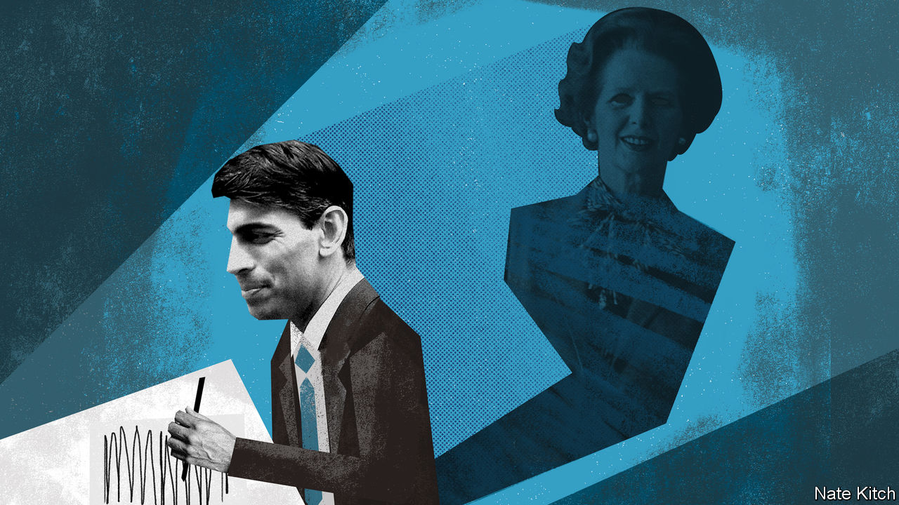

###### Bagehot

# Rishi Sunak, Thatcherite at heart 

##### The spending review did not reveal the real chancellor 

 

> Nov 28th 2020 

RISHI SUNAK is one of the most familiar figures in British politics. An assiduous public-relations campaign has ensured that the newspapers bulge with profiles of him and his photogenic family. Pundits speculate about how long it will be before he moves into Number 10. Economic policy is now associated with his skinny suits and easy smile in much the same way that it was once associated with Gordon Brown’s crumpled clothes and grumpy scowl.

Yet beyond Mr Sunak’s fabulous wealth and professional competence, not much is known about him. There are several reasons for this opacity. His rise has been so swift that he has left few traces. In early 2015 he was just another bored banker looking for a safe Conservative seat. By early 2019 he was a junior local-government minister dealing with public lavatories. From there he vaulted into Number 11.


The Conservative Party’s various factions project what they want onto the young chancellor: social liberals see him as one of their own because he is from an ethnic minority, while right-wingers welcome him as a fellow-Brexiteer. Mr Sunak’s PR team keeps the screen as blank as possible. Revelations that he likes “Star Wars” and Christmas songs have not been followed by disclosures about his philosophy of life or what makes him tick as a politician. But the deeper reason is that Mr Sunak has two warring identities.

The first identity is that of a pragmatist who tacks to the political winds. He got the job of chancellor when his predecessor, Sajid Javid, fell out with Boris Johnson over plans by the prime minister’s now-departed chief adviser, Dominic Cummings, for Number 10 to seize control of economic policy. As an MP for Richmond, in North Yorkshire, who campaigned energetically across the North of England in the December election, he is an enthusiastic supporter of the prime minister’s agenda of “levelling up” the country and consolidating the party’s recent gains in poorer places far from London. When the covid-19 crisis broke, he announced that “this is not the time for ideology and orthodoxy” and that he was willing to do “whatever it takes” to save the country from disaster. His first budget represented “the largest sustained fiscal boost for 30 years”.

The spending review which he delivered with his usual aplomb on November 25th was designed by Rishi-the-pragmatist, whose Keynesian mantra is “we’re prioritising jobs” and who reeled off a mind-boggling list of spending commitments. It was also a very political budget. Mr Sunak boasted of the “highest sustained level of public investment in more than 40 years”, repeatedly nodded to manifesto commitments to build more hospitals and increase police numbers, and conveniently scattered his largesse around marginal northern constituencies.

But there is another, more ideological Rishi. Mr Sunak may be a social liberal who took his parliamentary oath on a copy of the Bhagavad Gita, but he is also a chip off the old Thatcherite block, even down to the stories about working in the family shop. His parents were immigrants who scrimped to send him to Winchester College, one of the country’s best and most expensive schools. He spent his early career in two of the world’s centres of creative destruction—working for Goldman Sachs in New York and studying business at Stanford University in Silicon Valley. He has the same bullish pride in being British as Margaret Thatcher had. He values the country’s institutions—he describes his time at Winchester (where he was head boy) as “absolutely marvellous”—loves cricket and football, and relishes the rural rituals in his constituency. He came out in favour of leaving the EU in 2015, even though the party establishment was vigorously pro-Remain—a brave position for an ambitious new arrival.

He also has the same ingrained enthusiasm for balancing budgets and limiting expenditure as the grocer’s daughter had. He likes to tell the story of how he learned the rudiments of economics, including the importance of things like National Insurance and VAT rates, by helping his mother do the accounts at her pharmacy when he was still at school. In one of his first speeches in parliament in 2015 he noted that tax receipts had remained at around 36-38% of the economy since 1955 and that this suggested a “natural ceiling to what any government can extract from the pockets of its hard-working taxpayers”. In his speech to this year’s virtual Conservative Party conference he vowed to balance the budget in the medium term and spoke about the “sacred duty” to leave the finances strong.

Showing steel

Which Rishi Sunak will dominate in the long term? While interest rates remain low, there will be little pressure for him to balance the books. Even so, the chancellor’s Thatcherite instincts are likely to play a growing role in shaping British politics. There were flashes of steel in the spending-review announcement. Mr Sunak not only froze most public-sector wages and reduced foreign aid from 0.7% of GDP to 0.5% (which would have delighted Thatcher). He also reduced planned spending: excluding emergency expenditure on the virus, he cut more than £10bn a year from departmental spending plans next year. As the economy recovers, the Thatcherite Rishi is likely to become more assertive.

Mr Cummings’s attempt to grab power from Number 11 failed, at least in part because the Treasury has performed so much better than other departments have in the course of the pandemic. Mr Sunak’s reputation in his party and the country has continued to rise as Mr Johnson’s has sunk. He has also acquired a cohort of influential supporters among MPs as his star has risen. Strong chancellors have always used their power in the past to shape policy and the economy. Nigel Lawson was a joint architect of Thatcherism, and Gordon Brown ran a rival domestic administration to Tony Blair. Under Mr Sunak, the ghost of Thatcher, handbag and all, will stalk the corridors of power.■

