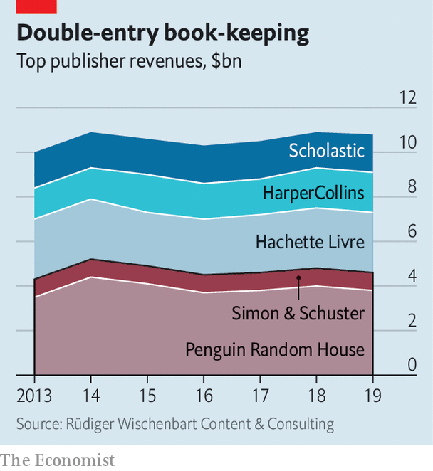

###### Book-binding

# Bertelsmann snaps up Simon & Schuster 

##### The merger will create a new biblio-behemoth 

 

> Nov 26th 2020 

IN THE DAYS before Thanksgiving two top contenders emerged for Simon &amp; Schuster, the fifth-biggest English-language book publisher by revenues, from ViacomCBS, an American media group. On November 25th Bertelsmann gained the upper hand. With an offer of $2.2bn the German parent of Penguin Random House (PRH), the largest publisher by a Tolstoyan margin, outbid News Corp, Rupert Murdoch’s media group, whose catalogue contains HarperCollins, ranked third (see chart).

A merger with Simon &amp; Schuster would give PRH almost one-third of English-language book sales. That is more than double the market share of its closest rival, Hachette Livre, owned by Lagardère, an ailing French conglomerate. (Vivendi, a French group that is Lagardère’s biggest shareholder, also briefly vied for Simon &amp; Schuster.) In America the merged biblio-behemoth would control 70% of the market for literary fiction.


Authors and agents worry that the enlarged PRH may become ever more dominant in distribution—and that market concentration could lead to an excessive focus on bestsellers such Michelle Obama’s memoir of her time as America’s first lady (which was published by a PRH subsidiary) at the expense of niche titles that are no less worthy. Robert Thomson, News Corp’s boss, is certain, for his part, that the Bertelsmann deal will alert trustbusters. Earlier this year America’s Department of Justice thwarted a merger of Cengage and McGraw-Hill, two publishers of educational books. Any delay would be bad news for ViacomCBS, which needs the money badly for investments in video-streaming, where it lags behind rivals such as Netflix, Disney or AT&amp;T, a telecoms giant that owns HBO.

 


Thomas Rabe, Bertelsmann’s boss, says he is confident that regulators in America and other countries will bless the deal. They rarely block mergers that only reduce the number of big players from five to four. The last big union, Bertelsmann’s takeover in 2013 of Penguin, did not fall foul of antitrust guardians. Moreover, the leading five have lost market share in recent years to smaller rivals, not to mention Amazon, which these days not only sells books (as well as just about everything else) but also publishes them.

That still leaves the question of whether the deal is a good one for Bertelsmann. The price was heftier than even ViacomCBS expected. Covid-19 initially hurt book sales, as it did other discretionary spending. “The first five weeks [of the pandemic] were very tough,” admits Brian Murray, chief executive of HarperCollins.

But with their pantries full, self-isolators turned to fiction for escapism and edification. “People are always predicting the decline of book publishing, but it has actually been very resilient,” says David Steinberger, chief executive of Arcadia Publishing, a publisher of history books.

And Simon &amp; Schuster is a prestigious prize. It was originally set up in 1924 to publish crosswords, but went on to represent Ernest Hemingway, F. Scott Fitzgerald and Tom Wolfe. This year it made waves with the publication of “Rage”, a ferocious account of Donald Trump’s White House by Bob Woodward, a far-famed journalist, as well as a tell-all memoir by the president’s niece, a psychologist.

Nabbing Simon &amp; Schuster is Bertelsmann’s second coup in the space of a week. On November 17th American and Canadian readers set a record for first-day sales, snapping up 890,000 copies of a new memoir by Mrs Obama’s husband, also published by a PRH subsidiary. ■

