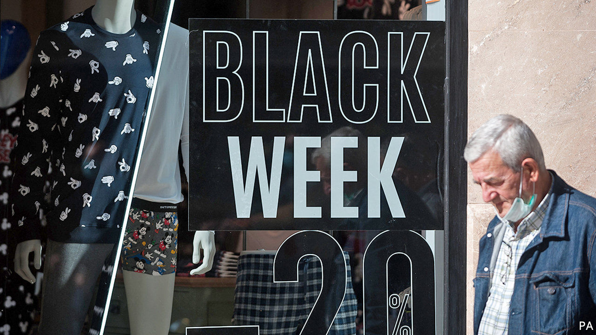
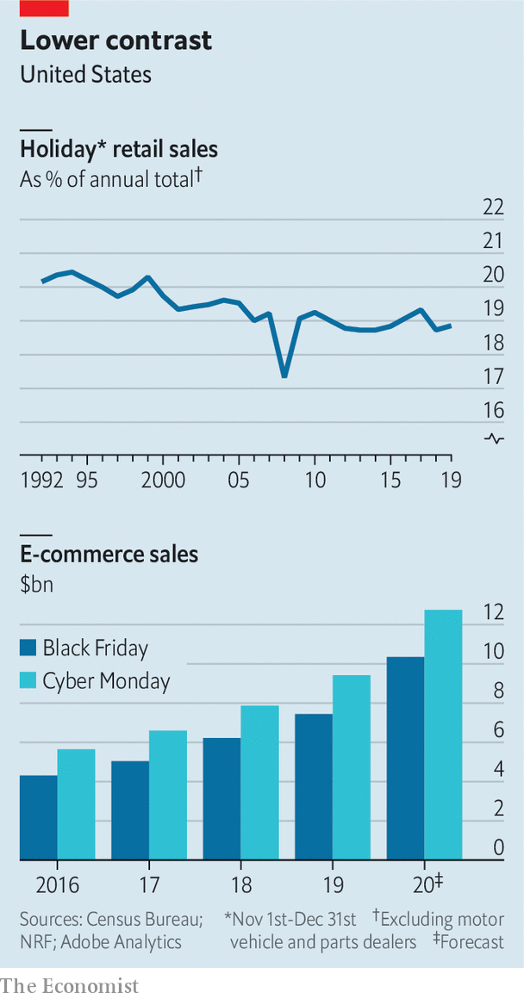

###### Holiday shopping

# Black Friday isn’t what it used to be 

##### The fading importance of America’s favourite shopping spree 

 

> Nov 28th 2020 

OXFORD-DICTIONARY lexicologists recently declared “blursday” a word of the year. Pandemic-induced date confusion extends beyond self-isolating households. Best Buy, a large American electronics retailer, recently declared that “Black Friday isn’t just one day this year—it’s months long.”

The start of the pre-Christmas shopping season, which this year falls on November 27th, has long been a bonanza for American retailers. The term itself is often credited to Philadelphia’s policemen, who used it to describe the pandemonium caused by suburban shoppers and tourists thronging the city ahead of the annual Army-Navy American-football game on the Saturday after Thanksgiving. By the 1980s shops recognised the branding opportunity—and began marking the occasion with deep discounts and “doorbuster” deals to pull people from their turkey-laden tables to shopping aisles.


These days retailers make one-fifth of their holiday revenue, defined as sales in November and December, in the five days from Thanksgiving to Cyber Monday, invented in 2005 by the National Retail Federation (NRF), a trade group, in recognition of an online sales bump on the first working day after the holiday weekend. Black Friday typically attracts more than twice the foot traffic of other annual shopping sprees in America.

This year, though, covid-19 has made many shoppers reluctant to elbow their way to cut-price wedding gowns or TV sets. So large retailers have, like Best Buy, stretched Black Friday from a frenzied 24 hours to several weeks. Walmart, Target and other big-box retailers announced discounts on holiday items as early as October 11th. In lieu of mall Santas and mistletoe, they offered refurbished online interfaces, generous return policies and expanded options for kerbside pickup. Amid the pandemic-induced collapse of travel and other “experiential” spending, some of the unspent dosh is going on stuff instead, notes Jill Standish of Accenture, a consultancy. NRF expects this year’s holiday retail sales to grow by as much as 5% compared with 2019, as friends and families use gifts to show long-distance appreciation.

 


Even if NRF’s forecast proves accurate, however, this year’s haul is unlikely to arrest the stagnation of the holiday shopping season. Its share of annual retail sales faded below 19% throughout most of the past decade, from 20.2% in 1992 (see chart). Online shopping offers perpetually low prices, making one-off discounts somewhat less exciting.

In this light, Black Friday’s in-store stampedes no longer look that appealing. The day’s internet sales have been rising (though Cyber Monday has digitally outshone it since at least 2016). Last year a third of the day’s $23bn trade happened online. Now the share could be closer to a half.

In any case, the idea of squeezing all your bargain-hunting into a day is falling out of fashion. Since 2019 Amazon Prime Day, the e-empire’s signature shopping event, has lasted 48 hours. And this year Singles’ Day, a Chinese extravaganza which normally falls on November 11th, lasted a full 11 days. ■

