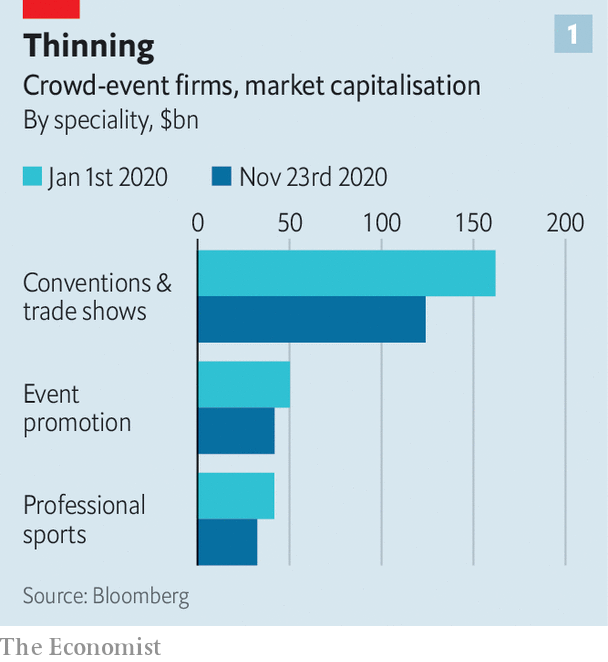
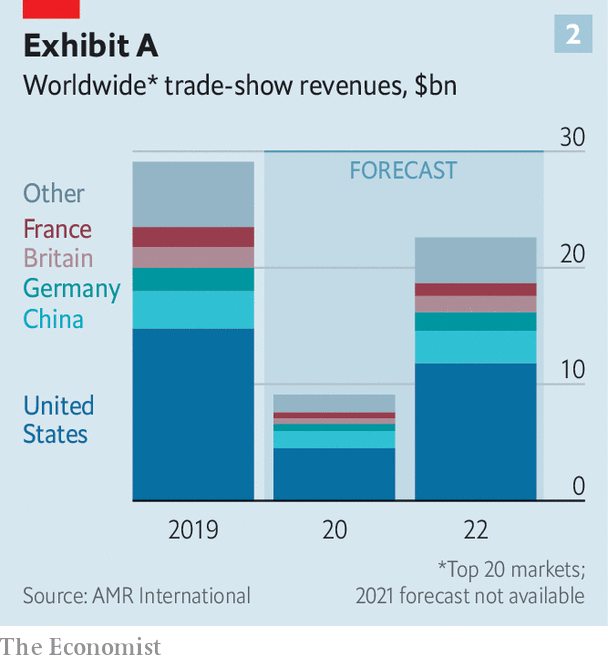

###### Playing on

# Covid-19 and the business of crowds 

##### How sports, music and exhibitions are managing in a time of social distancing 

 

> Nov 26th 2020 

THIS MONTH Britain’s National Exhibition Centre (NEC), the country’s largest events venue, was due to host shows including Motorcycle Live, Simply Christmas and Cake International. Yet instead of being filled with bikes, toys and Sachertorte, the space has been fitted with 380 hospital beds. Covid-19 has wiped out the planned exhibitions, tipped the NEC’s management company into restructuring and caused the government to turn one of its halls into an emergency field hospital.

Social-distancing rules have forced all businesses to think hard about how to keep their customers safely apart. But for events companies the rules pose a particular problem, for these firms’ purpose is to bring people together. Trade shows and conferences lose their value if those attending cannot mingle. Concerts are no fun alone. And the excitement of a goal, slam dunk or home run is not the same without thousands of fans roaring their support. Although stockmarkets have mostly recouped their losses since January, the market capitalisation of listed “crowds businesses” identified by The Economist has sunk from $234bn to $183bn (see chart 1).


Some live-events industries are dealing with the crowds problem more easily than others. But as the pandemic grinds on, it looks as if those that have had the hardest time in 2020 will emerge least scathed when things get back to normal—whereas those that have found ways to adapt may find that the temporary fixes cause long-lasting disruption.

 


Hardest hit has been the exhibitions industry, which makes up nearly two-thirds of the crowds sector’s market value. According to AMR International, a consultancy, its global revenues will contract by two-thirds this year, to $9bn (see chart 2). The outlook is so uncertain that AMR’s analysts have not hazarded an estimate for next year’s revenues.

 


Take the colossal trade-fair centre in Hanover, the size of 60 football pitches. It closed in March and has been empty most of the time since. Deutsche Messe, which runs it, was expecting revenues of €330m ($392m) this year; Andreas Gruchow, a member of its managing board, says that it will end up with about €100m, partly from events it has run in China, which has controlled covid-19 better than America or Europe. A few events have been held in Hanover, following new rules mandating masks, a reduced headcount and so on. But exhibitors “expect the whole world to come to Hanover and visit them at their booth”, observes Mr Gruchow; with international travel on hold, the big fairs are not happening.

Organisers have dabbled online with limited success. Some exhibitions, like Cake International, are best enjoyed in person. Even the liveliest Zoom panels lack the opportunities for networking that justify many conferences’ eye-popping admission price. Exhibitors pay a four- or five-figure fee for a spot in one of Deutsche Messe’s online trade fairs, says Mr Gruchow; for a physical booth at Hanover they would pay up to €300 per square metre, leading to seven-figure bills for the largest participants.

Yet trade fairs’ digital clunkiness will protect the industry from disruption. “You can’t ‘Amazon’ the events business,” points out Marcus Diebel of JPMorgan Chase, a bank. He cites this as a reason for long-term optimism about the industry. RELX, owner of Reed Exhibitions, the world’s second-largest exhibitions company by sales, saw its revenues fall by 70% year on year in the first half of 2020, but its share price is down only 8% since January. That of Informa, the largest, has shot up by a third this month, as successful late-stage trials of covid-19 vaccines have been reported.

Organisers agree that future events will have more digital elements. But a dire couple of years are likely to give way to something much like the old normal. AMR expects revenues to rebound to 78% of last year’s level by 2022.

Pitch-dark

The opposite is true in sport, another crowd-dependent business. After a pause in the spring, most professional leagues have managed to play on, getting round the lack of spectators in novel ways. FC Seoul populated its stadium with mannequins from a sex-toy supplier (and in the process earned a fine from the South Korean football league for indecency). Others have piped in sound, added cardboard cut-outs or CGI spectators. Some have even live-streamed fans’ faces onto screens in the stands, as in WWE wrestling’s new “ThunderDome” in Florida.

Yet the smooth transition disguises disruption that may last. The cost of forgone ticket revenue has been borne unevenly. In the main American leagues teams keep the income from tickets—and the drinks, hot dogs and so on that go with them—whereas leagues get the proceeds of national broadcasting rights. So teams are on the rack. Major League Baseball, with its long season and relatively modest TV deals, is in bigger trouble than the National Football League, which has fewer games and pricier TV rights. The New York Mets, a struggling baseball team that was sold last month, is expected to lose out on nearly $250m in ticket sales this year.

The pandemic has also accelerated changes in how people watch sports at home. The lack of crowds has contributed to a fall in viewership of full games, as fans switch to highlights and new formats. The National Basketball Association (NBA) highlights show on Snapchat, a social app, has had 37% more viewers this year, even as American television ratings for the NBA finals fell by 49%. People are spending more time on betting sites and forums like Barstool Sports, says Brandon Ross of LightShed Partners, a media-research firm. “There are millennials and Gen Z-ers who would rather just sit and watch the Barstool personalities pontificate...than watch the games themselves,” he says.

The decline in whole-game viewing bodes ill for the big sports broadcasters. ESPN, owned by Disney, announced this month that it was cutting 500 jobs amid “tremendous disruption in how fans consume sports”. Its chairman, Jimmy Pitaro, said the company would now focus on “serving sports fans in a myriad of new ways”; some written and audio content has gone behind its paywall.

Lower whole-game audiences will translate into lower advertising revenues for broadcasters and, ultimately, lower budgets for rights deals, “the overwhelming financial engine for sports”, warns Mr Ross. These trends will persist long after covid-19 is defeated.

If the exhibitions industry looks stable and sport is heading for disruption, live music combines both trends. Coronavirus has pulled the plug on concerts. Live Nation, the world’s biggest live-entertainment company, reported this month that its revenues plummeted by 95% in the third quarter, compared with a year ago. CTS Eventim, a European rival, saw its sales slide by 79% in the first nine months of 2020, year on year.

Rather like the exhibition organisers, however, the big music promoters are protected by investors’ faith that mosh pits and muddy festivals are not easily replicable online. Live Nation’s and CTS’s share prices are down by, respectively, only 10% and 15% since February—not bad for firms that have lost nearly all their revenue.

This suggests that live-music companies can outlive the pandemic. The giants should have no problem. Live Nation has nearly $1bn of cash and the same again in undrawn debt facilities, comfortably enough to see it through to next summer. But many smaller operators will not make it. America’s National Independent Venue Association says that 90% of its 2,900 members expect to close permanently without a bail-out. Live Nation will get a chance to sweep them up, entrenching its dominant position.

That does not mean the live-music industry will escape disruption. Early in the pandemic artists, who these days make more money from touring than recording, performed amateurish streaming concerts from makeshift home studios. Online gigs have since become more professional with the help of companies such as Driift and Dice, which organise elaborate streamed productions.

Tickets are much cheaper than those for in-person gigs—entry to an online show this month by Dua Lipa, a British singer, cost €12.99, about a quarter of the minimum that fans used to have to pay to see her in real life. But there is no limit to capacity. And stars can attract concertgoers in places where they would never tour. BTS, a South Korean boy band, staged an online concert last month which brought in almost 1m viewers from 191 countries.

A different tune

There are also glimpses of completely new forms of entertainment. In April Travis Scott, an American rapper, appeared in virtual form in Fortnite, an online video game. Some 28m players attended the free concert as avatars. Experiences such as these are not replacements for in-person live music. But they are the makings of a sub-industry that will supplement the incomes of stars with global followings. Covid-19 has dealt live music a severe blow in 2020, but the resulting innovation could help the industry come back stronger—if, perhaps, a bit less crowded. ■

