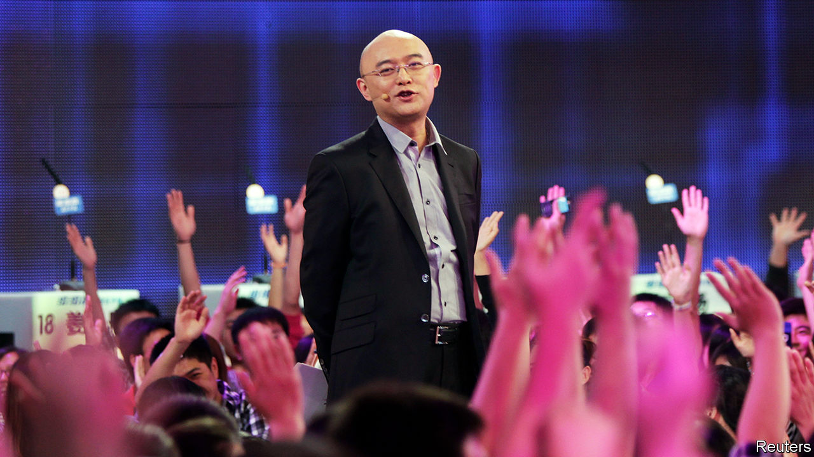

###### Loaded questions

# Officials in China abhor money-worship. A dating show glorifies it 

##### Censors frown on “If You Are The One”, but the programme is wildly popular 

 

> Nov 28th 2020 

FEW CHINESE television programmes command as loyal a fan base as “If You Are The One”, a matchmaking show now in its tenth year. In its early days, some 50m viewers tuned in to each episode—an audience second only to the evening news bulletin produced by the state broadcaster. Today “If You Are The One” is the sixth-most-watched show in China. But this modest dip in its domestic ranking has been offset by gains overseas. Broadcasters in Australia and Malaysia have picked it up. Episodes on YouTube attract millions of views around the world.

Each instalment features a male contestant and 24 prospective female dates. The charismatic moderator, Meng Fei, a former news anchor, invites the bachelorettes to grill the bachelor on any topic they like. The main draw of the show lies in their questions, which often focus on the man’s financial standing. In one of the show’s first episodes, a female participant famously quipped that she would rather “cry in a BMW” than smile on the back of her boyfriend’s bicycle. In another one a woman refused to shake a contestant’s hand because he made less than 200,000 yuan ($30,400) a month.


Such unabashed hankering after wealth on a programme watched by legions of young Chinese made the Communist Party feel uneasy. Media regulators promptly ordered the show to stop “showcasing and hyping up money-worship” on pain of cancellation. The ostensible reason was that glorifying gold-diggers contravened the party’s socialist values. Officials, however, may have been concerned about another danger. Chinese men outnumber women, thanks to sex-selective abortion, so many poor males are doomed to remain single. Reminding them that rich blokes have far more romantic options might make them envious—and angry.

These days, female candidates on the programme are no longer allowed to ask male contestants how much they earn or which car they drive. Hobbies from rugby to rap have become the go-to topics of conversation. Yet “wealth fetishism” remains an undercurrent, notes Siyu Chen, a Chinese scholar. The questions are just phrased more diplomatically. Bachelors are probed about their jobs rather than their salaries.

Tactfulness is not always observed. In a recent episode one bachelorette asked whether the man was willing to subsidise her monthly rent of 6,800 yuan. Incidents like this often prompt angry (male) viewers to dig up and publish private information about the “female offender” on Baidu Tieba, a social-media forum which hosts a fan page for the show containing 16m user-generated posts. Many female commentators ridicule these “insecure” men.

Censors reckon the show could try harder to tone down the money motive. Last year the government published an “Outline for the Moral Construction of Citizens in the New Era”. It identifies “money worship” as a cause of “moral failure”. In February regulators hinted that dating shows were not helping. But “If You Are The One” keeps going. Perhaps officials deem that Mr Meng, the host, has done just enough to restrain his contestants’ impulses. Or perhaps the party reckons that crushing the life out of such a popular show could infuriate people. Enraged citizens may be a more unsettling prospect than people lusting for wealth. ■

