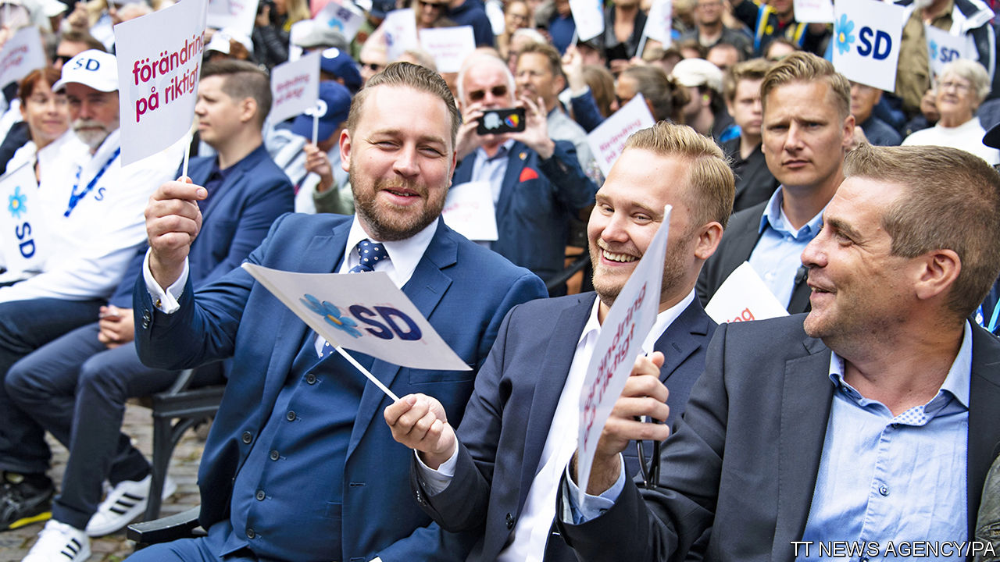
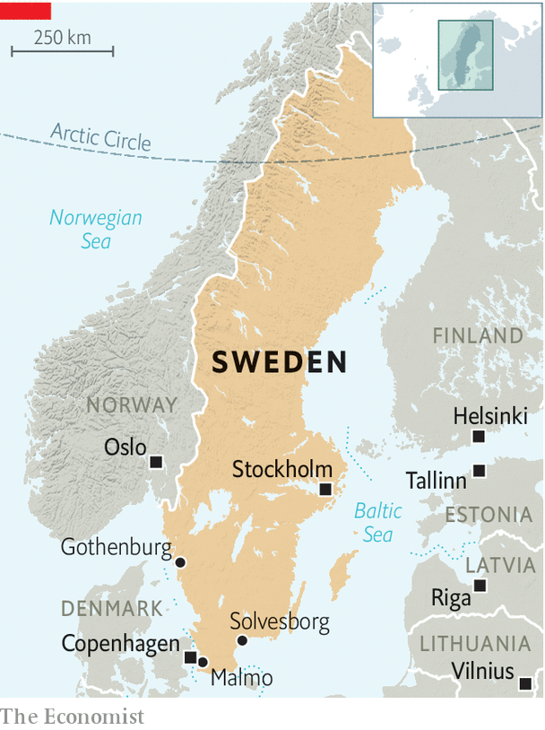

###### On their way in

# How long will Sweden’s nationalists be excluded from power? 

##### The Sweden Democrats’ long-term strategy looks as if it could work 

 

> Nov 28th 2020 

TWO YOUNG men, Andreas Palmlov and Julian Kroon, sit in a bar swapping anecdotes about their native Sweden. The welfare system is so lax that an immigrant drew benefits while serving as the defence minister of Iraq. A lecturer was suspended because students complained that a lesson about fatherhood was heteronormative. And 1m kroner ($116,000) of taxpayers’ cash was lavished on art intended not for human eyes but those of birds and beetles.

Some of the details are disputed. The Iraqi politician, Najah al-Shammari, a Swedish citizen, denies committing benefit fraud. But stories like these help explain why Mr Palmlov and Mr Kroon are members of the Sweden Democrats, a nationalist party. They believe that Sweden is under threat: from immigrants who drain the welfare state, from radicals who undermine traditional values and from an establishment that stigmatises voices of common sense like their own.


Storytelling matters in politics. Voters remember a good yarn more easily than any statistic. And the Sweden Democrats tell a simple, emotive one: that non-European immigrants are ruining Sweden, and a left-wing government is letting them.

In 1988, when it was founded, the party was dismissed as a rabble of neo-Nazis. But since the 1990s it has purged overt racists and cleaned up its image. It gained momentum in 2015 when Sweden opened its doors to refugees, letting in over 160,000 (1.6% of the population), mostly from culturally distant places such as Syria and Afghanistan. The government mishandled the influx, showering the newcomers with handouts but making it hard for them to work. (For example, the de facto minimum wage in shops, hotels and restaurants is nearly 90% of the average wage in those industries, pricing newcomers who are still learning Swedish out of entry-level jobs.) The open-door policy was quickly reversed. But the sight of so many jobless Muslims lent credibility to the Sweden Democrats’ message. At an election in 2018, the party won 17.5% of the vote. To keep it out of power, mainstream parties have had to form unstable coalitions.

 


An upsurge in violence between ethnic gangs (see ) has given the Sweden Democrats another boost. “The majority society is losing control over areas of Sweden,” says Mattias Karlsson (pictured, with waistcoat), an MP and the party’s unofficial chief ideologue. He wants to hire more police, pay them better and swiftly deport foreign criminals. When an Afghan commits a crime in Sweden, he says, “human-rights people say we can’t guarantee his safety in Afghanistan, so they let him out on the streets again.”

An increase in recorded sex crimes “is to a large extent cultural”, says Mr Karlsson, noting that Sweden took in many refugees from sexist countries. Reality is more complicated. Sweden expanded its definition of rape in 2013, and counts it differently from other countries. If a woman says her boyfriend assaulted her daily for a year, Sweden records 365 offences; other countries might record only one. So the claim, common on alt-right websites, that immigration has made Sweden the “rape capital of the world”, is nonsense.

Still, crime rates among refugees really are higher than among native-born Swedes, partly because so many are jobless. Other parties approach the topic gingerly, for fear of sounding racist. The Sweden Democrats have no such hang-ups. “We say what you think,” is their slogan.

The party is planning for the long term. Its leaders swap notes with American Republicans. Mr Karlsson has set up a think-tank. Mr Kroon runs a fast-growing federation for students. Many are “tired of political correctness”, he says, and need “a new home” outside the “opinion corridor” of socially acceptable (ie, left-liberal) views.

At the national level, centre-right parties have resisted the temptation to cut a deal with the Sweden Democrats, though it would give them a swift path to power. But the taboo is fading. Local politicians have already taken the plunge. The Sweden Democrats enjoy power or a share of it in several towns, especially in the conservative south. Some of their local leaders are risibly incompetent. But others are eager to show that they are not scary and can handle the humdrum tasks of government.

The party’s showcase is Solvesborg, a town of 17,000. The mayor, Louise Erixon, is the ex-partner of the party’s national leader, Jimmie Akesson. She is popular, pro-business and unashamedly populist. She boasts of hiring more security guards, banning begging and barring visits to nursing homes to protect the elderly from covid-19. She favours drug tests in schools, and repatriation for immigrants “who refuse to be a part of [Swedish] society”. She accuses the mainstream parties of weakening “good old Swedish togetherness”. She is thought to have national ambitions.

Ms Erixon came to power thanks to a deal with the centre-right Moderate party, whose national leaders opposed it. But a local one, Emilie Pilthammar, went ahead, for bread-and-butter reasons. Ms Pilthammar says she wanted to bring down a cronyist left-wing administration, boost local business and provide more choice in child care. However she later fell out with Ms Erixon, who she says would give councillors only a few minutes to read key documents before making a decision on them—something she says was bad for democracy. (Ms Erixon denies this.)

Mr Karlsson is “very optimistic” that the Sweden Democrats will gain a share of national power, perhaps after an election in 2022. Nils Karlson (no relation) of Ratio, a research institute, predicts that the centre-right will not join a formal coalition with them but might form a looser arrangement, whereby the Sweden Democrats “consent” to a centre-right government in exchange for policy concessions. “That scares me a lot,” he adds.

Meanwhile, the mainstream parties have all but adopted the Sweden Democrats’ policies on shutting out new refugees. Mattias Karlsson’s suggestion that Sweden does not send Afghans back to Afghanistan would come as news to Jacob (not his real name), who was deported last year. His claim to asylum appeared watertight: he arrived in Sweden as a 14-year-old orphan and a member of a persecuted minority. He had fled Afghanistan after his father disappeared (and was probably murdered by the Taliban). He has studied hard, learned Swedish and stayed out of trouble. He is now back in Kabul taking maths classes. “Yesterday when I was in school, a rocket exploded outside. And again today. It’s hard,” he says. The Swedish family who took him in while he was in Sweden, the Winbergs, have found him a permanent job at a trendy vegetarian restaurant in Stockholm. In theory, he should get a work visa and be allowed to return. But Hans Winberg, an academic, frets that the government is doing everything it can to keep refugees out. “The climate has changed,” he says. “This is painful to me as a Swede.” But many Swedes welcome it. ■

