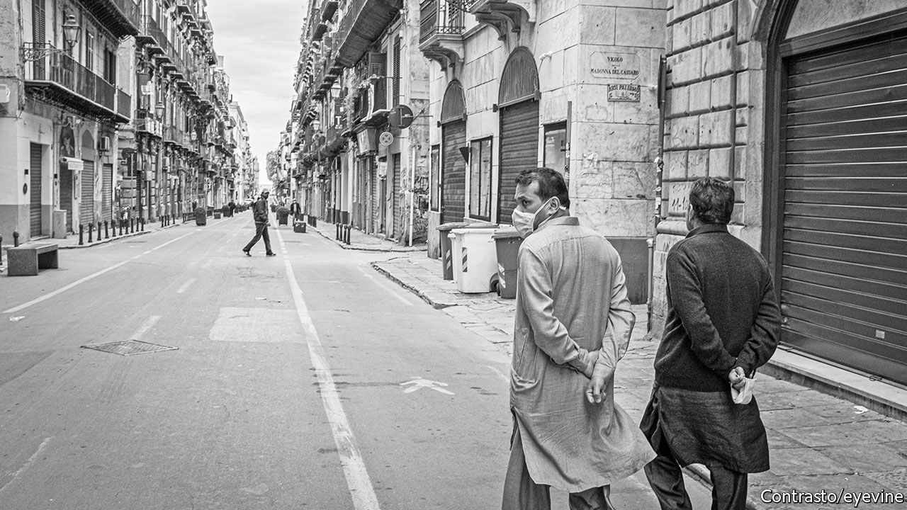

###### No cosying up to Cosa Nostra

# Sicily is desperate for the EU’s cash 

##### But it needs to get better at arguing for it—and spending it 

 

> Nov 28th 2020 

SEBASTIANO (“NELLO”) MUSUMECI, the governor of Sicily, counts off on his fingers some of the many things he says his island lacks: a hub-port to tap into the goods traffic that flows from the Suez Canal into the Mediterranean; an international airport (“Malta, smaller than the smallest Sicilian province, has one,” he notes indignantly); a modern rail system (large stretches of the existing network are either single-track or unelectrified, or both); and a motorway that fully encircles the triangular island (there is a long gap on one side). “Then there is all the social infrastructure we lack,” he goes on. Top of that list is a shortage of nursery schools.

Europe’s efforts to recover from covid-19 focus on poorer regions like Sicily. One of the aims of its €750bn recovery fund, currently blocked by Poland and Hungary (see ) but due to come on stream next year, is to “level up” the EU. The Italian government will soon spell out to the European Commission how it wants to spend its share of the loans and grants on offer—more than a quarter of the total, says the prime minister, Giuseppe Conte. Last month, Sicily’s regional government sent Rome a list of schemes it hopes will qualify for funding. But although the island’s needs are great, the EU scheme may not help to satisfy them.


Most of the projects the regional government wants for the island are large-scale, long-term and designed to fulfil relatively basic requirements. But the conditions attached to the EU’s main recovery fund prioritise schemes that are “smart”, green and can be completed quite fast. Vincenzo Provenzano, who teaches economics at the university of Palermo, worries that the regional government’s aims may be too ambitious and that it ought to focus more on the potential of the EU’s promised Green Deal. “If we want to have immediate effects, we need to work on areas where Sicily has a comparative advantage,” he says. Organic farming, which Sicily has a lot of, is a perfect example.

Other doubts over Sicily’s capacity to benefit from this unique opportunity have a longer history. The island’s bureaucracy is notoriously sluggish. It may struggle to meet the deadlines set for having access to the EU’s funds: 70% of the money has to be committed, with contracts awarded and signed, by the end of 2022, the remaining 30% within the year after. The entire fund has to be spent by the end of 2026. Sicily has in the past found it hard to devise projects suitable for EU funding and then spend the money it has been given.

In any event, a worry persists that EU or state money invested in Sicily will enrich the island’s Mafia, known to affiliates as Cosa Nostra (“Our Thing”). In this respect there are grounds for optimism. Once the beefiest of Italy’s three main organised-crime syndicates, Cosa Nostra has been losing ground since the 1990s to the Camorra, which operates in and around Naples, and to the Calabrian ’Ndrangheta. Since the early 1990s police and prosecutors have relentlessly pursued it. Under Mr Musumeci, a former president of Sicily’s anti-Mafia commission, they have had solid backing from the regional authorities.

One reason Cosa Nostra has retreated from the streets is that it has increasingly concentrated on white-collar crime. As many investigations have shown, it is still able to muscle in on the allocation of contracts and has a special penchant for helping itself to EU financing.

That has prompted the creation of numerous laws and regulations which are intended to thwart the mobsters’ infiltration of the legal economy but which also slow down the approval of public investment projects. Mr Musumeci argues that the precautions have become excessive. He wants the central government to simplify the procedures for being granted the EU’s funds. “We can’t not look to the future,” he says. ■

