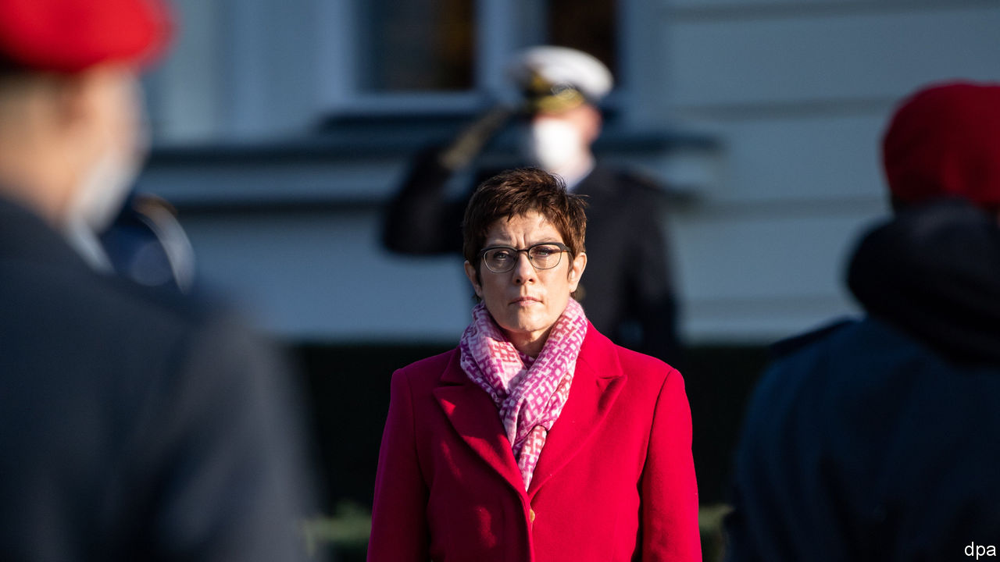

###### War of words

# The imminent Biden presidency reawakens Europe’s defence debate 

##### And an old row between France and Germany 

 

> Nov 28th 2020 

EMMANUEL MACRON does not shy from controversy. But the French president’s recent dig at Annegret Kramp-Karrenbauer, Germany’s defence minister, was sharp. Earlier this month she wrote: “Illusions of European strategic autonomy must come to an end.” Since “strategic autonomy” is a centrepiece of Mr Macron’s European ambitions, he did not hold back. Calling her views a “historical misinterpretation”, he added pointedly: “Fortunately, if I understood things correctly, the chancellor does not share this point of view.”

Franco-German differences are not just normal; they are the basis of the post-war Franco-German link. Usually leaders try to avoid making disagreements personal, and work through them in private. This time, the spat is out in the open. As Europeans prepare for an American presidency under Joe Biden, it has exposed old cracks within the European Union over how far Europe should, or could, do more to defend itself.


Under Donald Trump, Mr Macron edged the European debate in his direction. An American president with undisguised contempt for NATO helped focus European minds, and prompted concerns about the solidity of the American security guarantee. In terms of capacity, European defence does not yet add up to much. An alphabet soup of embryonic security programmes focuses on new co-operation mechanisms, rather than step-changes in Europe’s ability to handle collective defence. Yet France and Germany now agree that Europe must do more. German defence spending, though a smaller share of GDP than in France, has been growing steadily since 2015. A common EU military-strategy document will be concluded under France’s EU presidency in 2022. A new poll finds that 51% of Germans think Europe should grow more independent of America. There is deepening European co-operation in a counter-terrorism operation in the Sahel, albeit with American intelligence backing.

So why do France and Germany appear to be talking past one another? Mr Macron has neither called for America to withdraw from Europe, nor suggested that NATO is “superfluous”, as Ms Kramp-Karrenbauer has hinted. He sees beefing up European defence as a response to a pre-Trump American pivot to Asia, and stresses that it should be “complementary” to NATO. In Germany the deeper divide is not between pro-NATO Atlanticists and pro-Europeans; but between those, like Ms Kramp-Karrenbauer, who encourage difficult domestic conversations about defence spending and military capabilities, and those who would prefer to ignore the subject. If Mr Macron worries that a Biden administration will induce the German establishment back into deep strategic sleep, Ms Kramp-Karrenbauer ought to be among his closest allies in Berlin, not the subject of his barbs.

The difficulty may stem partly from language. Mr Macron uses “European sovereignty” and “strategic autonomy” almost interchangeably, sometimes to cover broader industrial and technological independence. Yet full defence sovereignty means a great deal more than merely Europe’s ability to act autonomously, for example to resolve a limited regional crisis. As Mr Macron pointed out in a speech to the Bundestag in 2018: “In France, ‘sovereignty’ is a common term; in Germany I know it can cause surprise, even fear.” Many Germans also resist Mr Macron’s emphasis on “strategic autonomy”, preferring to talk about the “European pillar of NATO” in order to avoid ambiguity about America’s security role in Europe.

There is also old distrust in Berlin (and elsewhere in the EU) about French intentions. Some officials see in Mr Macron an old-style Gaullist wrapping French interests in a European flag. They suspect him of seeking to undermine NATO and substitute French leadership in Europe for American influence. Others appreciate Mr Macron’s energy but find his unilateralism exhausting—and sometimes counter-productive, as in Libya or the eastern Mediterranean.

Above all, the gulf between the two countries’ defence cultures is just extremely hard to bridge. Defence, says Claudia Major of the German Institute for International and Security Affairs, remains the “problem child”. France has a tradition of military intervention and the use of expeditionary force (and boasts nuclear weapons); Germany’s culture of military restraint is as strong as ever, and politicians struggle to articulate a national strategic interest. Where France instinctively sees threats to Europe’s south, Germans look eastward—and take seriously scepticism towards Mr Macron from eastern Europeans who balk at any hint of weakening transatlantic security ties. The defence minister of Poland has intervened in the spat to say he agrees with the Germans (as has Spain’s prime minister).

If Europeans accept the need to “do more” for their own defence, they have yet to agree on what this means. The idea of partial defence autonomy commands wide and growing support, but not when coupled with the more ambitious and pricey idea of total sovereignty in defence. Instead of a war of words, Europeans must work out what capabilities they need and when, and how to pay for them—no matter who is president in America. ■

