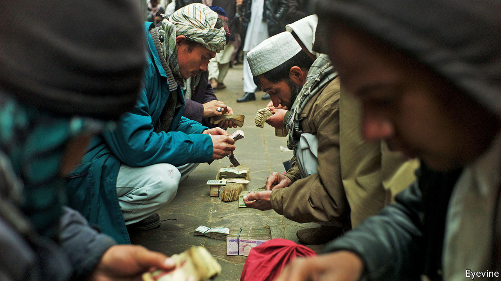

###### Merchant bankers

# Hawala traders are being squeezed by regulators and covid-19 

##### But the centuries-old system will bounce back 

 

> Nov 28th 2020 

PACKED TRADING floors are rare these days. An exception is the Shahzada currency-exchange market in Kabul. Seven days a week hundreds of men crowd into a modest courtyard. Each has a bundle of banknotes; some have piles several feet deep. Prices—for American dollars, Iranian rials and Pakistani rupees—ring out and deals are done, on the spot, in cash. In the small offices around the sides, money that is changed can then be transferred to almost anywhere in the world. Cash is handed over and WhatsApp messages fly.

The money travels by hawala (from the Arabic for “transfer”), a centuries-old system. Transactions in opposite directions are matched against each other through a network of personal contacts. An Afghan in London sending remittances home might in turn finance a Kabuli merchant importing Chinese goods purchased in Britain. Banks may be used—but not formally. The sender is given a serial number, which they send (these days on WhatsApp) to the recipient, who then picks up the money from a contact of the hawala merchant.


Hawala is the core of Afghanistan’s financial system. One in six adult Afghans has a bank account; there are just two branches for every 100,000. Most remittances—which some estimates reckon amount to 15-18% of the country’s GDP each year—flow through it. Even international aid agencies use it. And Afghanistan is not the only place where hawala dominates. In Iraq, Somalia and Syria, the transfer system is vital too. Hawala is used in India and Pakistan to avoid slow and unwieldy banks. And the presence of huge numbers of migrants means it is well-established in the Gulf, especially Dubai.

Yet hawala is under intense pressure. Regulators around the world hate the system, because of its opacity and its role in helping to fund terrorism. And covid-19 has hammered many merchants, by drying up cross-border trade and closing the small shops and businesses that do transfers.

Hawala dominates in places like Afghanistan because it is so efficient. Margins on even small international transfers may be as low as 1%, far less than banks’ charges. Indeed, sending money from Afghanistan to the West is often free, says Haroun Rahimi of the American University of Afghanistan. It is not only cheaper to use a hawala merchant than a bank, but quicker and easier too. Transfers can typically be picked up the same day. Customers do not need to prove their identity, or explain why the money is being sent. That is why it is essential in places like Afghanistan and Somalia, where large parts of the population do not have identity documents.

But this is also precisely why regulators dislike it. Western banks cut off anyone they suspect is using an account to send money to places that are considered high-risk, such as Afghanistan or Somalia. In India and Pakistan hawala merchants are arrested for evading the countries’ capital controls. In Afghanistan the central bank, under foreign pressure to ensure transparency, has long sought to crack down on traders. In 2018 they were banned from holding deposits and making loans, and were required to start collecting documents on their customers. Instead of complying they went on strike, claiming that the new rules would destroy their business. Within a week the government had backed down. “Shutting down hawala markets would paralyse the economy,” says Mr Rahimi. Now an uneasy truce prevails.

Covid-19 has not helped hawala traders, many of whom also provide trade finance. In his office at Shahzada, Haji Zarak, the spokesman of the union of currency exchangers, says that the past year has been the toughest ever. When coronavirus first hit Afghanistan, the traders at the market went down to three days a week to socially distance. But the bigger hit was to goods trade. With borders closed, importers did not need to move money around, or to borrow to cover liquidity gaps. The only country with which transactions have increased is Turkey—which Mr Zarak suspects is largely rich Afghans moving money out to buy property, fearing a Taliban takeover. He worries about a second wave. “If covid-19 comes back, we will be in trouble.”

What comes next for hawala? Some think that it can, in effect, be taken over. Abdul Bari Ahmadzai of Moore, a consultancy that works on Hesab Pay, a mobile-money app, says if regulators allow it, hawala merchants could work as mobile-money agents on the side. Transactions around the country at least could be done instantaneously on phones. In Somalia, where telecoms operators are largely unregulated, that has already happened. According to the World Bank, around three-quarters of Somalis use mobile money—mostly denominated in dollars—and it is more common than cash. Mr Bari reckons the shift would in turn expand Afghans’ access to banking, and gradually formalise the financial sector.

Yet that outcome is far from guaranteed. Hawala merchants will be nervous of anything that requires them to start collecting data or comply with other regulations. And if they do not, Afghanistan’s few formal banks have a lot to lose by working with them. These already have only limited access to the international banking system. Huge amounts of money travel from Afghanistan to neighbouring Iran, its main source of imports. And as the number of people on America’s sanctions list rises, the risks for western banks dealing in the region grows. They could decide to cut off many Afghans entirely. If that happens, hawala could be the only alternative left. ■

Editor’s note: Some of our covid-19 coverage is free for readers of The Economist Today, our daily . For more stories and our pandemic tracker, see our 

