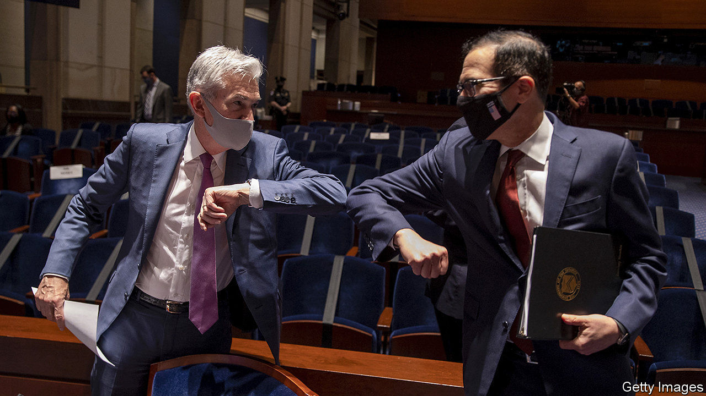

###### A clash over cash

# Jerome Powell and Steven Mnuchin are at odds over emergency loans 

##### Mr Mnuchin argues the funds could be better used elsewhere 

 

> Nov 28th 2020 

AS COVID-19 spread across America, its fiscal and monetary tsars donned their masks, bumped elbows and presented a united front. Jerome Powell, the chairman of the Federal Reserve, slashed interest rates and bought Treasuries and mortgage debt. Steve Mnuchin, the treasury secretary, pushed through a stimulus package worth $2.2trn that increased the generosity of unemployment benefits and secured funding for the Fed to support firms and market participants in need.

This partnership seemed to fracture on November 19th, when Mr Mnuchin wrote to Mr Powell to say that he would let several of the Fed’s emergency lending schemes expire on December 31st. He asked for Treasury funds that had been allocated to the Fed, as capital to support these programmes, to be returned.


Mr Mnuchin’s decision earned a rare rebuke from the Fed, which said that it “would prefer that the full suite of emergency facilities...continue to serve their important role as a backstop for our still-strained and vulnerable economy”. Just a few weeks earlier Mr Powell had said the pair were working on an extension. On November 20th, though, he acquiesced to Mr Mnuchin’s request. The Treasury had allocated $195bn in capital to support the Fed’s programmes, half of which had been transferred to the central bank. The Fed will now return $70bn, keeping $25bn for loans it has already made.

Mr Mnuchin pointed out that the programmes that would cease—including facilities to buy corporate and municipal bonds, and those that make direct loans to firms—were under-used and seemed to have served their purpose. The Fed could have made up to $2trn-worth of loans; instead it lent just $25bn. The schemes were intended to quell market dysfunction; corporate-credit and municipal spreads on Treasuries have since normalised, and companies have been able to issue plenty of debt.

Emergency-lending schemes can act as a sort of insurance, even if they are not widely used. Indeed the mere announcement of the schemes in the spring served to kick-start credit markets, even before anything had been bought. But capital markets seemed to broadly endorse the idea that the Fed’s emergency lending schemes were no longer needed. Stockmarket futures and bond yields dipped a little, as Mr Mnuchin’s letter was published, but both had recovered by the end of the day. Credit spreads did not widen.

What might explain Mr Mnuchin’s actions? With government-borrowing yields near all-time lows, the cost of allocating capital to the Fed’s facilities is small. But the political costs may have been higher. When Mr Mnuchin and Mr Powell testified to Congress in September, no fewer than seven representatives quizzed them about the poor take-up of the Main Street Lending facility, which makes loans to firms.

Mr Mnuchin has suggested directing some of the funds to other schemes, such as the Paycheck Protection Programme, a vehicle that lends to small businesses, which ran out of funds in August. Perhaps he hopes that promising support for small firms will sway Republicans reluctant to approve another stimulus package. A less charitable explanation is that he wants to obstruct the next administration. The returned cash will go to the Treasury’s General Fund, which will require legislation if it is to be tapped. If Janet Yellen, President-elect Biden’s choice for treasury secretary, wants to use it, she will have to secure the votes first. ■

