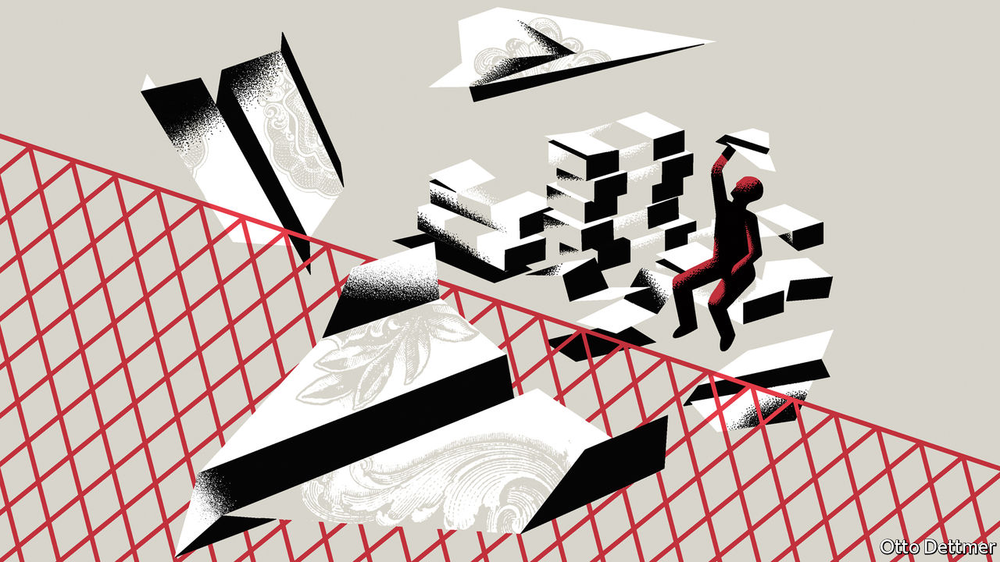

###### Free exchange

# Why it is misleading to blame financial imbalances on a saving glut 

##### New research calls for a careful distinction to be made between saving and financing flows 

 

> Nov 28th 2020 

IN 2005 BEN BERNANKE, then a governor of America’s Federal Reserve, noted a “remarkable reversal in the flows of credit” to several emerging economies, especially those in East Asia. These countries had begun to save more than they invested at home, becoming a “net supplier of funds” to the rest of the world. Their “saving glut”, as Mr Bernanke called it, was helping finance America’s widening current-account deficit, allowing the world’s richest country to buy more goods and services from others than it sold to them. Mr Bernanke wondered whether this arrangement could, or should, persist. Some economists later blamed the glut for America’s housing bubble.

Similar concerns are resurfacing. In the second quarter of this year, America’s net national saving rate dipped below zero, as Stephen Roach of Yale University pointed out in the Financial Times last month. Lacking saving of its own, America instead borrowed “surplus saving from abroad”, he wrote. Its current-account deficit widened faster in the second quarter than ever before recorded.


This sort of reasoning is quite common, not least in these pages. But a number of economists, including Michael Kumhof of the Bank of England, Phurichai Rungcharoenkitkul of the Bank for International Settlements (BIS) and Andrej Sokol of the European Central Bank, take strong issue with it. Echoing work by Claudio Borio and Piti Disyatat of the BIS, they call for a careful distinction between flows of saving and flows of finance. The two are not the same. They need not even move together. The implication is that Mr Bernanke may have got things the wrong way around.

In everyday language, saving is the opposite of spending. The word evokes money accumulating in a bank account. And it is easy to imagine this money helping finance spending elsewhere. But in economics, saving is rather different. It is the opposite of consumption. By producing something that is not consumed, the economy is saving. Thus someone who spends all their earnings on home improvements is saving, however stretched they may seem, because a house is a durable asset, not a consumer trifle. Similarly a farmer who stores his harvest in a barn, rather than eating it, is saving—even if he never deposits money in a bank.

So how does saving, properly defined, flow across borders? Any output that is not consumed meets one of two fates: it is either invested or exported. It follows that anything that is neither consumed nor invested at home must be exported. (A farmer might, for example, export wheat to a barn overseas.) What flows across borders are the unconsumed goods and services themselves. “Other countries are not sending saving to America to give it ‘funds’ to finance their imports,” argue Mr Kumhof and Mr Sokol. “Their net exports are the saving, by definition.”

But how then do Americans pay for these foreign goods? That raises the question of financing. Unlike saving, financing is inseparable from money. To ask “how did you finance that?” is to ask “how did you obtain the money to buy that?”. Most money is brought into the world by banks, which have the happy ability to create it whenever they make a loan or purchase an asset. Thus the amount of financing available to a country depends heavily on the behaviour of banks, rather than on the amount of saving that either it or its trading partners do.

In a world of gluts and deficits, who finances whom? The conventional answer is that countries with excess saving finance those with saving shortfalls. But this less conventional group of economists argues that the answer depends not on the geography of saving and investment but on that of banking and finance. In many cases, American importers will fund their purchases with dollars borrowed from (or already held in) American banks.

When the purchase is complete, the dollars will be held by foreigners. They then represent a foreign financial claim on America. Because America is buying more stuff from the world than it sells, these claims on America will grow faster than the payments it receives for its exports. Many conventional economic models treat these net payment flows as the only kind of capital flow. But in reality, they are but a small fraction of the financial flows between countries. Many cross-border transactions, after all, do not involve goods and services at all. They instead represent purchases of foreign assets, including shares, bonds, property and the like. In the year Mr Bernanke made his speech, the net capital outflow from “saving glut” countries (with current-account surpluses) was 2.5% of global GDP. Gross capital flows, by comparison, were around 30%, according to Mr Borio and Mr Disyatat.

Gluttonous behaviour

An excess of saving, then, determines neither the geographical source nor the scale of cross-border financing. Nor is excess saving necessarily the right causal starting point. The paper by Mr Kumhof and others models what they call a “credit glut”: an abundance of lending by American banks to the country’s citizens. In spending this fresh money, Americans would no doubt suck in goods from abroad. This leads other countries to increase their saving, since America cannot import goods that are being consumed or invested elsewhere. But in this case, the increase in foreign saving and surpluses is a side-effect of a financial boom within America, not a cause of its overspending. The authors believe a credit, rather than a saving, glut is a more convincing explanation for the pre-2008 imbalances identified by Mr Bernanke, although they have less to say about more recent developments.

For many people (including some economists), it is natural to think that saving must precede investment and that deposits must precede bank lending. It is therefore tempting to see saving as a source of funding and the prime mover in many macroeconomic developments. Mr Kumhof and his co-authors see things differently, giving banks a more active, autonomous role. They give less credit to saving and more to credit. ■

