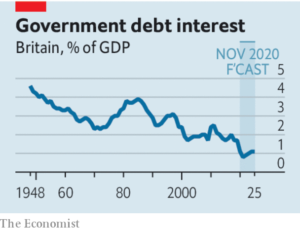

###### The right kind of discipline

# Budget deficits should depend on the unemployment rate 

##### Fights about stimulus are breaking out everywhere. Time for rules-based budgeting 

 

> Nov 28th 2020 

ECONOMIC FORECASTERS could be forgiven for feeling a sense of whiplash. As covid-19 runs rampant in Europe and America the world economy is taking another hit from the pandemic. America’s consumers are gloomy; Europe’s service sector is contracting. At the same time the growing prospect of mass vaccination in 2021 raises the prospect of an imminent recovery. In 2020 economists were too pessimistic about how fast growth would rebound after the first wave of infection, especially in America. A vaccine might allow another snapback in 2021.

A springtime consensus that governments should spend big on rescue packages has given way to bickering and confusion. In America Steve Mnuchin, the treasury secretary, is bringing to an end some of the Federal Reserve’s emergency programmes (see ). Janet Yellen, whom President-elect Joe Biden this week chose to be Mr Mnuchin’s successor, will be greeted by a legal and political storm about the Fed’s lending authority. Congress looks unlikely to agree to renew emergency spending on unemployment insurance and loans before Mr Biden takes office. In Europe Hungary and Poland are holding up the EU’S budget and its €750bn ($900bn) “recovery fund” in a spat over whether the disbursement of cash should be conditional on countries upholding the rule of law. The European Commission has warned several countries about their debts. Britain’s government is trying to reconcile an instinctive suspicion of deficits with a recognition that the economy still needs life support, in part by cutting the foreign-aid budget (see ).


Clear thinking is needed. It should start with the recognition that public debts in rich countries, though soaring, are sustainable because of rock-bottom interest rates. Despite borrowing 19% of its GDP this year, Britain will save about £13bn ($17bn) on debt interest compared with last year. While rates are low, higher debt will not by itself demand belt-tightening after the crisis.

 


A different problem will arise if the pandemic scars economies, reducing tax revenue and increasing welfare spending for a long time. The result would be a persistent shortfall in the public finances. Yet the extent of the pandemic’s lasting impact is highly uncertain owing to the novel nature of the crisis. The main driver of recent economic fluctuations has been government diktats about whether shops and restaurants can stay open, the impact of which baffles orthodox economic models. America’s unemployment rate undershot the Fed’s summer forecast by more than two percentage points within a matter of months. The scenarios presented by Britain’s official forecasters this week ranged from there being no enduring damage to a long-term hit to GDP of 6% a year.

It is better to wait to see how large a hole the pandemic leaves in budgets than to risk slowing the recovery with premature austerity. Britain has chosen to wait. More countries should follow the example of Australia and pledge not to tighten fiscal policy actively until the economy has crossed a defined threshold—in its case an unemployment rate of 6%. Much as clear “forward guidance” by central banks helps monetary stimulus to work, fiscal rules would help boost confidence in the future.

Sadly, putting in place a new, formal, fiscal framework will be hard in America, with its divided and gridlocked political system. All the same, a pragmatic deal may be possible in the short run—Democrats should accept the smaller stimulus on offer from the Republicans, rather than hold out for the enormous spending they would prefer. With the unemployed burning through their savings and small firms facing a bleak winter, the speed of emergency support matters more than its size.

The consequences of any policy mistakes will be all the greater today because low interest rates mean that central banks cannot easily ride to the rescue. Governments can afford to wait a little longer before tightening the purse-strings. And waiting is the cautious and responsible choice. ■

