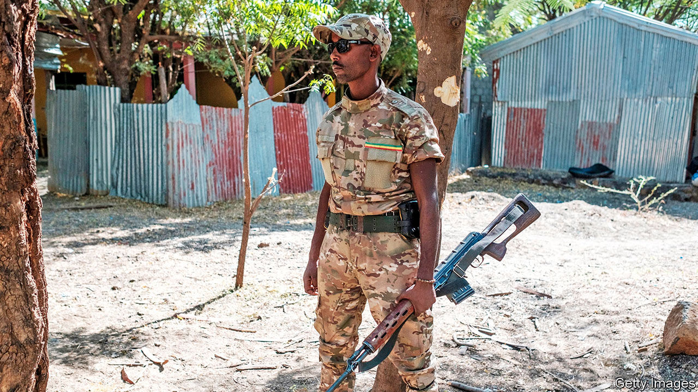

###### Things don’t have to fall apart

# The world needs to stop war crimes in Ethiopia 

##### Atrocities are mounting in Tigray. Outsiders should press both parties to talk 

 

> Nov 26th 2020 

FIRST, THE police and militia shut the roads out of Mai Kadra, a farming town in Ethiopia’s northern province of Tigray. Then they went from door to door, checking ID cards and singling out non-Tigrayans. They destroyed SIM cards to stop people phoning for help. Then, on November 9th, members of a Tigrayan youth group stabbed, hacked, burned and strangled hundreds of Amhara men, according to the Ethiopian Human Rights Commission (EHRC). When federal government troops entered the town the next morning at least 600 people were dead, says the EHRC.

Because of an internet and telephone blackout, as well as restrictions on journalists and NGOs, it is hard to be sure exactly what happened. But there is no doubt that a massacre occurred. Amnesty International has videos of bodies strewn across the town. And it seems likely that it was committed by forces allied to the Tigrayan People’s Liberation Front (TPLF), the ruling party in Tigray. It is also beyond doubt that federal government forces or their allied ethnic militias have also committed atrocities in the same area. Tigrayans who have fled across the border to Sudan tell of attacks on civilians by Amhara militiamen and government soldiers. The government says undercover TPLF agents are sowing disinformation.


Ethiopia’s civil war is less than a month old, but its horrors are multiplying fast. Government forces surround Mekelle, Tigray’s capital. On November 21st Ethiopia’s army warned the city’s 500,000 inhabitants that it would have “no mercy” and that they should “save themselves”. A day later Abiy Ahmed, Ethiopia’s prime minister, gave the TPLF 72 hours to surrender. To treat an entire city and its people as a target would be a war crime. In a country as riven with ethnic tensions as Ethiopia, it could also lead to wider bloodletting. Tigrayan civilians elsewhere are already being singled out. Hundreds have been arrested in the capital, Addis Ababa. Tigrayans in the army have been disarmed or detained. Those in the civil service have been told not to come to work. Tigrayans trying to leave the country are turned back at the airport. “This has the smell of Rwanda,” says a foreign diplomat.

Both sides passed up opportunities to reduce tensions before the first shots were fired by the TPLF on November 4th. Now each appears to think it has the upper hand. Abiy seems to be trying to topple the TPLF before Joe Biden takes charge in America. The TPLF’s leaders, many of whom are graduates of its guerrilla war against a Marxist dictatorship in the 1970s and 1980s, seem to think they can win concessions by fighting from the hills and dragging the war out. Both sides act as if they have more to gain from killing than talking.

Outsiders need to convince them otherwise. First, the UN and African Union (AU) should make it clear that those who commit war crimes will be held accountable. Independent investigators should be allowed in to determine what happened at Mai Kadra. Non-combatants must be spared. Humanitarian corridors should be opened to allow aid to flow.

If Ethiopia commits grave war crimes, the UN and AU should also impose an arms embargo. This would not stop the killing entirely—the region is awash with guns and machetes. But halting the flow of artillery shells and bombs would dampen it and send a clear signal to both parties.

Donors should rethink their support for Ethiopia, which relies on aid. Western powers are hesitating for fear of being accused of neocolonialism. The AU is reluctant to act because of its policy of not interfering in its members’ internal affairs. But if nothing is done, Ethiopia will slide deeper into crisis. It could even break apart, like Yugoslavia in the 1990s. Good neighbours should apply pressure now to prevent such a catastrophe. ■

