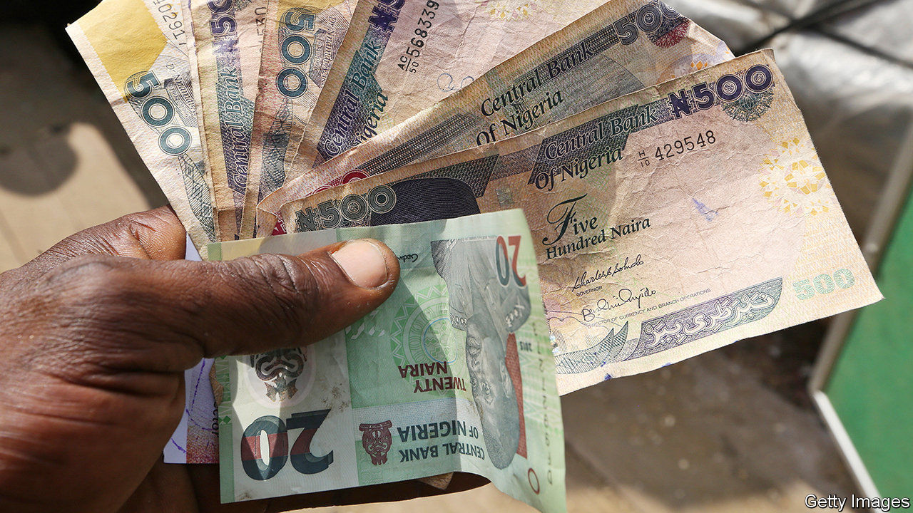

###### It’s all in the script

# Nigeria argues over the writing on its banknotes 

##### Some say Arabic script smacks unconstitutionally of Islam. Others shrug 

 

> Nov 28th 2020 

MALCOLM OMIRHOBO is no stranger to the Federal High Court in Lagos, Nigeria’s commercial capital. A human-rights lawyer, he is well-known for filing suits against the government, including one for not releasing his ten-year-old son’s exam results. His latest case has created an especially loud buzz. He is arguing that Arabic script (known as Ajami when used to write non-Arabic languages) on certain Nigerian banknotes violates the country’s secular constitution. He wants it removed. He may also petition the army to delete an invocation in Arabic on its flag.

With perhaps 200m people and 350-plus languages and ethnic groups, Nigeria is a mosaic of cultures. A century ago the British amalgamated the three biggest groups under one administration—Hausa-Fulani in the mainly Muslim north, Yoruba and Igbo in the mainly Christian south—despite each having its own traditions and history. Ethnicity and religion have often clashed, especially in Nigeria’s central area, known as the Middle Belt.


Ajami and other Arab influences have long stirred up arguments over Nigeria’s identity. In the early 2000s a dozen northern states imposed sharia (Islamic law). In 2007 the central bank replaced Ajami with Roman letters on lower-denomination notes of the naira, Nigeria’s currency. It said it was trying to foster national unity by upholding the spirit of the constitution of 1999, which bans the establishment of a state religion and the use of any language in parliament except English, Hausa, Igbo or Yoruba. In 2014 Nigeria’s then president, Goodluck Jonathan, a southerner, did the same with a new 100-naira banknote.

Many northerners were cross. Ajami is a modified Arabic script used for writing Hausa, just as the Roman alphabet is used for English, explains Mustapha Kurfi, an Ajami scholar. For centuries it has been used across Africa for writing Swahili in the east, Mandinka in the west and Yoruba in what is now Nigeria. In northern Nigeria it is used in everyday life. On naira notes it is understood by “the old woman in my village” who cannot read English, explains Aliyu Ibrahim Gebi, a former lawmaker from Bauchi state, in the north-east.

Many Christians, by contrast, fear what they deem to be “Islamisation”. They mutter that President Muhammadu Buhari, a northern Muslim, previously endorsed sharia. Many Christians complain that key cabinet posts are filled by northerners: all 36 states are equally represented in cabinet, but not all posts have equal clout.

Equally, many northerners see southerners as “educated but ignorant”, says a Nigerian-born academic. On both sides, conspiracy theories are rife. Even educated people often believe that Boko Haram, the jihadist group that has ravaged the north-east, has been bankrolled by shadowy elites—northern or southern.

Bad governance makes matters worse. Divisions widen when leadership is weak, says Jacob Olupona, a Nigerian professor at Harvard. “Buhari is not able to manage Nigeria justly,” he says. “This is why things are getting out of hand.” Mistrust of government turns many Nigerians to religious fundamentalism. The rising popularity of Pentecostal churches and of mosques that preach extreme versions of Islam deepens mutual suspicion.

Most Nigerians agree that their country is better together, though many Igbos, whose bid for secession led to a catastrophic war in the late 1960s, may hanker after greater autonomy. “I think the ties that bind us are very strong,” says Ebenezer Obadare of the University of Kansas, the author of “Pentecostal Republic”. Gimba Kakanda, who has also written about ethnicity and religion, argues that national ties still need strengthening: “We need to understand one another, to know each other.” Mr Omirhobo’s case is probably going nowhere. But the argument behind it is far from over. ■

