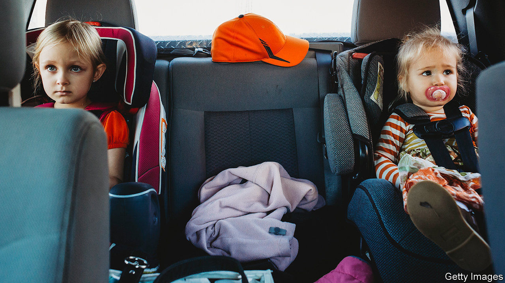

###### Children’s car seats

# Child-safety laws may reduce the birth rate 

##### Berth control 

 

> Nov 28th 2020 

IN THE EARLY 1970s American women gave birth, on average, to 2.12 children each. By 2018 that figure had fallen to 1.73. Many alterations in people’s lives have been invoked to help explain this change, including the facts that women now are better educated, more likely to have jobs or run businesses, and have better access to contraception than their antecedents of five decades ago. Also, demand for children to work as extra pairs of hands on family farms has dropped.

None of these explanations, though, overlaps neatly with birth-rate curves. Other factors must be at work, too. And Jordan Nickerson and David Solomon, professors of finance at the Massachusetts Institute of Technology and Boston College respectively, think they have found an intriguingly counterintuitive one: America’s increasingly protective child car-seat laws.


Their study, “Car seats as contraception”, published in SSRN, a repository for so-called preprint papers that have yet to undergo formal peer review, examines the effect that car-seat policies may have had on American birth rates between 1973 and 2017. During the Reagan era, only the truly wee—tots aged under three—had normally to be secured in child-safety seats. But states’ governments have, since then, gradually ramped up the requirements. Today, most places in America make children sit in safety seats until their eighth birthdays. That concern for youngsters’ safety has had the unintended consequence, Dr Nickerson and Dr Solomon suggest, of fewer three-child families.

In drawing this conclusion they have correlated census data with changes in state laws on safety seats. They discovered that tightening those laws had no detectable effects on the rates of births of first and second children, but was accompanied by a drop, on average, of 0.73 percentage points in the number of women giving birth to a third while the first two were young enough to need safety seats. That may not sound much, but it is a significant fraction of the 9.36% of women in the sample who did become third-time mothers.

The authors also made two other pertinent observations. The reduction they saw was confined to households that did actually have access to a car. And it was larger in households where a man was living with the mother. The latter point is relevant, they think, because this man would take up space in a vehicle that could otherwise be occupied by a child.

And space in the vehicle is the crucial factor. In pre-safety-seat days, squeezing three young children into the back of a family saloon was a perfectly feasible proposition. Most such cars, though, can comfortably accommodate only two safety seats. So, the older a child must be before no safety seat is required, the longer a family must wait before a third child will fit in the car. Sometimes, that wait will mean no third child is ever conceived and born.

Unless, of course, the family concerned buys a bigger car. And here things get yet more interesting, for the obvious reasons not to do so—big cars cost more, and are more costly to run—may not be the only disincentive to changing. Dr Nickerson and Dr Solomon found, in fact, that the third-child deterrent appears stronger among wealthier families. As they observe, “large cars like minivans also have class and aesthetic connotations that may make people reluctant to switch even when they can afford to.”

Back-seat driver

Oddly, though, the authors do not leave it at that. Instead, they point to previous studies which suggest that, for children over two, safety seats are no better than seat belts at protecting against death or serious injury in a crash. They estimate that laws requiring children to sit in special seats until they are eight years old saved about 57 lives in 2017 and contrast that number with the 8,000 children who might have been conceived and born in the absence of such rules. There is, they conclude, no “compelling social interest” in requiring child seats for children over four.

This seems weird. Comparing putative lives forgone to actual lives saved is, to put it politely, a strange moral calculation. And the empirical basis for it is, in any case, doubtful. Alisa Baer, a paediatrician in New York who specialises in car-seat safety and who says she has installed at least 15,000 such seats over the years (she is known as “The Car Seat Lady”), says that this part of the paper is “completely preposterous”. Children’s car seats, she says, “save the quality of life” of children who would suffer higher rates of injury compared with simply belting up—including massive abdominal trauma and paralysis. A recent study by Mark Anderson at the University of Washington and Sina Sandholt at Columbia University bears this point out.

That does not, though, detract from the wider observation Dr Nickerson and Dr Solomon make that well-intentioned actions can have surprising knock-on effects. And one such, it seems, is that the back seats of American cars, once renowned as places where children were conceived, may now, themselves, be acting as contraceptives.■

