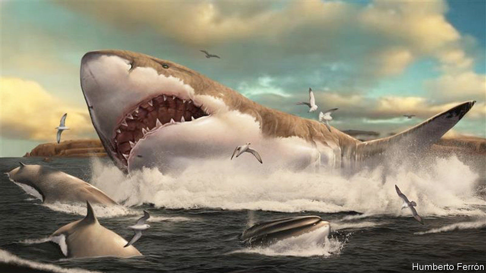
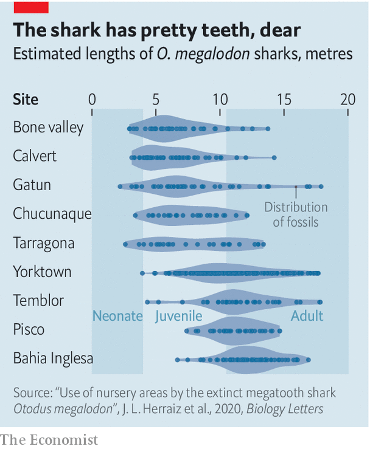

###### Nursery days

# Giant prehistoric sharks left their young in nurseries 

##### The perfect place for a Miocene remake of “Jaws” 

 

> Nov 28th 2020 

IF SHARKS HAD bony skeletons, which preserve easily as fossils, rather than cartilaginous ones, which do not, then Otodus megalodon would probably be as famous as Tyrannosaurus rex. Even though only its teeth are routinely available for study, it has starred in at least one film, “The Meg”, released in 2018. Were it better known, a whole ocean-based franchise akin to “Jurassic Park” might now exist.

No matter. It is still an intriguing animal. Adults are reckoned to have reached a length of 18 metres. (T. rex was 12 metres from snout to tip of tail.) And megalodons, as they are called colloquially, lasted as a species from the beginning of the Miocene epoch 23m years ago to 3m years ago, during the Pliocene. That is far longer than T. rex’s brief appearance 68m-66m years ago at the end of the Cretaceous. Their family life has, however, hitherto been obscure.


Perhaps “family” is a slight exaggeration. But many modern sharks lay their eggs (or, if viviparous, give birth) in places known as shark nurseries. Jose Herraiz of the University of Valencia and his colleagues wondered if that had also been true of megalodons. As they report this week in Biology Letters, it seems it was.

Shark nurseries are shallow coastal areas that have abundant food available and are, precisely because of their shallowness, difficult for predators like other, bigger sharks to move around in. Some 16m years ago part of north-eastern Spain, between what are now the cities of Barcelona and Tarragona, was just such a shallow, protected bay. And two quarries dug into the rock that formed from the sediment in this bay have yielded a number of megalodon teeth.

Shark’s teeth indicate, by their size and shape, the size of their possessor’s body. That is how O. megalodon’s adult length has been estimated. But body size within a species is also a good indicator of age. Dr Herraiz and his colleagues therefore studied the 25 best-preserved megalodon teeth from these quarries, to deduce the size distribution, and thus the age distribution, of the sharks that had lived there.

To do so they used a formula for length determination worked out for great whites, the largest existing shark that hunts individual prey. (There are larger species, such as the whale shark and the basking shark, but these filter small prey from the water in a manner similar to baleen whales.) Applying this formula to the teeth from the quarries, they found that the sharks in question had probably ranged in length from about three to 14 metres. These animals were therefore either juveniles or small adults, suggesting it was, indeed, a nursery.

 


Thus encouraged, the researchers then applied their method to eight other sites from which megalodon teeth have been recovered (see chart). Four were similarly youngster-dominated. The other four were dominated by adults. They therefore think they have identified five megalodon nurseries. The remainder, they suspect, were either breeding grounds or feeding grounds for grown-ups.■

