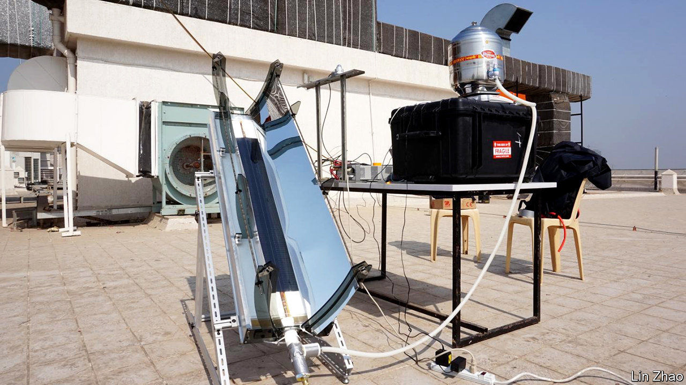
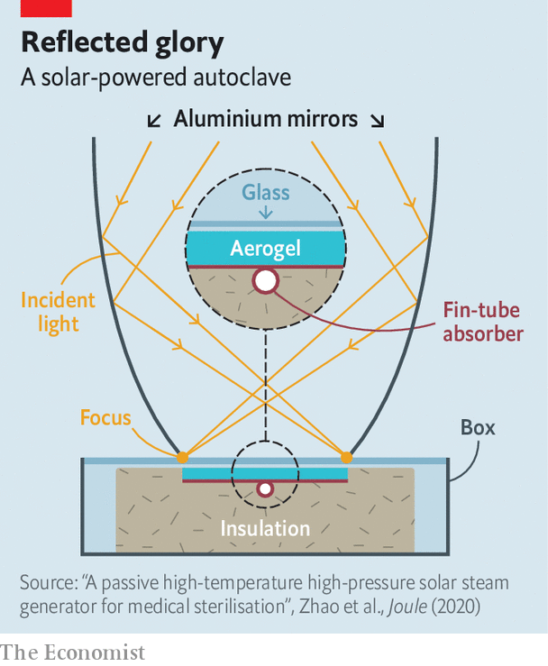

###### A solar autoclave

# How to sterilise scalpels when no electricity is available 

##### Sunlight is the best disinfectant 

 

> Nov 28th 2020 

IN THE HISTORY of medicine, praise is rightly showered on those who invented vaccines, antibiotics, antiseptics and anaesthetics. Few, though, remember Charles Chamberland, inventor of the humble autoclave. Yet the ability to sterilise surgical instruments reliably, by exposing them to high-pressure steam in such a device, has been crucial to the development of modern surgery. A mere 12 minutes in an autoclave at 121°C and two atmospheres of pressure kills 99.99% of common pathogenic bacteria. Standard boiling, at 100°C and one atmosphere, takes 80 hours to achieve that level of bactericide.

Electrically powered autoclaves have, as a consequence, become so routine as to be almost unregarded—at least in those places with a reliable electricity supply. Where electricity is not reliable, though, it can be hard to keep surgical instruments germfree. This is a problem to which Zhao Lin of the Massachusetts Institute of Technology thinks he may have an answer. As he and his colleagues describe in Joule, they have designed an autoclave that is powered directly by sunlight. And not only that; they also reckon it should cost just a tenth as much to make commercially as a conventional autoclave of equivalent potency.


Dr Zhao’s device is a work of simplicity and cheap materials. It consists of a metre-long box of rectangular cross section, with two curved fins of polished aluminium, just under 30cm high, sticking out of the top (see diagram). Each fin, seen end on, forms a section of a parabola, and it is a property of parabolic mirrors to focus light from distant sources (the sun, for example) onto a single point—or, in the case of elongated mirrors like these, onto a line.

 


The new invention’s principal trick is that these focal lines coincide with the edges of a copper plate within the box. This plate is part of a commercially available device called a fin-tube absorber. The absorber’s other element is a copper pipe running along the plate’s central axis. The particular geometry of the aluminium fins means that any incident sunlight will continue to be focused onto the copper plate even when the sun is not directly overhead. Anything inside the pipe is therefore going to get—and stay—pretty hot.

Within the box, the fin-tube absorber is seated on a bed of glass fibre, an excellent insulator, and it is covered with a layer of silica aerogel. This stuff, referred to colloquially as “solid smoke” because it has a density of a mere 200 milligrams per cubic centimetre, has the valuable properties of being transparent to light but opaque to heat. This means it admits the sunshine reflected from the mirrors while keeping the pipe as hot as possible. Although such a material sounds rather high-tech, and does, indeed, require specialist equipment to make, silica aerogel is actually quite cheap to buy, at $4 a litre. And a production model of the autoclave, Dr Zhao reckons, would require only half a litre of the stuff.

The whole thing is then topped off with a pane of glass, to protect the aerogel from damage while admitting light. All that is needed after this is to attach a sterilisation chamber to one end of the pipe and a water supply to the other, and then aim the mirrors at the sun. With an appropriate arrangement of valves, the sun’s heat will boil the water, heat the resulting steam well above boiling-point and increase the pressure in the tube—and thus also in the sterilisation chamber.

In tests carried out at a hospital in Mumbai, in partnership with the Indian Institute of Technology in that city, Dr Zhao’s new autoclave was able to sustain steam at a temperature of 128°C and two atmospheres of pressure for half an hour. When tested with autoclave indicator tape, a material used routinely to make sure autoclaves are working properly, it passed with flying colours, meaning it would have successfully sterilised anything within the sterilisation chamber.

Demand for this product is likely to be high. Some 15% of hospital patients in low- and middle-income countries get infected while receiving treatment, and surgery is an important cause of this iatrogenesis. Dr Zhao therefore hopes to have commercial versions ready by 2022. Recognition for his work, as Chamberland might have observed, could take a while longer.■

