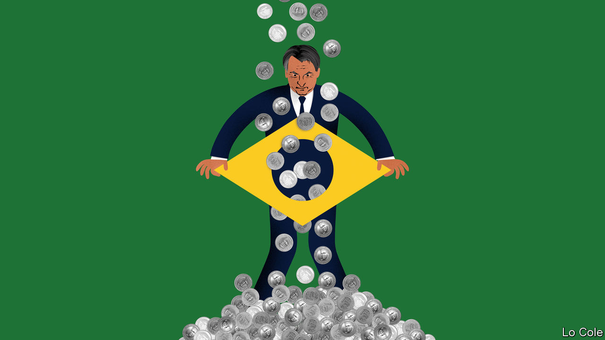

###### Bello

# The future of bolsonarismo 

##### Brazil’s weak economy could deny President Jair Bolsonaro a second term 

 

> Nov 26th 2020 

THIS HAS been a bad month for Brazil’s populist president, Jair Bolsonaro. First, Donald Trump, whose victory in 2016 served as a template for his own and with whom he aligned his government, lost his bid for a second term. And then the candidates Mr Bolsonaro backed in municipal elections on November 15th nearly all fared poorly, while the big winners were mainstream parties. Some pundits are rushing to write his political obituary. “The elections of 2018 were a hiatus and those of 2020 have put things back in their right place,” wrote Eliane Cantanhêde, the political columnist of O Estado de S. Paulo, a newspaper.

Brazilian liberals hope she is right, and that Mr Trump’s defeat will be an augury of Mr Bolsonaro’s fate at the next election in 2022. A former army captain, Mr Bolsonaro is scornful of democracy and its checks and balances, has stuffed his government with military men, says offensive things about gay, feminist and black Brazilians, favours gun ownership and underplays both covid-19 and climate change. His election broke the mould of Brazilian politics and was in some ways an aberration. Even so, it would be a mistake to write off his chances of a second term.


In 2018 Mr Bolsonaro was the beneficiary of an unusual moment in which the country’s political class was widely seen to have failed. His chief opponent, Luiz Inácio Lula da Silva, a once idolised former president, was in jail, barred from running by a conviction for bribe-taking in the so-called Lava Jato (Car Wash) scandal. Lula’s left-wing Workers’ Party was seen by many not just as corrupt and self-serving but incompetent, having driven the economy into what was then its deepest recession in a century. But the opprobrium extended to centrist politicians, many of whom were caught up in Lava Jato.

Mr Bolsonaro, who posed as an anti-political outsider, tapped into conservative currents in Brazilian society, some long present, some newer. He attracted disproportionate support from men and evangelical Protestants. But what tipped the election to him was the popularity of his talk about family values and law and order in the poor peripheries of Brazil’s big cities, the Workers’ Party’s former base, argues a recent book by Jairo Nicolau, a political scientist. His victory owed much to the skilful use of social media in a way that was novel in a Brazilian election.

As president, Mr Bolsonaro empowered hard-right ideologues, pursued polarisation and all but self-destructed. Six months ago, amid rising tension caused by the pandemic, corruption allegations against one of his sons and threats of impeachment, he came close to ordering the armed forces to shut down the Supreme Court. Some of his military advisers talked him out of that. Mr Bolsonaro saved his presidency by edging away from anti-politics and towards conservative politics as usual, allying with the centrão (big centre), a clutch of conservative parties of professional politicians who hold 221 of the 513 seats in Congress. An emergency stipend paid to 66m people has blunted criticism of his mishandling of the pandemic. Brazil has had more than 6m confirmed cases and 170,000 deaths. Mr Bolsonaro’s approval rating has risen from 30% to 40%.

His most likely path to a second term involves cementing his alliance with the centrão, which did well in the municipal elections. His attempts to set up his own political party, announced a year ago, have yet to bear fruit. An alliance with the centrão would make him a much less credible campaigner against corruption and the political class. But it would offer the kind of political machine that historically helped to win Brazilian elections—useful since social media alone are unlikely to give him such a competitive edge twice. If the opposition remains divided both between left and centre and within those camps, that would help him, too.

The big problem for Mr Bolsonaro is the economy. The emergency stipend has helped the country avoid a deeper recession. But how long can the government sustain it? Public debt is heading for 100% of GDP. Even with interest rates low, that is a big number for a country with a history of default and inflation. Economic recovery may be slow and austerity looks unavoidable next year. Income per person has already fallen below its level of 2010. Many Brazilians are suffering. Nationalist sound and fury will not pay the bills. Mr Bolsonaro remains today a competitive candidate. But by 2022 Brazilians may be less receptive to him than they were in 2018.

