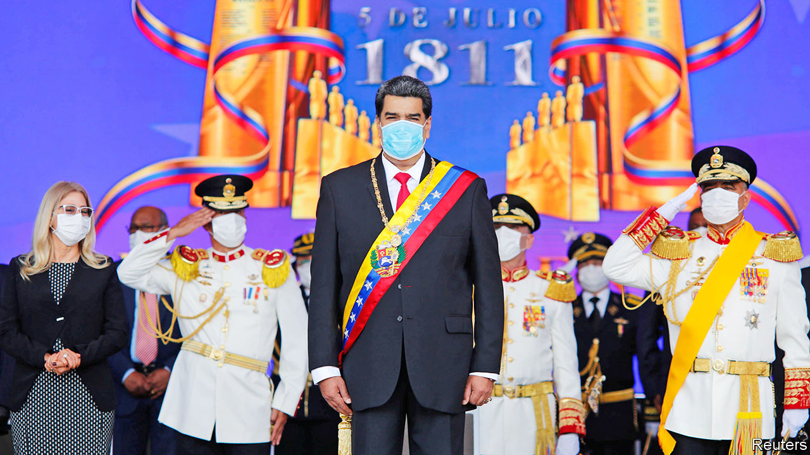

###### Consolidating dictatorship

# Venezuela’s regime will win December’s legislative election, by a lot 

##### A rigged vote will end the opposition’s control of the last democratically elected institution 

 

> Nov 26th 2020 

“WE ARE going to rescue the National Assembly,” sing Chucho y Omar Acedo, a pop duo hired by the Venezuelan regime to drum up enthusiasm for the forthcoming parliamentary election. Their catchy ode to the government, broadcast repeatedly on state media, makes it seem simple. “A future with greatness is arriving ...Happiness and hope are returning,” the band chants, to a Latin beat.

The first claim is probably correct. The National Assembly is the one branch of government still controlled by the opposition to the authoritarian regime of Nicolás Maduro. In an election due to be held on December 6th the socialist ruling party, the PSUV, will dislodge it. The regime has taken steps to ensure that it cannot lose. It has cemented its control over the National Electoral Council (CNE).


Pop musicians are not the only means of ensuring that turnout will be high and pro-regime. “I don’t want to vote but I have to because of my work,” says an employee of the tourism ministry. She intends to cast her ballot for the PSUV because she assumes it is not secret and fears losing her job if she shows disloyalty. Most of the opposition is boycotting the election, on the grounds that it will be fixed. A last-ditch attempt by the European Union to delay it by six months to create conditions for a fair election (like having a trustworthy CNE) came to nothing.

Although the result is preordained, the vote will matter. The regime’s takeover of the National Assembly will be a big step in its march towards full dictatorship. It will strip Juan Guaidó of his job as the legislature’s president. As the holder of that office he claims to be Venezuela’s rightful president, on the grounds that Mr Maduro won re-election fraudulently in 2018. That claim is recognised by more than 50 countries, including the United States, several large Latin American democracies and nearly all EU members.

Mr Guaidó will lose the speakership just before Joe Biden assumes the presidency of the United States, on January 20th. The new American administration and its partners will have to reconsider their approach to restoring democracy to Venezuela.

The opposition’s current hold on the legislature came about by accident. In 2015 Venezuela’s “Bolivarian” regime, in power for 16 years, was so convinced that it would win the election held that year it did not cheat enough to secure victory. It lost in a landslide, especially in the poor barrios that were once its stronghold. Venezuelans rightly blamed Mr Maduro for a severe recession (which was about to get much worse), high inflation (soon to become hyperinflation) and shortages of basic goods.

The coalition of opposition parties that won control of the legislature should have been able to check the regime. But Mr Maduro, while recognising its victory, ignored its consequences. The puppet supreme court vetoed all the laws passed by the legislature. Eventually, he replaced it with a rubber-stamp Constituent Assembly.

Parliament remained a threat to the regime, especially after Mr Maduro began a second six-year term in 2019. His rigged re-election gave Mr Guaidó constitutional grounds to assume the interim presidency in January of that year. The administration of Donald Trump tightened sanctions, seeking to deny Venezuela income from oil, its main export. The hope was that angry Venezuelans, joined by the armed forces, would switch their loyalties to Mr Guaidó within weeks. Fair national elections would soon follow.

Twenty-one months later the opposition is discredited and divided. The armed forces have not defected. The regime looks entrenched. Some components of the opposition will participate in the legislative election, thinking it is better to have a toehold on power than no purchase at all. Mr Guaidó’s allies plan a referendum opposing the vote, to be held mostly online.

Venezuelans are more miserable than ever. American sanctions come on top of years of economic mismanagement by the Bolivarian regime. Since 2017 they have cost the Venezuelan state $17bn-31bn in revenue, estimates the Washington Office on Latin America (WOLA), a think-tank. That is between a third and a half of this year’s shrunken GDP. This year alone the government has had to slash its imports by half, worsening the misery.

The effects are felt by people like Alicia Hernández, a former lawyer from Ciudad Bolívar in southern Venezuela, who walks up to 20km (12 miles) a day to find fuel and food for her children. In the once opulent oil city of Maracaibo on the northern coast residents make home-brew petrol from stolen crude. The exodus of Venezuelans since Mr Maduro became president in 2013 has reached 5m people, a sixth of the population, the largest such movement ever in South America.

Now, despite his catastrophic record in office, he looks forward to untrammelled power. Once the PSUV wins the assembly election it will choose one of its own to preside. Mr Guaidó will lose his title on January 5th, when the term of the current legislature ends. His allies deny this. The forthcoming vote “is not an election”, declares Leopoldo López, Mr Guaidó’s mentor, who is in exile in Spain. “The National Assembly is not being replaced. There will just be a continuation of what is already in place constitutionally.”

In fact, Venezuela’s constitution does not spell out what should happen if a legislature’s term ends without a duly elected successor. “There’s far from a consensus on this issue among constitutional scholars in Venezuela,” says Geoff Ramsey of WOLA.

The main risk for Mr Guaidó is that doubt over his claim to the interim presidency will erode his international backing. Mr Ramsey expects “a sort of slow walk away” from support. European “backsliders” are looking for a way to distance themselves from Mr Guaidó, grumble diplomats who represent more hawkish governments in Caracas. Among them are Spain and Portugal, which are uneasy about continuing to recognise an interim president who has no power nor much prospect of winning it.

Mr Trump, who will still be in office on January 5th, is unlikely to waver. His backing of Mr Guaidó helped him win Florida in the United States’ presidential election. Mr Biden, who won that election, will adjust American policy. He has called Mr Maduro “a dictator, plain and simple” and expressed support for Mr Guaidó. But the president-elect has also rejected the idea of engineering regime change.

The Biden presidency is expected to focus its diplomacy on countries such as Turkey and China that continue to do business with Mr Maduro’s regime, thereby propping it up. They would seek ways to alleviate the humanitarian crisis while pushing Mr Maduro to negotiate seriously with the opposition on restoring democracy. Mr Biden is thought to favour modifying sanctions to lessen the pain felt by ordinary Venezuelans.

But democracy would mean the demise of the regime, which is not in its plans. It is “incapable of negotiating”, fumed a European diplomat in Caracas after the abortive effort to delay the legislative election. Changing Mr Maduro’s mind will require pressure from his friends. For now, he is bent on “rescuing” the National Assembly. Bringing “happiness and hope” to Venezuelans is another matter.■

