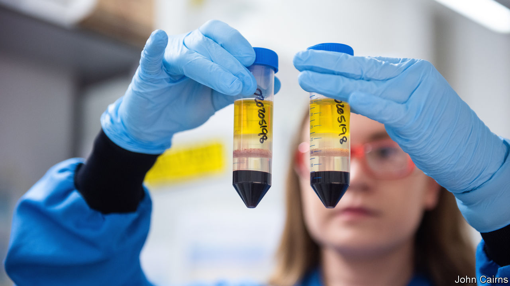
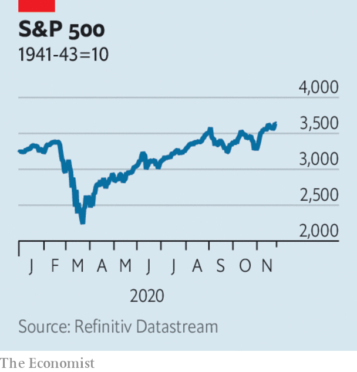

###### 

# Business this week 

#####  

 

> Nov 28th 2020 

Researchers at AstraZeneca, a drug company, and Oxford University reported that their vaccine for covid-19 is 70% effective on average. In one course of treatment that rises to 90%, close to the efficacy of the other two recent vaccine successes, though questions have been raised about the data behind AstraZeneca’s trial. Its jab is expected to be cheaper and easier to distribute globally. Three billion doses could be ready next year. See .

 


The good news on vaccines is one factor that has pushed stockmarkets into new territory. The Dow Jones Industrial Average passed the 30,000 mark for the first time and is on course for its best monthly gain since 1987. The S&amp;P 500 hit a new record; it is up by more than 10% this month. See .

Mellow Yellen

The growing probability of a smooth transfer of power to Joe Biden also cheered investors. His choice of Janet Yellen as treasury secretary was seen as a safe bet. The former chairwoman of the Federal Reserve should pass her confirmation hearing in the Senate, even if it remains under Republican control. Her first task will be to help craft a new stimulus bill. See .


One of the clearest signs yet that businesses are adapting to the new administration came from General Motors. The carmaker is withdrawing its support from the current government’s legal challenge to California’s vehicle-emission standards, the toughest in America. Mr Biden will bring in “ambitious” targets when he takes office, when he will also have a new climate tsar.

Tesla’s share price soared again, following the news that it is to be included in the S&amp;P 500 index from next month, which means tracker funds will be obliged to buy its stock. The electric-car maker’s market capitalisation raced past $500bn this week. That is more than five times the combined value of GM and Ford.

Rishi Sunak, Britain’s chancellor of the exchequer, produced his spending review, which was as grim as expected. Mr Sunak noted that the emergency had “only just begun”, forecasting that borrowing will be £394bn ($530bn) this year, or 19% of GDP, which would be the highest deficit in peacetime. In addition to a public-sector pay freeze he also took a swipe at foreign aid, by abandoning a policy of spending 0.7% of national income on it. See .

With the roll-out of vaccines for covid-19 on the horizon, airlines announced a raft of measures that they hope will make flying easier. Qantas became the first big carrier to suggest that it may ask passengers to prove they have had a vaccination before boarding a plane. Five airlines, including United and Lufthansa, said they would offer a “common pass” to travellers who have tested negative. American airports had their busiest weekend since March, handling more than 3m people ahead of Thanksgiving.

The good news about vaccines also spurred a rally in oil markets. Brent crude rose above $48 a barrel, its highest price since early March, before markets went into meltdown over the coronavirus.

Bertelsmann emerged the winner in a bidding war for Simon &amp; Schuster, the publishing arm of ViacomCBS. Bertelsmann, which owns Penguin Random House, is paying $2.2bn for the firm, though getting the deal completed will be a page turner. Regulators will look closely at the rationale for combining the publishers, which would have a third of the American market. See .

The drastic slowdown in global human activity because of covid-19 has led to only a “tiny blip” in the concentration of greenhouse gases in the atmosphere, according to the World Meteorological Organisation. Emissions may have been reduced by between 4% and 7.5% for the whole of the year relative to 2019, but CO remains in the atmosphere for centuries, so any amount of emissions contributes to a build-up. According to the WMO this year’s “blip” will be no bigger than normal annual fluctuations.

Showing that America is not the only country that has a problem with Chinese tech firms, India’s government banned another 43 apps that it said were “prejudicial” to the country’s “sovereignty and integrity”. Tension along the Himalayan border between China and India has risen since June and Delhi has banned 200 Chinese apps in all, in what it describes as a “digital strike”.

Move over Hollywood

Netflix announced that it would spend $1bn on expanding its studios in Albuquerque, creating one of the largest film-production sites in North America. Ten new stages, backlots and other facilities will generate 1,000 production jobs and almost 1,500 in construction. It will make films there, as well as the next series of “Stranger Things”. Last year Netflix opened a production hub at Britain’s Shepperton Studios and earlier this year plans were approved to build a studio complex near Ashford in southern England that may house Netflix and Amazon.

