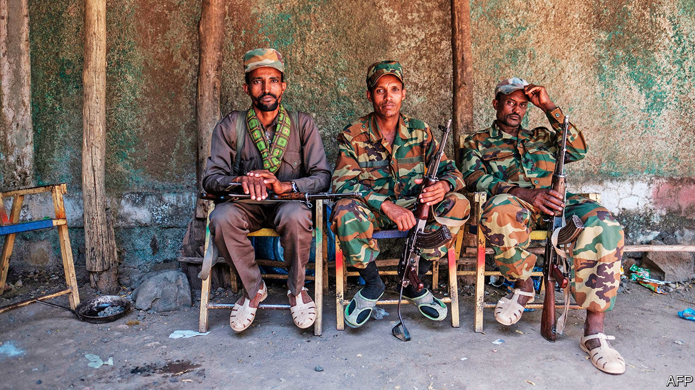
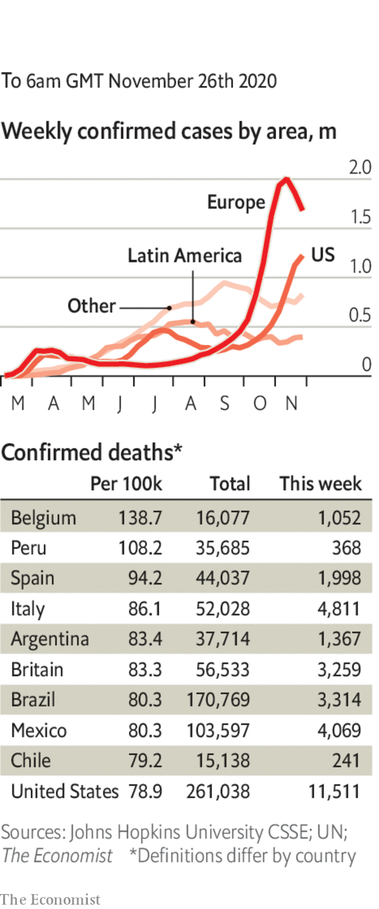

###### 

# Politics this week 

#####  

 

> Nov 26th 2020 

Federal forces in Ethiopia said they had surrounded Mekelle, the capital of the northern region of Tigray, and were about to attack the city to crush a rebellious regional government. They warned civilians to leave or receive “no mercy”. Ethnic clashes are exploding. Non-Tigrayans are being targeted in Tigray—perhaps 600 were massacred in one town. Tigrayans are being singled out elsewhere. Many have been arrested. Tigrayan soldiers in the national army have been disarmed. See .

Pre-election violence claimed at least 45 lives in Uganda. Bobi Wine, an opposition candidate, was arrested yet again. His supporters protested. Security forces shot several of them. See .


Israel’s prime minister, Binyamin Netanyahu, travelled to Saudi Arabia to meet Muhammad bin Salman, the powerful crown prince. There was no hint that the Saudi regime was about to recognise Israel. Rather, the meeting seemed intended to warn Iran to restrain its nuclear programme or risk a military strike, and to hint to Joe Biden that the two will oppose significant shifts in policy on the Middle East. See .

Iran released Kylie Moore-Gilbert, a British-Australian academic detained in 2018 and convicted of espionage in a secret trial. She was reportedly swapped for Iranians arrested abroad. Separately Iran said it will soon execute Ahmadreza Djalali, an Iranian-Swedish doctor, convicted in an unfair trial on charges that were brought after he refused to spy for the government.

Nicolas Sarkozy, president of France from 2007-12, went on trial accused of corruption and influence-peddling. He is charged with having tried to bribe a judge by promising assistance for a promotion in return for information about an investigation into him.

France’s lower house passed a bill that would make it illegal to share images of police for “malicious purposes”. This law, if also passed by the Senate, would make it harder to expose police brutality. Brussels is taking a look.

Donald Trump at last directed federal agencies to co-operate with the transfer of power to Joe Biden. The president’s refusal to do so had hindered the flow of classified information and other material to Mr Biden. Mr Trump also pardoned Michael Flynn, his first national security adviser, who had pleaded guilty to lying to the FBI during the Mueller investigation. Mr Trump is still contesting the election result, without success.

Mr Biden started choosing his team, picking Antony Blinken, who worked in Barack Obama’s administration, as his secretary of state. Avril Haines, another Obama veteran, is to be the director of national intelligence; Jake Sullivan, a former aide to Mr Biden, national security adviser. He also created a new position of special envoy on climate change. The job went to John Kerry, who signed the Paris accord in 2015 as Mr Obama’s secretary of state. In 2019 Mr Kerry started an initiative to hold politicians accountable if they fail to reduce emissions. See .

Joshua Wong, a prominent activist in Hong Kong, was remanded in custody after pleading guilty to charges relating to last year’s pro-democracy unrest in the city. Also detained were two leaders of Mr Wong’s now-disbanded political group, Demosisto: Agnes Chow and Ivan Lam. The three are expected to be sentenced next month.

China launched a spacecraft, Chang’e 5, in the first attempt by any country to retrieve rock samples from the Moon in more than 40 years. It is due to return to Earth in December.

Friendly governments and other donors promised to give the Afghan government $12bn over the next four years at a conference in Geneva. That marks a decline from the $15bn pledged four years ago.

Authorities in Singapore charged Jolovan Wham, a civil-rights activist, with disturbing public order for briefly holding up a sign with a smiley face on it. They maintain the act was an illegal protest. See .

Police in Thailand summoned 12 of the leaders of ongoing protests around the country in connection with an investigation into lèse-majesté. The protesters have called for reforms to the monarchy.

Thousands of Guatemalans protested against the budget passed by the country’s Congress. Some set fire to Congress itself. They were angry that the budget included extra money for congressmen’s meal allowances but less for the judiciary, malnutrition and health. Congress backed down.

Mexico’s Senate voted for a bill to legalise cannabis for recreational use. It would permit users to have up to 28g of cannabis and allow them to grow up to four plants at home. If the bill passes the lower house of Congress Mexico would become the third country, after Uruguay and Canada, to legalise cannabis fully for recreational use nationwide.

Diego Maradona, one of the best footballers of all time, died, aged 60. Short of stature, a dazzling dribbler and scorer of marvellous goals, Mr Maradona inspired Argentina, his national team, to victory in the World Cup in 1986 (with a bit of help from his miraculous “hand of God”). He also struggled with addictions to cocaine and alcohol. See .

Coronavirus briefs

 


Several Asian countries, including Japan, Malaysia and South Korea, reported an increase in cases. In Japan the government suspended a campaign in some areas to encourage people to travel.

Some European countries outlined plans to ease restrictions over Christmas. In Britain three households will be able to meet up over a five-day period. France will start reopening shops on November 28th and most other restrictions will end on December 15th. Restaurants will remain closed until January 20th, however. Germany went in the other direction and tightened its measures until at least December 20th.

The Australian states of New South Wales and Victoria reopened their border. It was shut in July, and flights between Sydney and Melbourne cancelled, amid a surge of the virus in Victoria. After a rigid lockdown, it has reported no new cases for several weeks.

