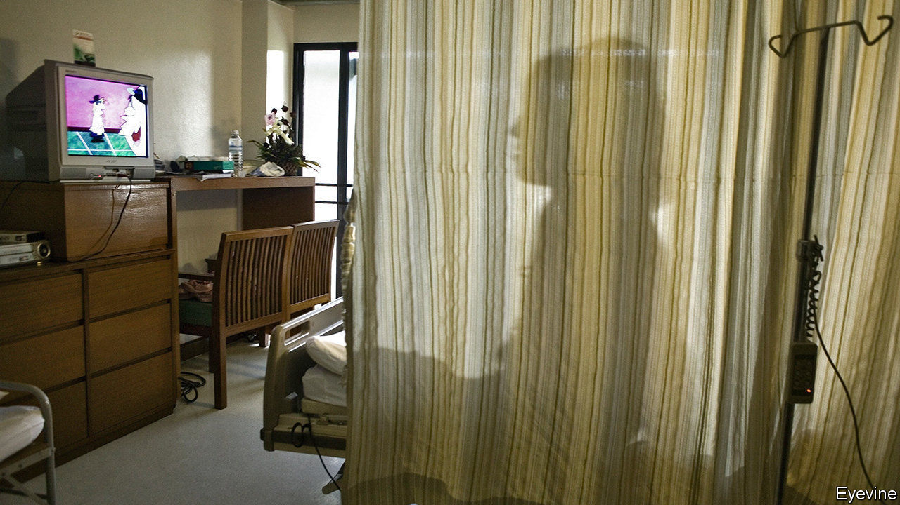

###### Miss gender

# A book on transitioning girls is denounced as transphobic 

##### Abigail Shrier has written the first book-length study of a fascinating phenomenon, yet it has been widely ignored 

 

> Nov 28th 2020 

A  TEENAGE GIRL who decides to alter her body so that it resembles a boy’s commits herself to a lifetime of medical treatments. “Top surgery”—a double mastectomy—is a major operation. She must take regular, large doses of testosterone. This may increase her chance of developing heart problems. It also causes the uterus to atrophy, often painfully, which may necessitate a hysterectomy.

Some of the changes to her body will be irreversible, and likely to cause distress if she changes her mind. If she has taken puberty-blockers as well as testosterone she may well be infertile. Only a few months of testosterone may have altered her voice and given her a lifelong five o’clock shadow. Fortunately for such girls, “bottom surgery”—a phalloplasty—is so often problematic that few request it.


All this, coupled with the fact that adolescence is confusing at the best of times, might suggest that teenagers should, by and large, be discouraged from embarking on biomedical gender reassignment. That is the argument running through “Irreversible Damage,” a book by Abigail Shrier, a journalist. It is not one that holds much sway in America. As the number of transgender clinics has grown from one in 2007 to at least 50 today, so has the number of young patients in them. Once they were mostly boys; today they are girls. Ms Shrier argues that many are victims of an ideology which holds that the feeling of being in the wrong body must be affirmed at all costs. It has fuelled a craze, she writes, to which teenage girls are particularly susceptible.

“Irreversible Damage” is full of stories from the mostly white, privileged world in which this seems to have flourished. Teenagers, often awkward and anxious, who have lost themselves in an online world that lionises anyone who identifies as trans. YouTubers, who “extol the glories of testosterone as if it were a protein shake” and dismiss parents who are sceptical of trans-identification as “toxic”. Teachers, who do not tell parents that their child is going by a different name at school. The group she reports on in greatest detail is parents. Many of them come across as hapless. Apparently unable to tell their children that feelings of pain and confusion, especially in adolescence, are part of life and usually pass, they instead hope therapists will sort everything out.

Ms Shrier is damning of some of the professionals who have built careers working with trans-identifying children. She points out that this is the only medical field apart from cosmetic surgery in which both diagnosis and treatment are determined by the patient. She describes doctors and therapists (who would ordinarily consider it their job to challenge their patients’ assumptions) bowing to the judgment of vulnerable teenagers. They also, grievously, tell parents who do not accept that their daughters are boys that failing to affirm their identity may heighten the risk of suicide (research does not back this up).

Data on transgender medical interventions are poor—no one knows how many teenagers have transitioned—and one wonders at times if Ms Shrier may have become so steeped in the phenomenon that she exaggerates its reach. But she tells the stories of those she interviews with great care. She writes empathetically about the distress of gender dysphoria, “the relentless chafe of a body that feels all wrong,” and the experience of adults who have transitioned (a group that has long suffered discrimination). She quotes her interviewees at such length that it would be hard to claim she has misrepresented them.

Yet despite this the book has been denounced as transphobic. This month, a prominent lawyer from the American Civil Liberties Union tweeted, from his personal account, that “stopping the circulation of this book and these ideas is 100% a hill I will die on”. A professor of English literature at Berkeley suggested that people should steal the book and burn it. Few mainstream newspapers have reviewed it, though it is one of the first accessible treatments of a subject that has generated much fascinated coverage.

This is a clear illustration of what the book claims: the dominance of an ideology that brooks no dissent or debate. One of the most shocking episodes it describes concerns Lisa Littman, a medical doctor and researcher at Brown University, who noted in a paper in 2018 that most transgender children were teenage girls with no history of gender dysphoria. Many of the teenagers in her study had been exposed to peers who had come out as trans shortly before doing so themselves; a majority had spent more time on the internet. The study sparked a bullying campaign, which prompted Brown to publish an apology, though the paper’s findings never changed. She was fired from another job as a consultant.

In “Irreversible Damage” Ms Shrier describes meeting Dr Littman and wondering out loud about the cultural factors that might be causing so many American girls to want to become boys. She is impressed when Dr Littman refuses “to theorise beyond the limits of her data”. This punctilious respect for the facts had threatened to destroy her career.■

