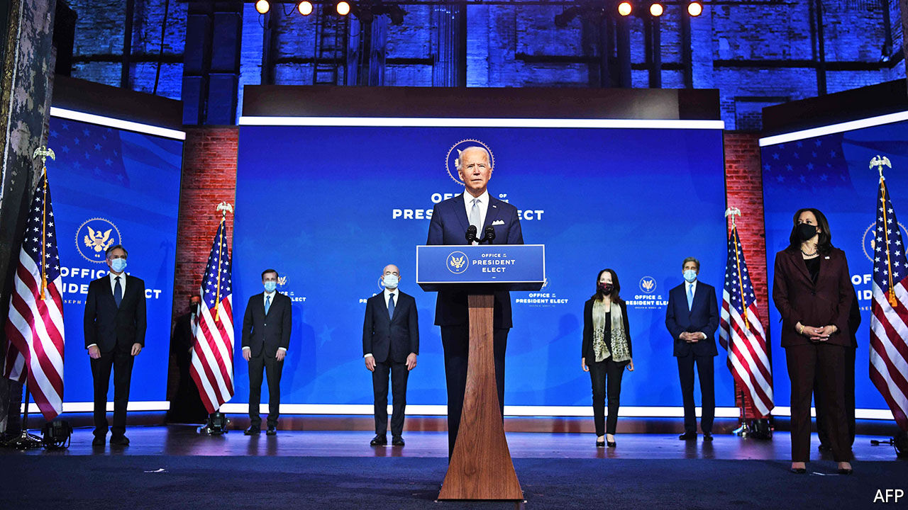

###### In transit

# Joe Biden unveils a reassuringly familiar national-security team 

##### The mixture of brains and experience will delight allies 

 

> Nov 28th 2020 

LESS THAN 24 hours after Donald Trump concluded that he could block the transition to Joe Biden’s incoming administration no longer, the Democratic veteran took the stage alongside his chosen national-security team. “America is back, ready to lead the world, not retreat from it,” he said. The happy gurgles of relief this elicited in Washington, DC, London, Tokyo and beyond may be imagined.

Even more than expected, Mr Biden’s choices reflected a stress on unflashy expertise, pragmatism and personal loyalty. His secretary-of-state nominee and national security adviser, respectively Antony Blinken and Jake Sullivan, are well-regarded Obama administration veterans. Mr Blinken, mild-mannered, impeccably coiffured and Francophone, served as the former vice-president’s national security adviser and as a deputy secretary of state. Mr Sullivan, possessed of a first-rate intellect and slightly lesser coiffuring, was another well-liked Biden NSA.


Being friends, they would not be at each other’s throats as Mike Pompeo and John Bolton were. The likely result of their partnership (cue more cooing) would be a return to low-key, competent governing, and a predictable foreign policy that reflects Mr Biden’s long-standing views. Messrs Sullivan and Blinken could be expected to engage with global problems, through alliances where possible, and rebuild the institutions they were charged with. America, suggested Mr Blinken, should have the “humility and confidence” to rely on its allies. By choosing a relatively low-profile secretary, notwithstanding Mr Blinken’s qualities, Mr Biden may additionally be signalling that he intends to do the highest-level diplomacy himself.

It was hard not to hear this as a repudiation of Mr Trump—and harder still when Mr Biden’s chosen Director of National Intelligence (DNI), Avril Haines, promised that, if confirmed by the Senate, she would “continue speaking truth to power”. Another Obama administration veteran, and former deputy chief of the CIA, she would be the first woman DNI. Alejandro Mayorkas would be the first Latino and immigrant to lead the Department of Homeland Security. Mr Biden’s chosen UN ambassador, Linda Thomas-Greenfield was a rare black woman at the heights of American diplomacy, before she was sacked by Mr Trump.

The diversity of Mr Biden’s nominees is also from Mr Obama’s playbook. It is intended in part to mollify the hard-left, whose champions the president-elect has otherwise ignored. His nomination of John Kerry, to be his empowered climate envoy, was another challenge to the left. Mr Kerry is a pillar of the reviled Democratic establishment; yet the left must love his newly-created post. Mr Biden’s nominees have been duly welcomed across the party. By way of dissent, Representative Alexandria Ocasio-Cortez and other lefties have limited themselves to signing a petition against the possible reappointment of Mr Biden’s former chief of staff, Bruce Reed, a relatively obscure figure, on account of his past openness to welfare reform. If that constitutes the serious Democratic infighting that some news reports have described it as, Mr Biden can rest easy.

Stiffer criticism of Mr Biden’s nominees has come from Republican hawks. Senator Marco Rubio characterised them as a bunch of privileged do-gooders who would be “polite &amp; orderly caretakers of America’s decline”. That rather ignored the fact that most of Mr Trump’s team are Ivy Leaguers, who have not restored American hegemony—and that Ms Thomas-Greenfield grew up poor in Louisiana. Yet Mr Rubio’s spiky comments speak to a legitimate question about how Mr Biden’s national security approach will differ from Mr Obama’s.

Mr Sullivan and Mr Blinken have criticised the Obama administration’s areas of diffidence (on Syria and China especially). Mr Biden has additionally underlined that the post-Trump world is different from the one his former boss presided over. On balance, that is probably to his advantage.

Besides lashings of goodwill, his administration will have some useful leverage to work with, in the form of Mr Trump’s sanctions on Iran and tariffs on China. It will have little incentive to dispense with either in a hurry. Even if Iran can be persuaded to comply with the terms of the nuclear containment deal (negotiated by Mr Sullivan) that Mr Trump abrogated, Mr Biden would try to broaden it. And there is no appetite in Washington for giving China something for nothing. Notwithstanding the happy rhetoric, this might augur a foreign policy that is neither a total repudiation of Mr Trump’s nor a re-embrace of Mr Obama’s, but a cross between the two.■

Dig deeper:Read the  and explore our , then sign up for Checks and Balance, our  and  on American politics.

