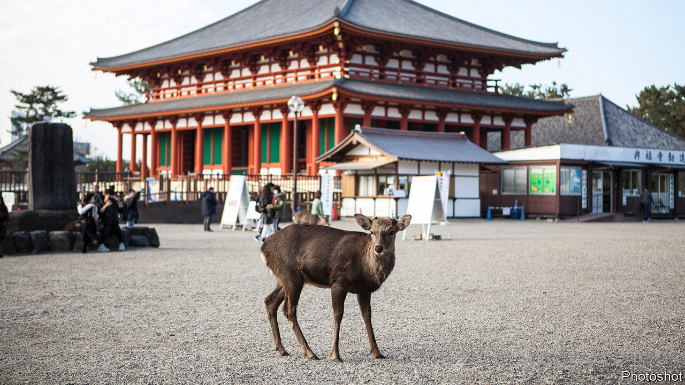

###### Hungry ungulates

# A crash in tourism leaves Japanese deer ravenous for treats 

##### The sacred deer of Nara miss their old diet of rice crackers 

 

> Dec 3rd 2020 


THE MORE than 13m tourists who visit Nara, an ancient capital of Japan, each year tend to follow a well-worn path. On their way into a park at the edge of the city they pass the towering wooden pagoda of Kofuku-ji, a temple complex founded in 710. They continue to nearby Todai-ji, gazing in awe at Japan’s largest Buddha, a bronze behemoth weighing 400 tons and standing 15 metres tall. And finally they feed shika senbei, a special kind of rice cracker, to the sacred deer, some 1,300 of which live in the park.


The deer, though wild, have come to love the crackers. With tourism reduced to a trickle because of the pandemic, they are hungry. Many have begun wandering far from home in search of food. A recent study by the Nara Deer Preservation Foundation and Tatsuzawa Shirow of Hokkaido University shows that 20% fewer are spending their days in the park; incidents of damage caused by deer in town have shot up. The less enterprising ones, apparently accustomed to eating only crackers, have become emaciated.


The deer are not the only ones going hungry. So are businesses in places like Nara, which have come to rely ever more heavily on tourism in recent years. Fewer than 7m foreign tourists visited Japan in 2009; last year some 32m did. Revenue from tourism hit a record 4.8trn yen ($46bn). With the Olympics scheduled for this past summer, Japan had hoped to welcome 40m foreigners this year. Instead, after a near-total closure of its borders because of the pandemic, arrivals have dropped by 99.4%.


The government has tried to cushion the blow by encouraging its own citizens to get out more. The Diet earmarked ¥1.35trn ($12.9bn) for “Go To Travel” subsidies, which provide discounts of up to 35% at domestic hotels and inns; a concurrent programme called “Go To Eat” applies to restaurants. The ministry of tourism says nearly 40m nights have been booked under the programme since it was launched in July. That is a pyrrhic victory: the campaign is thought to have contributed to a recent uptick in covid-19. Daily cases reached a record of 2,680 on November 28th. Suga Yoshihide, Japan’s prime minister, recently announced that the subsidies would be suspended in areas with high caseloads. In addition, older Japanese have been asked not to make use of them.


Japan is loth to give up on tourism, or to let the infrastructure that supports it wither. (Mr Suga himself championed tourism as chief cabinet secretary to his predecessor, Abe Shinzo.) Officials see spending by foreign visitors as a means to compensate for Japan’s own shrinking population. Tourism may also help make Japan more open to foreign migrants in the future, says Saito Jun of the Japan Centre for Economic Research, a think-tank in Tokyo.


Meanwhile, the more resourceful deer in Nara have reverted to a healthier diet of plants and nuts, which has been good for their insides. Their droppings, made pale and runny by the crackers, have become firmer and darker again. If only belt-tightening were as good for the economy. ■


Editor’s note: Some of our covid-19 coverage is free for readers of The Economist Today, our daily . For more stories and our pandemic tracker, see our 

