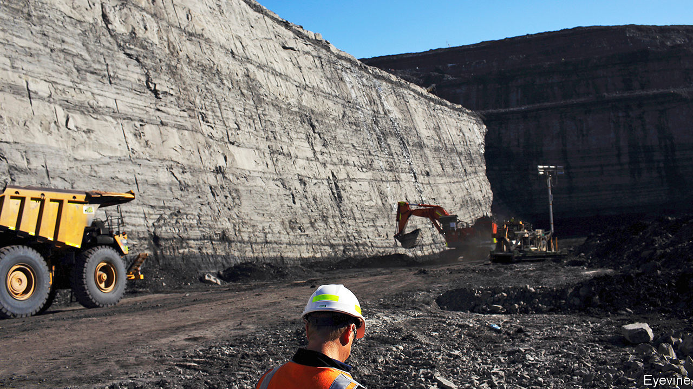

###### Losing seam

# As the federal government harrumphs, Australia moves away from coal 

##### Both its states and its export markets have pledged drastic cuts in carbon emissions 

 

> Dec 5th 2020 


IF A COAL-FREE future awaits the town of Muswellbrook, in New South Wales, there is little sign of it. It is surrounded by vast canyons of grey and brown rock—open-cast coal mines. Nearby, two huge power plants burn their output for electricity. More is piled onto sooty trains which rumble constantly through the town, conveying its riches east, to the port of Newcastle, from which the coal is shipped across Asia.


According to Muswellbrook’s mayor, Martin Rush, the surrounding region is the source of more than a tenth of the world’s internationally traded thermal coal (the sort burnt in power plants, as opposed to coking coal, which is used to make steel). Fully one third of locals rely on the stuff for well-paid work. The problem is that, in the next five years, three of the area’s mines will close. So will one of the ancient power stations, as utilities replace coal with cheaper, cleaner energy. Mr Rush reckons that it will take “between 20 and 30 years” for the local industry to die out altogether. Some miners hope for longer. Either way, says Mike Kelly of the local chamber of commerce, no one denies that the long-term trend is down.


The same realisation is dawning across Australia. Its three biggest export markets for fossil fuels—China, Japan and South Korea—have all recently pledged to achieve carbon neutrality by the middle of the century or just after. Another buyer of Australian coal, the Philippines, has banned new coal-fired power plants.


The federal government, a right-wing coalition, appears in denial about this changing outlook. Scott Morrison, the prime minister, insists he is “not concerned about our future exports”. When ANZ, a bank, said in October that it would stop funding new coal mines, coal-loving MPs griped that it was “virtue-signalling” and called for a boycott. (Australia’s three other big banks had already pledged to steer clear of coal.) A government minister told pension funds, which are also selling sooty investments, that their goal should be to maximise returns and “not to change the earth’s temperature”.


The politicians’ misgivings are understandable. Coal is Australia’s second-biggest export, bringing in almost A$70bn ($49bn) in 2019. It also provides two-thirds of its electricity. The industry’s hold over politics is such that three of Mr Morrison’s four most recent predecessors lost power after trying to curb the country’s emissions of greenhouse gases.


Yet even right-wingers in the federal parliament harp on less than they used to about the need to open new mines or subsidise coal-fired power stations, notes Greg Bourne of the Climate Council, a green pressure group. And while they may have prevented the federal government from taking steps to curb the use of coal, they cannot prevent Australia’s states and territories from trying to. In fact, every one of them has set a target of reducing net emissions to zero by 2050, although Mr Morrison refuses to do so. The tiny Australian Capital Territory, host to Mr Morrison’s government in Canberra, already generates all its power from clean sources. In October South Australia became, for an hour, the world’s first big jurisdiction to run only on solar power.


But it is a state run by the same coalition as the federal government, New South Wales, that has the most ambitious plan to decarbonise, notes Simon Holmes à Court of Melbourne University. It has pledged to underwrite 12 gigawatts of clean-energy projects and a further two gigawatts of energy storage to back them up over the next ten years. That would be enough to power several smaller states on its own.


The state’s energy minister, Matt Kean, won support from the coal lobby in the coalition by promising A$32bn of investment in regions that will need it as mining declines. When the legislation passed the state parliament in late November, only One Nation, a populist party, opposed it. Mr Kean takes this as a sign that “we have wrested back control” from “the coal barons that have decided energy policy in this country for generations”.


Miners, though, argue that these grand green plans will inevitably lead to higher power prices and thus crimp economic growth. Ditch coal, and all Australians “will have to downgrade their lifestyle”, says Gus Mather, who makes equipment for the mines. Muswellbrook is planning multiple clean-energy schemes, from pumped-hydro to biofuels. But Mr Rush, the mayor, worries that no coal town has ever managed to stop digging the stuff up and remain prosperous. ■


For more coverage of climate change, register for The Climate Issue, our fortnightly , or visit our 

