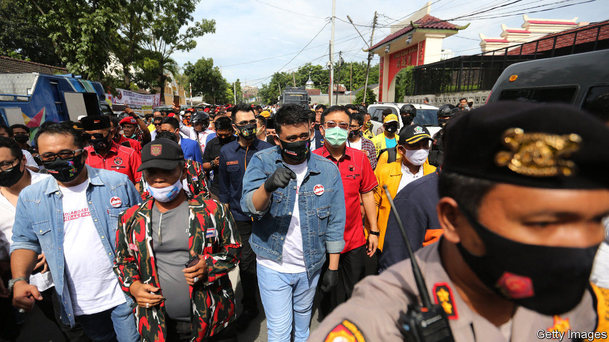

###### Son set

# Indonesian politics is becoming a family affair 

##### Both the president’s son and his son-in-law are standing in regional elections 

 

> Dec 3rd 2020 


WHEN JOKO WIDODO was elected president of Indonesia in 2014, it marked a turning-point in the country’s politics. Jokowi, as he is better known, hails from a humble background—he grew up in a riverside shack—yet managed to vault himself into the nation’s highest office. It was the first time that somebody who did not belong to the political or military elite was in charge of the country. True to his image as an outsider, he vowed that budding politicians in his family would not ride on his coat-tails, writing in his autobiography, published in 2018, that “becoming a president does not mean channelling power to my children”.


But since his re-election last year, Jokowi seems to have had a change of heart. Both his son and son-in-law, neither of them with any experience in politics, are running in regional elections on December 9th under the banner of Jokowi’s party, the PDI-P. His son, Gibran Rakabuming Raka, is running for mayor of the city of Surakarta, the job that was his father’s political launchpad. Mr Gibran is so far ahead of his opponent in the polls that December 9th will be less an election, more a coronation. 


Jokowi is unusual only in his initial refusal to smooth the way for his offspring. Since the advent of democracy in 1998, and the devolution of power from central to local governments shortly after that, politicians have sought to establish dynasties. A growing number are doing so at the local level. In elections held in 2015, 52 candidates, or 3% of the total, were related to politicians who currently or previously led a regency (county), city or province, according to Yoes Kenawas, who studies dynasticism in Indonesian politics. In next week’s local elections, nearly three times as many candidates—about 10% of the total—have family connections.


Jokowi’s son and son-in-law are not the only people with ties to the presidential palace to have entered the fray. The vice-president’s daughter, who is running for mayor of South Tangerang, a city abutting Jakarta, the capital, is competing against the niece of the defence minister. In eastern Java the 28-year-old son of Jokowi’s cabinet secretary is running for regent.


This is the first time that so many relatives of national figures are running in local elections, according to Mr Yoes. Many of those national figures are themselves dynasts. The defence minister, Prabowo Subianto, was married for a long time to a daughter of Suharto, Indonesia’s dictator of 31 years. Suharto came to power by overthrowing Sukarno, Indonesia’s first president. Sukarno’s daughter, Megawati Sukarnoputri, was president from 2001 to 2004, and remains the head of the PDI-P.


The Indonesian public is put off by the cosiness of its political class, so much so that in 2015 the national parliament passed a law barring the relatives of incumbents from running for regent, mayor or governor. The law was deemed unconstitutional by the courts and overturned later that year, yet the public’s distaste persists: nearly 61% of those surveyed in July by Kompas, a local magazine, disapproved of relatives of politicians running for regional offices. 


Yet politicians keep trying to entrench power within their families—often because the opportunities to make money that come with a political office are too good to turn down. Political parties do little to discourage nepotism. They are, after all, animated by personalities, not by policies, points out Ben Bland of the Lowy Institute, a think-tank in Australia. They therefore need politicians with name recognition to propel them to victory: better the relative of a somebody than a nobody.


Plus, candidates must bear the cost of campaigning, which is becoming ever more exorbitant. Parties therefore need candidates who either have deep pockets themselves or know people who do. The prohibitive cost of running for office means that “it is virtually impossible” for those without means or “connections with established patronage networks to prevail”, says Vedi Hadiz of the University of Melbourne in Australia. 


It is up to the “smart and discerning” Indonesian public to decide whether his son is fit for office, Jokowi told the BBC earlier this year. But the high cost of campaigning and the associated preponderance of well-connected candidates mean that a growing share of those running for office come from the same background, winnowing the options available to voters. Many would-be politicians doubtless balk at pitting themselves against an opponent backed by a powerful family.


Take Mr Gibran. He risked running unopposed, which would have underscored the perception that he was coasting on his father’s reputation. Heroically, somebody threw his hat into the ring at the last minute: Bagyo Wahyono, a tailor. He says he had no desire to run in the election—“I actually don’t like politics,” he told a local magazine. The chairman of the organisation funding his campaign denies the allegation that Mr Bagyo is a “puppet” of the PDI-P, put up to ensure Mr Gibran had some competition. If smart and discerning voters have doubts about that, it is not clear how they can express them. ■

