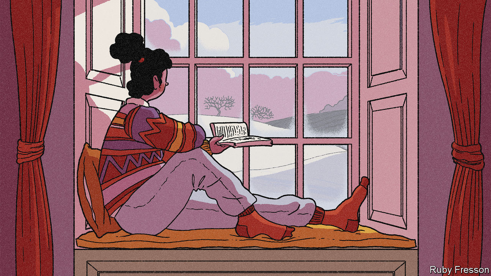

###### Cold comforts

# Our books of the year 

##### They were about corruption, revolutionaries, Glasgow in the 1980s, John Maynard Keynes and musical lives 

 

> Dec 5th 2020 

Politics and current affairs


Kleptopia: How Dirty Money is Conquering the World. By Tom Burgis. Harper; 464 pages; $28.99. William Collins; £20


It is hard to write about international corruption in an accessible and colourful way, while retaining an urgent sense of moral condemnation. This book beautifully captures both the murkiness and turpitude involved. Its ultimate theme—the intersection of politics and personal enrichment—is one of the most important stories of the age.


Putin’s People. By Catherine Belton. Farrar, Straus and Giroux; 640 pages; $35. William Collins; £25


Many books have tried to explain the rise and ruthlessness of Vladimir Putin; this one is the closest yet to a definitive account. It draws on extensive interviews and archival sleuthing to tell a vivid story of cynicism and violence. On this view, a massive concentration of wealth and power in the hands of a few is used to quash dissent and project force abroad.


Eat the Buddha: Life and Death in a Tibetan Town. By Barbara Demick. Random House; 352 pages; $28. Granta; £18.99


This is the grippingly told story of Ngaba, a county seat near the edge of the Tibetan plateau, and of the sufferings of its people under the Chinese Communist Party’s rule. Exploring an area rarely visited by foreigners, the author paints striking portraits of people living there, with a fine eye for detail and a keen grasp of Tibet’s history.


Irreversible Damage. By Abigail Shrier. Regnery Publishing; 276 pages; $28.99 and £22


A critical look at the enormous rise in recent years in people identifying as trans, especially among girls. It covers a brewing scandal over the provision of irreversible treatments, whether surgical or pharmaceutical, to teenagers. Predictably controversial—yet there is not a drop of animosity in the book.


Should Auld Acquaintance Be Forgot. By John Lloyd. Polity; 224 pages; $25 and £20


A timely, forceful rehearsal of the painful consequences that might follow independence for Scotland, and of the virtues of union with England. The author, a distinguished journalist, makes a case for enhanced devolution, powerfully enlisting and evoking his own childhood in a Scottish fishing village.


Why the Germans Do It Better. By John Kampfner. Atlantic Books; 320 pages; £16.99


This breezy but comprehensive paean argues that Germany’s culture of consensus and stability has bred a resilience unusual among crisis-prone democracies. Despite the teasing title—a jab at the author’s native Britain—it acknowledges Germany’s problems, from creaking infrastructure to somnolent foreign policy.


Twilight of Democracy. By Anne Applebaum. Doubleday; 224 pages; $25. Allen Lane; £16.99


Mixing personal anecdote and analysis, a well-connected historian of communism chronicles the collapse of the international liberal coalition that was forged during the cold war. A perceptive insight into the rise of authoritarian populism.

Biography and memoir


Black Spartacus. By Sudhir Hazareesingh. Farrar, Straus and Giroux; 464 pages; $30. Allen Lane; £25


The subject of this superbly researched book was born a slave and grew up to be the leading figure in the uprising of 1791, in modern Haiti, which reverberated around the world. Fragmentary records have until now meant Toussaint Louverture was a shadowy historical character; this reconstruction gives his political, military and intellectual accomplishments their due.


A Promised Land. By Barack Obama. Crown Publishing Group; 768 pages; $45. Viking; £35


There is little score-settling and much introspection in this account of the author’s rise to the White House and his first few years in it. Reflective and reasonable almost to a fault, the book is also a reminder that the 44th president is one of the best writers ever to serve in that office.


Stranger in the Shogun’s City. By Amy Stanley. Scribner; 352 pages; $28. Chatto &amp; Windus; £16.99


Set in the first half of the 19th century, this story of an obscure woman’s everyday struggles in what is now Tokyo is a triumph of scholarship. Using a trove of documents about her downtrodden subject, the author lifts the veil on a half-remembered world of beauty and cruelty.


House of Glass. By Hadley Freeman. Simon &amp; Schuster; 352 pages; $26. Fourth Estate; £16.99


Living out her final years in Florida, the author’s grandmother, Sala, longed for Paris. She was actually born in what today is Poland, fleeing from the pogroms to France. Her family’s intricately reconstructed lives are a moving parable of the Jewish 20th century. One of her brothers was murdered in Auschwitz. Another leapt from a train, joined the resistance and later became friends with Picasso.


Kiss Myself Goodbye. By Ferdinand Mount. Bloomsbury; 272 pages; $30 and £20


This is the hilarious tale of a bizarre, multi-bigamist, pathologically inventive aunt in raffish, upper-class Britain either side of the second world war. Part detective story, part social history, it moves from the backstreets of Sheffield to Claridges.

History


Underground Asia. By Tim Harper. Harvard University Press; 864 pages; $39.95. Allen Lane; £35


A brilliant study of Asian revolutionary movements in the first decades of the 20th century, showing how a collective consciousness emerged in the liminal cracks of empire—in steerage class on steamships, in the doss houses of port cities and radical circles in London and Paris. Western ideas raced back to Asia, undermining colonial rule. The revolutionaries’ big truth, says the author, was that Asia lay “at the forefront of human futures”.


Every Drop of Blood. By Edward Achorn. Atlantic Monthly Press; 336 pages; $28. Black Cat; £19.99


Abraham Lincoln’s second inaugural address, delivered towards the end of the civil war, is etched on the wall of his memorial in Washington. Declining to gloat, the soon-to-be victorious—and assassinated—president instead advocated “malice toward none” and “charity for all”. This book richly evokes the intellectual origins and context of a speech that remains a model of political magnanimity.


A House in the Mountains. By Caroline Moorehead. Harper; 416 pages; $29.99. Chatto &amp; Windus; £20


After the country capitulated to the Allies in 1943, around 80,000 partisans in northern Italy died in a fight for freedom against fascist loyalists and their Nazi backers. Weaving deep research into a compelling narrative, this book tells the story of four women involved in the struggle.


Alaric the Goth. By Douglas Boin. W.W. Norton; 272 pages; $26.95 and £19.99


History may mostly be written by the victors, but the destruction of Rome by the far less literate Goths in 410AD is an exception. This colourful portrait of the city and empire in the fifth century tells their side of the story. Rich Romans lived in splendour while Goths endured slavery. Alaric, their leader, served in the Roman army—before turning on the oppressors.

 


India’s Founding Moment. By Madhav Khosla. Harvard University Press; 240 pages; $45 and £36.95


A punchy reminder of the success of India’s birth as a democratic republic. The genius of its constitution kept the country on course for seven decades of peace and (slow) growth; but it has suffered erosion in the era of Narendra Modi.

Fiction


The Slaughterman’s Daughter. By Yaniv Iczkovits. Translated by Orr Scharf. MacLehose Press; 528 pages; £18.99. To be published in America by Schocken in February; $28.95


Echoes of Russian and Yiddish literature resound in this delightful picaresque, but you need not hear them to enjoy it. It is the late 19th century, and a Jewish mother in the Pale of Settlement sets out to retrieve her wayward brother-in-law from Minsk. Technicolour characters, pathos and humour are all wonderfully captured in a nimble translation from the Hebrew.


Shuggie Bain. By Douglas Stuart. Grove Press; 448 pages; $17. Picador; £14.99


This richly told coming-of-age story, set in the deprived Glasgow of the 1980s, won this year’s Booker prize. Though the title character charms with his humorous sideways look at the world, the emotional centre of the book is his “disintegrating mother”, Agnes, whose high hopes are tragically derailed by alcoholism.


My Dark Vanessa. By Kate Elizabeth Russell. William Morrow; 384 pages; $27.99. Fourth Estate; £12.99


The title comes from a novel by Vladimir Nabokov, and the story is in part a reworking of “Lolita”, recounting a teenage girl’s grooming and abuse by a middle-aged teacher. In intercut sections she looks back on those events from adulthood, through a haze of twisted memory. A powerful tale that will strike a chord with many women—but really ought to be read by men.


The Glass Hotel. By Emily St John Mandel. Knopf; 320 pages; $26.95. Picador; £14.99


This immersive novel’s main character is a bartender who becomes the trophy wife of a con-man, then a cook on a container ship. Evoking the atmosphere of the financial crash of 2008, its real theme is the difficulty of outrunning the past. “There are so many ways to haunt a person,” the author writes, “or a life.”


The Ministry for the Future. By Kim Stanley Robinson. Orbit; 576 pages; $28 and £20


Climate change is a notoriously tough subject for novelists—this is its most important treatment for some time. Led by an Irish former minister, an intergovernmental body explores avenues from terrorism to geoengineering to central banking as it bids to avert disaster. At times horrifying, at others seeming almost to spin out of control, the book is powered by a hopeful yet illusionless vision of the future.


Homeland Elegies. By Ayad Akhtar. Little, Brown; 368 pages; $28. Tinder Press; £18.99


A dazzling, part-autobiographical tale about growing up as a Pakistani-American through the age of 9/11 and then Donald Trump. It grapples with ambivalence about Islam, permanent feelings of unbelonging and the hazards of material success. By a Pulitzer-prizewinning playwright.


The Perfect Nine. By Ngugi wa Thiong’o. The New Press; 240 pages; $23.99. Harvill Secker; £12


Most writers lose their energy and inventiveness as they grow old. Not the 82-year-old Kenyan author of this fresh and magical novel. Written in galloping blank verse, it tells of the very first Kikuyu and their passionate attachment to Mount Kenya, the home of their god, Ngai.


Burnt Sugar. By Avni Doshi. The Overlook Press; 240 pages; $26. Hamish Hamilton; £14.99


“I would be lying,” the narrator begins, “if I said my mother’s misery has never given me pleasure.” Antara, now an adult, cannot forgive her parent’s failings and cruelties yet feels compelled to care for her as dementia takes hold. This gripping debut novel probes the ties that bind as well as the slippery nature of memory.

Culture and ideas


Magdalena: River of Dreams. By Wade Davis. Knopf; 432 pages; $30. Bodley Head; £25


The river of the title is the heart and soul of Colombia. As well as bisecting the country, the waterway is “the wellspring of Colombian music, literature, poetry and prayer”, says the author, a Canadian anthropologist and explorer. Travelling the 1,000-mile length of the Magdalena, on foot, horseback, by car or—often—by boat, he has produced an enchanting chronicle blending culture, ecology and history.


Mozart: The Reign of Love. By Jan Swafford. Harper; 832 pages; $45. Faber &amp; Faber; £30


Mozart’s compositions, notes this outstanding account of his life and work, display “a kind of effortless perfection so easily worn that they seem almost to have written themselves”. In this telling Mozart was a fundamentally happy man, a genius with an enduringly childish sense of humour. The author, a composer himself, peppers his narrative with penetrating insights into the music.


Time of the Magicians. By Wolfram Eilenberger. Translated by Shaun Whiteside. Penguin; 432 pages; $30. Allen Lane; £25


High thinking and low politics meet in this lively group portrait of four revolutionary German-language philosophers in the 1920s. Ludwig Wittgenstein, Walter Benjamin and Martin Heidegger all gazed thrillingly into the post-war cultural abyss; as a Nazi stooge, Heidegger jumped in. Only the decent, liberal Ernst Cassirer, “thinker of the possible”, entirely kept his head.

 


Leo Tolstoy. By Andrei Zorin. Reaktion Books; 224 pages; $19 and £11.99


The lineaments of Tolstoy’s astonishing life are well known: the libertinism, the remorse, the masterpieces, the infamously unhappy marriage and death at the train station in Astapovo. But this elegant, perceptive biography weaves together his times, his writing, his faith and his political activism into a single, seamless whole.


150 Glimpses of the Beatles. By Craig Brown. Farrar, Straus and Giroux; 592 pages; $30. Published in Britain as “One, Two, Three, Four”; Fourth Estate; £20


Books about the Beatles often get bogged down in minute details of the band’s career. This one cuts through the morass with wit and style, in an ingenious history that homes in on 150 revealing and entertaining anecdotes. Ringo comes out well, the others not so much.

Science and technology


A Dominant Character. By Samanth Subramanian. W.W. Norton; 400 pages; $40. Atlantic Books; £20


The subject of this astute book was a giant of British science. J.B.S Haldane helped flesh out Darwin’s theory of natural selection by marrying it to genetics and grounding it in maths. He served in the trenches during the first world war and wrote prodigiously. A committed communist, he was slow to acknowledge the Soviet Union’s depredations. “Even if the professors leave politics alone,” he remarked, “politics won’t leave the professors alone.”


The End of Everything (Astrophysically Speaking). By Katie Mack. Scribner; 240 pages; $26. Allen Lane; £20


The universe had a beginning and, one day, it will end. The author uses the latest physics to explore the possibilities for doomsday. Despite her solemn theme, her humour and eclectic references (from Shakespeare to “Battlestar Galactica”) carry the book along. Even through discussions of cutting-edge science, the general reader is never bewildered.


The Human Cosmos. By Jo Marchant. Dutton; 400 pages; $28. Canongate; £16.99


From the beginning of human civilisation, religion, art and science have been preoccupied by the stars and other celestial wonders. This is a thought-provoking look at how fascination with the heavens has shaped human culture, and still does.


Privacy is Power. By Carissa Véliz. Bantam Press; 288 pages; £12.99. To be published in America in June; $24.95


The constant and ubiquitous collection of data on private citizens is an abusive system that undermines their rights, argues an Oxford philosopher. Her solutions, such as banning the trade in personal data, may be extreme, but she galvanises an urgent conversation.


Apollo’s Arrow. By Nicholas Christakis. Little, Brown; 384 pages; $29 and £20


A leading sociologist and scientist considers the history of plagues and how some countries blundered in their responses to covid-19. Pandemics are not just biological but sociological, he notes: viruses mutate but human behaviour changes, too.

Business and economics


No Filter. By Sarah Frier. Simon &amp; Schuster; 352 pages; $28. Random House Business; £20


Drawing on the author’s close access to insiders at Instagram, this is a lively and revealing view of how the world came to see itself through the platform’s lens. Her tale includes glimpses of Silicon Valley’s weirdness, and an account of Instagram’s sale to Facebook—and its sour aftermath.


No Rules Rules. By Reed Hastings and Erin Meyer. Penguin Press; 320 pages; $28. Virgin Books; £20


Limitless holiday and no formal expense caps sound like a recipe for corporate chaos. In a rare book by a chief executive that is both readable and illuminating, the boss of Netflix—and his co-author—explain how he arrived at these and other radical management rules, and why they are not as bonkers as they sound.


The Price of Peace. By Zachary Carter. Random House; 656 pages; $35 and £25


This wonderfully written portrait of John Maynard Keynes traces the evolution of his thinking about political economy. It recasts his contributions to 20th-century intellectual life in a way both enlightening and truer to his thought than most accounts given in the classroom.


The Myth of Chinese Capitalism. By Dexter Roberts. St Martin’s Press; 288 pages; $28.99 and £22.99


An unvarnished look at the rural migrants who have fuelled China’s long boom but remain second-class citizens. The author combines sharp analysis with the story of a family he followed for two decades.


Fully Grown. By Dietrich Vollrath. University of Chicago Press; 296 pages; $27.50 and £20


A wide-ranging and original study of the slowdown in economic growth in America in recent decades. The author attributes it to the exhaustion of returns from the spread of education and women entering the workforce, and the switch towards services as people have become richer. These trends are welcome, he argues: a lack of low-hanging fruit means you have successfully picked it all.


Open: The Story of Human Progress. By Johan Norberg. Atlantic Books; 448 pages; $24.95 and £20


Progress depends on openness, this book contends, yet that creates a backlash, since people are hard-wired to fear rapid change. The author marshals arresting examples from every continent and era, ending on an optimistic, timely note. Recent years have seen the rise of populist demagogues who want to pull up drawbridges—but such leaders eventually lose power because they are hopeless at governing.

