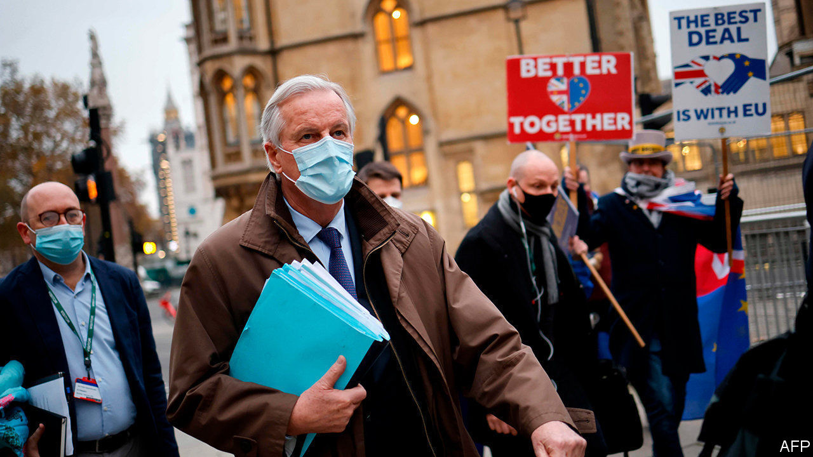

###### EU-UK negotiations

# Brexit talks inch towards a last-minute deal—but it is not done yet 

##### It will not be easy to get an agreement approved by the EU’s member states 

 

> Dec 5th 2020 


THE GOVERNMENT is urging businesses to step up preparations for the end of Britain’s transition out of the European Union on December 31st. This week Michael Gove, the cabinet office minister, announced the setting up of a new border operations centre, adding that significant change was coming with or without a trade deal. Yet many companies retorted that uncertainty over the negotiations made proper preparation all but impossible.


This week’s talks in London have made some progress, yet the old gaps remain over fisheries and a level playing-field for competition. Officials suggest Boris Johnson now needs to intervene to seal a deal. The prime minister is under pressure, especially after a big backbench Tory revolt on December 1st against his new covid-19 tier system. But Mujtaba Rahman of the Eurasia Group, a consultancy, sees little sign of early readiness to give more ground to the EU. And the mooted inclusion of more unilateral (and illegal) changes to the Northern Ireland provisions of the withdrawal treaty in next week’s finance bill could upset the applecart again.


As repeated Brexit deadlines come and go, the timetable for ratifying a trade treaty that runs to some 800 pages (plus annexes) becomes ever tighter. Getting a deal through Westminster should not be hard even with another revolt by hardline Tories, because the Labour opposition is unlikely to vote it down if the alternative is no deal. But rushed approval by the EU is a lot more problematic.


All national governments must agree. Some may jib if there is not enough time for full legal scrutiny and translation. In a few countries, such as Finland, parliamentary approval is needed before a government signs. Some parliaments may also demand a say if the deal is “mixed”, meaning it includes issues such as airline regulation or social security that fall within national not EU competence. But Georgina Wright of the Institute for Government, a think-tank, says lawyers in Brussels may still argue that the deal needs only EU approval. She also points to precedents for provisional application of trade deals pending any national ratifications later deemed necessary.


That is harder with the European Parliament, since its approval has always preceded a trade deal taking effect. Next week sees its last planned plenary meeting of the year. Two committees normally scrutinise and report on trade deals before they are voted on. Yet MEPs are well briefed on the Brexit trade talks, and are anxious not to be seen as an obstacle to a deal. They have already planned a remote session with a vote in the week of December 28th just in case.


Brexit’s potential cost is becoming clearer. The government tried unsuccessfully to head off this week’s backbench revolt by publishing a hasty economic-impact assessment of its covid-19 tiers. Yet Mr Johnson still refuses to offer a similar assessment of any Brexit trade deal (or of no deal). Fortunately the independent Office of Budget Responsibility has now done the job. It predicts a 4% long-term loss of output with a deal, and an extra cut in GDP of 2% next year with no deal. This echoes other forecasts and the Bank of England’s conclusion that Brexit will cost more than the pandemic. And it will come on top of a poor outcome in 2020. The OECD has just downgraded its forecasts, putting Britain second-to-last among leading members, with an expected fall in GDP this year of 11.2%. That is an unhappy position in which to inflict further disruption.■

