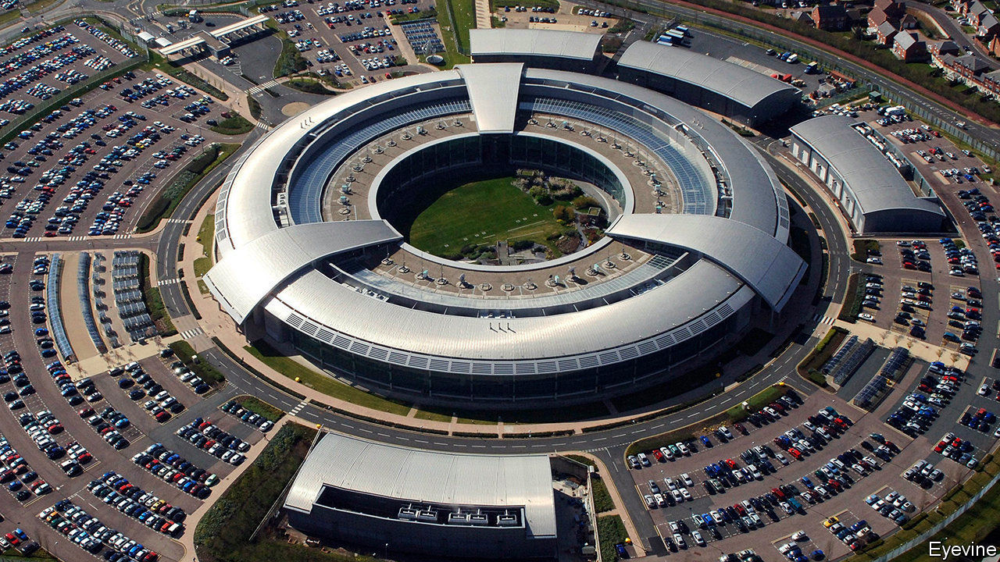

###### Digital defence

# Britain assembles a new cyber force of soldiers and spies 

##### Cyber-activity is increasingly common, but most countries keep quiet about it 

 

> Dec 3rd 2020 


THE HEAD of America’s Cyber Command, Paul Nakasone, is a four-star general whose chest is plastered in medals. The commander of Britain’s National Cyber Force (NCF) is a bespectacled, middle-aged man in a beige blazer—a 20-year veteran of GCHQ, Britain’s signals-intelligence service, whose name the government has asked to keep secret. Unassuming as he may be, his agency, responsible for offensive cyber-operations, now stands at the centre of a sweeping overhaul of British defence capabilities.


On November 19th Boris Johnson announced the biggest programme of investment in defence since the Thatcher era. The cash, an extra £6.5bn ($8.7bn) during this parliament over previous manifesto plans, reverses nearly a decade of military cuts and cements Britain’s position as the second-largest military spender in NATO, behind America, and the largest in Europe, with a budget of £46.5bn this year. It includes a tilt towards the seas and skies, with more spending on ships, a commitment to send an aircraft-carrier to Asia next year (with American marines aboard) and a Space Command to watch for threats to satellites.


The central theme, though, is technology. Britain will establish a new agency for artificial intelligence (AI). It will invest more in drones and lasers. And it will beef up cyber capabilities. That explains Mr Johnson’s decision to avow the existence of the NCF, which has been quietly hacking away since the spring. The force brings under unified command for the first time personnel from GCHQ, the Ministry of Defence and MI6, Britain’s foreign intelligence agency, and the Defence Science and Technology Laboratory (DSTL). The force is thought to number in the hundreds, with the aim of growing to 3,000 staff over the next decade. Adverts are up online.


The NCF’s purpose is not to collect intelligence—GCHQ has done that since its inception—but to make things happen. That could include shutting down the communications of a terrorist group or disabling enemy air defences, but also something as simple as sending a message to dissuade someone from acting.


Such offensive cyber-activity is increasingly common, though most countries keep quiet about it. Britain broke its own silence in 2013, when Philip Hammond, the defence secretary at the time, said that Britain was building a cyber “strike” capability. In 2017 Britain acknowledged it was “routinely” using offensive cyber against Islamic State, a terrorist group.


Acknowledging these offensive cyber campaigns was a cheap way of demonstrating counter-terrorism prowess. Yet these campaigns served a secondary purpose, too. They were low-key shows of force obliquely directed at bigger foes. British officials are wary of discussing operations against Russia or China. But “the fact you don’t see that we use it doesn’t mean we don’t,” noted Mark Sedwill in October, freshly retired as national security adviser.


Therein lies some of the appeal. “Policymakers love offensive cyber, for the same reason that they love special forces and intelligence operations,” says a former senior British official, who worked closely with two prime ministers. “They are largely covert, can be deployed flexibly and don’t have to be disclosed to or debated in Parliament or the press.”


Some cyber-operations are dramatic attacks that literally destroy physical equipment. Most are more prosaic. The NCF will probably spend more time tackling online child sexual exploitation and fraud than threatening Russia’s power grid. That a mixture of soldiers and civilians should handle everything from criminality to all-out war is unusual. The NCF “has no equivalent anywhere else in the world”, notes Marcus Willett, GCHQ’s former deputy head, approvingly.


Yet if the NCF has laid its foundation stones, its intellectual scaffolding remains a work in progress. Ciaran Martin, who retired as head of GCHQ’s defensive arm in August, warns that “in all my operational experience, I saw absolutely nothing to suggest that the existence of Western cyber capabilities, or our willingness to use them, deters attackers.” A former British spy chief agrees. “The reality is that non-military uses of offensive cyber are massively over-played.” Outside wartime, he says, such operations “will always be niche and ephemeral, though occasionally useful for sending messages”.


Mr Martin expresses another concern: that Western cyber-armouries might be raided, with baleful consequences for civilian digital infrastructure. “No one is likely going to be able to steal a nuclear weapon. No one will accidentally lose or leak a ballistic missile…None of these statements hold true for cyber capabilities.”


GCHQ says that its operations are “responsible, targeted and proportionate, unlike those of some of our adversaries”. The NCF will be scrutinised by Parliament’s Intelligence and Security Committee. Even so, Mr Martin urges caution. “We weaponise the internet at our peril,” he maintains. “In the cyber domain, the best form of defence is defence.” ■

