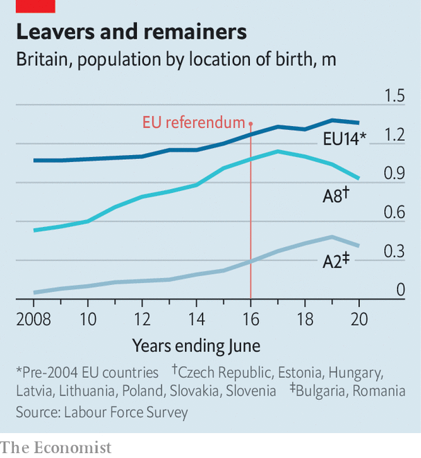

###### Demography

# Eastern European migrants stop coming to Britain 

##### Brexit did not persuade them to depart, but an economic slump might 

 

> Dec 3rd 2020 


OLENA HRABOVENSKA, who owns several Polish food shops in Huntingdon and Peterborough, shudders to remember the Brexit referendum in 2016. The campaign to leave the EU had unleashed ugly prejudices. Cards about “Polish vermin” were posted through letterboxes. Her customers seemed despondent, asking: “what’s the point of being here if we’re not appreciated?” Soon afterwards, eastern Europeans’ numbers started to decline, but not because they rushed for the exit.


Eight Baltic and eastern European countries joined the EU in 2004: the Czech Republic, Estonia, Hungary, Latvia, Lithuania, Poland, Slovakia and Slovenia. Many of their citizens moved to Britain, which, unlike most European countries, imposed no transitional controls. But according to the Labour Force Survey, the number of adults in England and Wales born in those countries has fallen from 1,139,000 in 2016-17 to 926,000 (see chart). Other data tell a similar story. Last year fewer than 17,000 babies were born to Polish women—down from almost 23,000 in 2015.

 


The Brexit vote caused sterling to fall, reducing the purchasing power of remittances sent from Britain. Two years later the government told people who wanted to settle to prove they had been mostly resident for five years in a row—a test that some found offputting. “You are treated as a number,” says Aga Dychton, a Polish immigrant who is now chairman of Watford borough council. Yet all Europeans face these problems. The number of French, German and Italian immigrants has not fallen much; nor has the number of Bulgarians and Romanians, who have been able to work in Britain since 2014.


The countries that joined the EU 16 years ago have changed in a way that makes Britain seem less attractive. Marius Vainauskar, who moved to Britain in 2005 to take a job sticking labels on vegetables, remembers that he used to feel rich when he went back to Lithuania. Today he has a better job, as a driving instructor, but no longer feels so flush. Over the past 16 years the average wage in Lithuania has risen from 41% of the British level to 61%, at purchasing-power parity. And many eastern Europeans are underemployed in Britain. The Oxford Migration Observatory, a think-tank, finds they have the lowest pay of any migrant group and are the most likely to be overqualified for the jobs they do.


Ruta Dalton, an accountant originally from Lithuania, suspects that Brexit itself persuaded few eastern Europeans to depart. Some have left—but most of them would have gone anyway, pulled back by family obligations or simply because they had saved as much money as they wanted to. The big change is that many fewer eastern Europeans are coming. Last year only 77,000 people from the 2004 accession countries received a British National Insurance number. In 2015, the year before the Brexit vote, 185,000 did so.


This is not exactly a ringing endorsement of the “global Britain” that Boris Johnson boasts about. But attracting eastern Europeans would be getting harder even if sterling and the economy were strong and Britain went easy on the immigration paperwork. A baby bust after the fall of the Iron Curtain and years of emigration means there are fewer potential migrants left in eastern Europe. The United Nations estimates that the number of 18-year-olds in Poland has fallen from 598,000 to 340,000 since 2005.

New customers


Some immigrants are still arriving in Lincoln Road, the traditional starting-off point for newcomers in Peterborough. Shops that once specialised in Polish food now sell Romanian products. And Petr Torak, a former police officer who now runs a community centre, says that Roma from the Czech Republic and Slovakia are settling in the area. Unlike the Poles and Lithuanians who came before, they are fleeing persecution as well as looking for jobs. He struggles to imagine them returning to their homelands.


Ms Hrabovenska’s shops are doing fine for now. But, like a good businesswoman, she worries about the future. What will happen if Britain enters a prolonged economic slump and unemployment soars? If everyone ends up counting their pennies, she thinks, the eastern Europeans really will leave in a hurry. “They can count pennies in their own country,” she says.■

